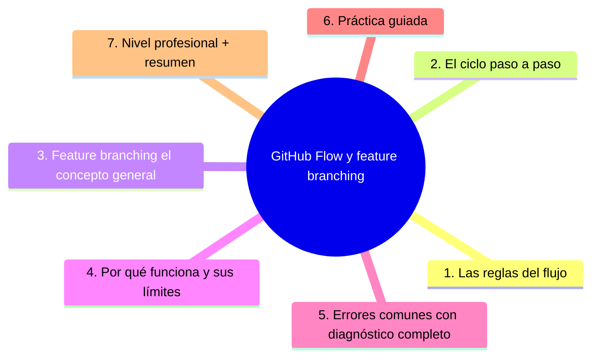
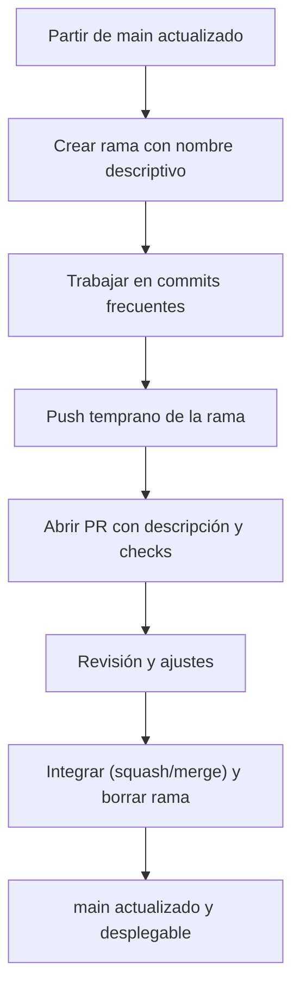

# GitHub Flow y feature branching

## Introducción

Existe una estrategia tan simple que casi no parece una estrategia: una rama por cambio, PR siempre, main siempre desplegable. Es el **GitHub Flow** (con su primo cercano, el *feature branching* clásico) y es la base sobre la que se entienden todas las demás.

Este capítulo describe el flujo completo, sus reglas de oro, por qué funciona y dónde empieza a doler — para que puedas aplicarlo conscientemente o elegir otra cosa con argumentos.

---

## Mapa conceptual de este capítulo



---

## 1. Las reglas del flujo

```text
GITHUB FLOW — 5 REGLAS
──────────────────────────────────────────────────────
1. main existe y es desplegable en todo momento
2. todo el trabajo ocurre en una rama (feature/*,
   fix/*, …)
3. el trabajo se publica con PR (nunca push directo
   a main)
4. los PR se discuten, revisan y verifican (checks)
5. se integra cuando está aprobado y verde → y se
   despliega
```

```text
   │
   ├── la rama dura DÍAS, no semanas: cambio
   │   pequeño → rama viva poco tiempo
   │
   └── main desplegable = la definición operativa de
       «hecho»
```



---

## 2. El ciclo paso a paso

```bash
# 1. partir de main actualizado
git switch main && git pull

# 2. rama con nombre que explique
git switch -c feat/exportar-csv

# 3. trabajar en commits con mensaje (sección 14)
git add src/export.py tests/
git commit -m "feat: parser CSV con UTF-8"

# 4. publicar pronto (backup + visibilidad)
git push -u origin feat/exportar-csv

# 5. abrir PR (descripción, Closes #n, checks)
#    → revisión (sección 15)
#    → más commits si hace falta

# 6. integrar (squash/merge/rebase — política del
#    equipo) y borrar la rama

# 7. main local al día para el siguiente cambio
git switch main && git pull
```

```text
BUENAS PRÁCTICAS DEL CICLO:
   │
   ├── push temprano (no guardes trabajo en local
   │   días)
   ├── rama por idea, no por persona eterna
   ├── sincronizar con main pronto (menos conflictos)
   └── desplegar desde main (no desde ramas)
```

---

## 3. Feature branching (el concepto general)

```text
FEATURE BRANCHING (nombre genérico del enfoque):
   │
   ├── una rama por feature/bugfix
   ├── el trabajo en la rama es aislado hasta el PR
   └── la integración ocurre en main (vía PR o
       merge directo según el equipo)
```

```text
GITHUB FLOW = feature branching + PRs obligatorios +
checks + «main siempre desplegable»
   │
   └── la diferencia con flujos con ramas de RELEASE
       (cap. 02): aquí NO hay rama estable aparte — si
       necesitas estabilidad para releases diarios/
       semanales, mira Git Flow o release branches
```

```text
VARIACIONES COMUNES (mención):
   │
   ├── «trunk-based» ligero: ramas de horas, no de
   │   días (cap. 03)
   └── ramas por ticket con naming: fix/JIRA-123-…
       (naming = trazabilidad)
```

---

## 4. Por qué funciona (y sus límites)

```text
POR QUÉ FUNCIONA:
   │
   ├── feedback temprano: PR en 1-2 días (sección
   │   15)
   ├── integración frecuente: menos «gran fusión»
   ├── despliegue trivial desde main (CI/CD —
   │   sección 22)
   └── bajo ceremonial: ideal para la mayoría de
       equipos y proyectos
```

```text
LÍMITES HONESTOS:
   │
   ├── releases que deben «congelarse» mientras el
   │   equipo sigue avanzando → necesitas ramas de
   │   release (cap. 02/05)
   │
   ├── features MUY grandes (meses) → flags o
   │   apilado (sección 15 cap. 06); rama viva
   │   semanas = dolor
   │
   ├── despliegues muy acoplados a releases con
   │   marketing/fecha → añade ventana de release
   │
   └── equipo distribuido con husos muy distintos:
       la sincronización diaria pesa más
```

```text
   │
   └── «main siempre desplegable» exige CI en cada
       PR (sección 19) — sin checks, la regla es
       decorativa
```

---

## 5. Errores comunes con diagnóstico completo

### Error 1: rama viva semanas («feature» eterna)

**Qué ocurrió:** la rama de la feature lleva 3 semanas; conflictos con main, PR gigante.

**Por qué posibles:**
* corte mal hecho (feature demasiado grande);
* PR abierto tarde.

**Cómo comprobarlo:** edad de la rama (`git for-each-ref --sort=-committerdate`), diff vs. main.

**Opciones:** partir la feature (más PRs), feature flags, PR de borrador temprano para alinear; rebase frecuente.

**Riesgos:** el «merge del fin del mundo»; revisión imposible.

**Solución:** ramas de días; integrar en tramos (punto 4).

**Cómo se evita:** estimar por tamaño de PR, no por «tarea».

---

### Error 2: main no desplegable (la regla rota)

**Qué ocurrió:** alguien integró a medias y main está roto; nadie puede desplegar.

**Por qué posibles:**
* checks ausentes o ignoradas;
* merge sin CI.

**Cómo comprobarlo:** último build de main; ejecutar la app desde main.

**Opciones:** arreglar YA (fix-forward o revert — sección 29); añadir CI obligatoria + post-merge build.

**Riesgos:** el flujo completo pierde sentido (main roto = todo el mundo bloqueado o parcheando encima).

**Solución:** checks obligatorias en PR y en main (sección 19).

**Cómo se evita:** regla «nada se integra sin verde».

---

### Error 3: push directo a main «porque es pequeño»

**Qué ocurrió:** un «cambio de 2 líneas» (que era 12 y rompió) entró sin revisión.

**Por qué:** la rama no está protegida o el bypass es costumbre.

**Cómo comprobarlo:** protección de rama; historial de pushes directos.

**Opciones:** activar protección (sección 15/18); abrir PR retroactivo si es analizable.

**Riesgos:** excepción que se vuelve hábito.

**Solución:** sin excepciones salvo protocolo de hotfix (sección 29) con revisión posterior.

**Cómo se evita:** protección + cultura de PR incluso para 1 línea.

---

### Error 4: rama por persona sin cierre

**Qué ocurrió:** «la rama de Marta» existe siempre con «pequeñas cosas»; nunca se cierra PR ni se borra.

**Por qué:** rama usada como espacio personal, no como unidad de cambio.

**Cómo comprobarlo:** lista de ramas remotas con días/meses.

**Opciones:** cerrar PRs viejos; partir; regla: rama = PR o se borra.

**Riesgos:** inventario incontrolable; miedo a borrar «por si acaso».

**Solución:** rama efímera (sección 15/17 cap. 04).

**Cómo se evita:** «delete branch after merge» + limpieza semanal de ramas huérfanas.

---

### Error 5: desplegar desde la rama

**Qué ocurrió:** staging con la rama X, producción con «la rama buena» de hace 2 semanas; nadie sabe qué corre donde.

**Por qué posibles:**
* miedo a integrar lo incompleto;
* flags ausentes.

**Cómo comprobarlo:** ¿qué commit corre en producción? vs. historial de main.

**Opciones:** integrar con flags apagados; alinear staging con main; documentar qué corre.

**Riesgos:** el artefacto desplegado no es auditable en el historial.

**Solución:** solo main se despliega (punto 4).

**Cómo se evita:** CD desde main (sección 22).

---

### Error 6: nombre de rama inútil

**Qué ocurrió:** `fix2`, `nuevos-cambios`, `prueba-julio` — nadie entiende qué contiene.

**Por qué:** sin convención.

**Cómo comprobarlo:** lista de ramas.

**Opciones:** renombrar (si no compartida), convención `tipo/descripción` (feat/fix/chore/JIRA-123).

**Riesgos:** ramas cruzadas por error.

**Solución:** naming documentado en CONTRIBUTING.

**Cómo se evita:** plantilla de creación de rama (o herramientas que la imponen).

---

## 6. Práctica guiada

### Objetivo

Recorrer el GitHub Flow completo en un repo de práctica, de main a merge.

### Paso 1: main limpio

```bash
git switch main && git pull
git status   # limpio
```

### Paso 2: rama + trabajo

```bash
git switch -c feat/primer-flujo
echo "hola" > nota.md
git add nota.md && git commit -m "docs: añade nota del ejercicio"
git push -u origin feat/primer-flujo
```

### Paso 3: PR + checks

1. Abre PR con descripción (qué/porqué/cómo probar).
2. Activa (o simula) una check: un workflow mínimo de `pull_request` que ejecute un comando (sección 19).
3. Observa cómo el PR la espera.

### Paso 4: revisión y ajuste

1. Pide revisión (o usa una segunda cuenta).
2. Aplica un comentario → nuevo commit → push.

### Paso 5: integrar

1. Squash o merge según la política (cap. 05 sección 15).
2. Comprueba: rama borrada, main actualizado, CI en main en verde.

### Paso 6: refleja el flujo

```text
Dibuja en tu cuaderno tu propio flujo con las 5
reglas, adaptado a tu equipo: ¿quién revisa? ¿cuánto
dura una rama? ¿desde dónde se despliega?
```

### Resultado esperado

Un ciclo completo: rama → PR → checks → revisión → integración → main desplegable.

### Conclusión esperada

El flujo es simple por diseño: la complejidad está en las disciplinas que lo sostienen (PRs, checks, ramas cortas), no en el diagrama.

---

### Ejercicio de transferencia

Aplica el GitHub Flow a un contexto diferente al ejemplo guiado: por ejemplo, en un repositorio de documentación donde cada cambio es una página nueva, crea una rama para cada página, abre un PR con revisión de estilo y integra solo cuando la documentación pase los checks de enlaces rotos.

## 7. Nivel profesional + resumen

### 7.1. GitHub Flow en equipo

```text
REQUISITOS PARA QUE FUNCIONE EN SERIO:
   │
   ├── rama protegida + PR obligatorio + aprobación
   ├── CI en cada PR y build post-merge
   ├── despliegue (automático o manual) SOLO desde
   │   main
   ├── ramas cortas: cut por tamaño, no por tarea
   ├── para features grandes: flags o PR apilados
   └── hotfix: mismo flujo acelerado con revisión
       posterior (sección 29)
```

```text
   │
   └── métricas: edad de ramas, tiempo PR→merge,
       % de CI rojo en main (sección 15 cap. 06)
```

### 7.2. Resumen

En este capítulo aprendiste que:

* GitHub Flow tiene 5 reglas: main desplegable, trabajo en rama, PR siempre, revisión+checks, integrar y desplegar;
* el ciclo completo: partir de main → rama con nombre → push temprano → PR → iterar → integrar → borrar rama → pull;
* feature branching es el concepto general; GitHub Flow lo endurece con PRs y checks;
* funciona por feedback temprano e integración frecuente; duele con features de meses y releases congeladas (soluciones: flags, apilado, release branches);
* los errores típicos (rama eterna, main roto, push directo, rama-persona, despliegue desde rama, nombres inútiles) se previenen con protección y disciplina;
* a nivel profesional: requisitos operativos y métricas de flujo.

La idea principal es:

> **El flujo simple escala por disciplina, no por ceremonia: main verde, ramas de días y PR obligatorio — todo lo demás es ajuste.**

---

## Autopreguntas de cierre

Sin mirar el material, responde mentalmente y luego compruébalo con este capítulo:

1. ¿Por qué es necesario que la rama main esté siempre desplegable y qué riesgos implica si no se cumple?
2. ¿Cómo afecta el tamaño de las ramas (días vs semanas) a la probabilidad de conflictos y al esfuerzo de revisión?
3. ¿En qué situación sería apropiado usar un PR de borrador temprano y qué ventajas aporta al flujo de trabajo?
4. ¿Qué métricas podrías usar para evaluar la salud de un equipo que sigue GitHub Flow y por qué son relevantes?
5. ¿Cómo decidirías entre integrar mediante squash, merge o rebase y qué factores de equipo influyen en esa decisión?

## Próximo paso

Ya dominas el flujo simple.

Cuando hay que entregar versiones «congeladas» mientras el equipo sigue, aparece Git Flow.

Continúa con:

[`02-git-flow.md`](02-git-flow.md)
