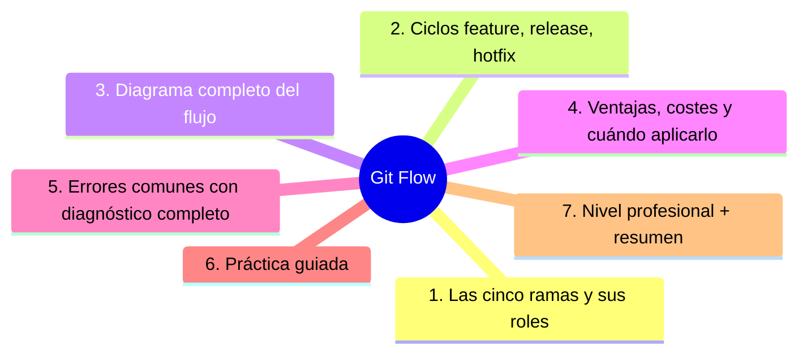
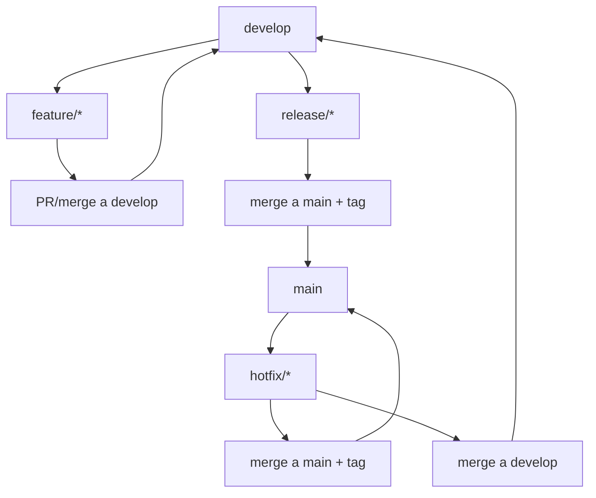

# Git Flow

## Introducción

**Git Flow** es el modelo de ramas de Vincent Driessen (2010): cinco tipos de rama con roles fijos — `main`, `develop`, ramas de release, de feature y de hotfix — pensado para software que se distribuye en versiones con números y calendario.

Sigue siendo la respuesta correcta en contextos de releases planificadas (aplicaciones de escritorio, móviles con tiendas, versiones empresariales). Este capítulo explica sus ramas, su ciclo, sus costes — y por qué muchos equipos web/producto hoy lo simplifican.

---

## Mapa conceptual de este capítulo



---

## 1. Las cinco ramas y sus roles

```text
RAMAS
──────────────────────────────────────────────────────
main (master)
  · producción SIEMPRE reflejada aquí
  · solo merges de release/hotfix (y sus tags)
  · cada commit en main = versión desplegada

develop
  · línea de integración del próximo release
  · recibe los features (vía PR/merge)
  · «¿está listo para release?» → se ramifica desde
    aquí

release/*  (release/1.4.0)
  · estabilización: solo fixes, docs, chores
  · al terminar → merge a main (tag) + merge a
    develop

feature/*  (feature/login)
  · trabajo en curso desde develop
  · se integra en develop (no en main)

hotfix/*   (hotfix/1.3.1)
  · arreglo CRÍTICO sobre main (producción)
  · → merge a main (tag) + merge a develop
    (¡siempre ambas!)
```

```text
   │
   ├── la regla de oro: main y develop no se
   │   «arreglan» directamente; todo pasa por sus
   │   ramas hijas con merge de vuelta
   │
   └── el doble merge de hotfix/release es lo que
       mantiene sincronizadas las dos líneas
```

---

## 2. Ciclos: feature, release, hotfix

```text
FEATURE (rutina diaria)
──────────────────────────────────────────────────────
develop ──► git switch -c feature/x develop
            …commits…
            ► PR/merge a develop
            ► borrar rama

RELEASE (preparar versión)
──────────────────────────────────────────────────────
develop ──► git switch -c release/1.4.0 develop
            …bump de versión, fixes finales, changelog…
            ► merge a main + tag v1.4.0
            ► merge a develop (¡otra vez!)
            ► borrar rama

HOTFIX (incidente)
──────────────────────────────────────────────────────
main ──► git switch -c hotfix/1.3.1 main
         …fix mínimo + test…
         ► merge a main + tag v1.3.1
         ► merge a develop
         ► borrar rama
```

```text
   │
   ├── ¿por qué merge a develop tras release? para
   │   que los fixes de estabilización no se pierdan
   │
   └── ¿por qué merge a develop tras hotfix? idem:
       el arreglo debe vivir también en el futuro
```

---

## 3. Diagrama completo del flujo



```text
FLUJO VISUAL RESUMIDO:
   │
   ├── el equipo trabaja en develop (integración)
   ├── cuando develop «se llena» → release branch
   │   congelada para estabilizar
   ├── release terminada → main recibe el tag
   ├── hotfixes saltan a main y vuelven a develop
   └── develop sigue avanzando mientras main
       «espera» el release (esa es la gracia)
```

---

## 4. Ventajas, costes y cuándo aplicarlo

```text
VENTAJAS
   │
   ├── main = producción garantizada (auditable)
   ├── puedes estabilizar release/1.4 mientras
   │   develop ya empezó 1.5
   ├── versiones numeradas con semver natural
   └── hotfixes con protocolo claro
```

```text
COSTES
   │
   ├── 5 ramas + 2 merges de vuelta = más ceremonia
   ├── sincronizar develop/release/hotfix = conflictos
   │   si no se practica
   ├── overhead real para apps web desplegadas a
   │   diario (¿qué release congelas si todo sale
   │   siempre?)
   └── mental: más reglas que recordar
```

```text
CUÁNDO ELEGIRLO
   │
   ├── SÍ: versiones con número y calendario
   │   (móvil con tienda, escritorio, entregables a
   │   clientes, soporte de versiones anteriores)
   │
   ├── SÍ con flags si solo necesitas «estabilizar»
   │   a veces (puedes combinar con GitHub Flow)
   │
   └── NO hace falta: producto web con deploy
       continuo desde main (GitHub Flow / trunk
       bastan — cap. 01/03)
```

```text
   │
   └── el autor del propio flujo recuerda en su blog
       que para muchos proyectos con deploy continuo
       la rama develop no es necesaria — dato
       histórico relevante para decidir con criterio
```

---

## 5. Errores comunes con diagnóstico completo

### Error 1: hotfix mergeado solo a main

**Qué ocurrió:** se parcheó producción, pero develop (y el próximo release) no traen el arreglo → se reintroduce el bug.

**Por qué:** se olvidó el segundo merge (o no se conoce el flujo).

**Cómo comprobarlo:** `git log develop --oneline | grep <fix>` o comparar archivos.

**Opciones:** mergear hotfix a develop de inmediato (antes de que avance mucho).

**Riesgos:** regresión garantizada en el siguiente release.

**Solución:** doble merge siempre (punto 2); checklist de hotfix.

**Cómo se evita:** plantilla de procedimiento de hotfix (sección 29).

---

### Error 2: commits directos en main/develop

**Qué ocurrió:** cambios en develop sin rama → sin revisión, con mensajes pobres.

**Por qué:** las ramas «de integración» se usan como cajón.

**Cómo comprobarlo:** historial de develop: ¿features completas o commits sueltos?

**Opciones:** regla: solo merges (equivalente a protección de rama en ambas).

**Riesgos:** integración sucia; imposible auditar qué trae un release.

**Solución:** protección en main Y develop (PRs en ambos sentidos).

**Cómo se evita:** configuración de ramas protegidas del proyecto (sección 18).

---

### Error 3: release branch que vive semanas (no estabiliza, acumula)

**Qué ocurrió:** release/1.4 abierta un mes; desarrolladores la piden para sus fixes → mezcla de estabilización y desarrollo.

**Por qué posibles:**
* proceso lento de QA;
* miedo a cambiar develop.

**Cómo comprobarlo:** edad de la release branch; commits «de feature» dentro.

**Opciones:** acortar ventana (release candidates), mover features a la siguiente; cambios no críticos fuera.

**Riesgos:** la release deja de ser congelada = no estabiliza nada.

**Solución:** release corta y aburrida (punto 2).

**Cómo se evita:** cadencia fija (semanal/quincenal) con checklist de cierre.

---

### Error 4: Git Flow para producto con deploy continuo

**Qué ocurrió:** app web desplegada a diario con cinco ramas y release branches que nadie entiende.

**Por qué:** se copió el flujo «de empresa» sin preguntar si hay releases.

**Cómo comprobarlo:** ¿los deploys salen de tags o de main? ¿qué versión «corre» en producción?

**Opciones:** simplificar a GitHub Flow + flags (cap. 01); documentar la decisión.

**Riesgos:** ceremonia sin valor; el proceso se salta → disciplina falsa.

**Solución:** el flujo depende del modelo de entrega (cap. 06).

**Cómo se evita:** decisión explícita del equipo con criterios del cap. 06.

---

### Error 5: develop «muerto» (nadie lo usa de verdad)

**Qué ocurrió:** todos trabajan desde main o desde release; develop es una rama decorativa desincronizada.

**Por qué posibles:**
* empezaron Git Flow y abandonaron a medias;
* confusión sobre quién es la base.

**Cómo comprobarlo:** divergencia main/develop; fecha del último merge a develop.

**Opciones:** decidir: volver al flujo completo o eliminar develop (migrar a otro flujo con comunicación).

**Riesgos:** dos «verdades» de integración.

**Solución:** un solo modelo acordado (cap. 06).

**Cómo se evita:** revisión del flujo en la retro al cambiar de fase.

---

### Error 6: tags y versiones desalineados

**Qué ocurrió:** main dice v1.4.0 pero el changelog/CHANGELOG.md no; o hotfix sin tag.

**Por qué:** el tag no es parte del checklist de release.

**Cómo comprobarlo:** `git tag --sort=-v:refname` vs. changelog (sección 14 cap. 04).

**Opciones:** crear tag anotado + release notes retroactivas si el contenido existe; documentar el paso.

**Riesgos:** auditoría rota: ¿qué código es la 1.4.0?

**Solución:** release = merge + tag + changelog + notas (checklist).

**Cómo se evita:** script de release (sección 22).

---

## 6. Práctica guiada

### Objetivo

Ejecutar un ciclo mínimo de Git Flow en un repo de práctica: develop, feature, release y hotfix.

### Paso 1: estructura inicial

```bash
git switch -c develop main
git push -u origin develop
# (en la plataforma: proteger develop con PRs)
```

### Paso 2: feature

```bash
git switch -c feature/saludo develop
echo "hola mundo" > saludo.txt
git add saludo.txt && git commit -m "feat: saludo inicial"
git push -u origin feature/saludo
# → PR a develop → merge (squash/merge según política)
```

### Paso 3: release

```bash
git switch develop && git pull
git switch -c release/0.1.0
echo "0.1.0" > VERSION && git add VERSION
git commit -m "release: v0.1.0"
# → merge a main con tag + merge de vuelta a develop
git switch main && git merge --no-ff release/0.1.0 -m "Merge release 0.1.0"
git tag -a v0.1.0 -m "v0.1.0"
git switch develop && git merge --no-ff release/0.1.0 -m "Merge release 0.1.0 a develop"
git branch -d release/0.1.0
```

### Paso 4: hotfix

```bash
git switch main && git switch -c hotfix/0.1.1
# arreglo mínimo…
git commit -m "fix: arreglo crítico de arranque"
git merge --no-ff hotfix/0.1.1 -m "Merge hotfix 0.1.1"
git tag -a v0.1.1 -m "v0.1.1"
git switch develop && git merge --no-ff hotfix/0.1.1   # ¡no lo olvides!
git branch -d hotfix/0.1.1
```

### Paso 5: observa el grafo

```bash
git log --graph --oneline --all
# main con tags, develop con las dos vueltas
```

### Paso 6: documenta

1. Escribe en CONTRIBUTING: las 5 ramas, quién puede mergear y el checklist de release (merge + tag + changelog + notas).

### Resultado esperado

Ciclo completo con los dobles merges y tags correctos, y el flujo escrito.

### Conclusión esperada

Git Flow funciona cuando cada merge de vuelta se hace — la herramienta no perdona el olvido.

---

### Ejercicio de transferencia

Imagina que gestionas el ciclo de vida de una biblioteca de código abierto con versiones semver. Describe cómo usarías Git Flow para preparar una versión 2.0.0, incluyendo la creación de ramas release, el manejo de hotfixes y la comunicación de cambios rompiendo compatibilidad.

## 7. Nivel profesional + resumen

### 7.1. Git Flow bien llevado

```text
   │
   ├── protección de rama en main Y develop (PRs
   │   obligatorios)
   │
   ├── checklist de release y hotfix (doble merge +
   │   tag + changelog) como plantilla del equipo
   │
   ├── release windows cortos y fijos (cadencia)
   │
   ├── soporte de versiones anteriores → ramas
   │   release/* por versión con fixes backport
   │   (mención avanzada)
   │
   └── herramientas de release (bump version, changelog
       auto) para reducir ceremonia manual —
       sección 22
```

### 7.2. Resumen

En este capítulo aprendiste que:

* Git Flow tiene 5 ramas: main (producción), develop (integración), release/* (estabilizar), feature/* (trabajo), hotfix/* (críticos);
* la clave son los DOBLES merges: release y hotfix vuelven siempre a develop;
* aporta main auditable y estabilización paralela; cuesta ceremonia y sincronización;
* se elige por modelo de entrega con versiones numeradas; con deploy continuo suele sobrar (cap. 01/06);
* los errores típicos (hotfix sin develop, directos en ramas base, release eterna, flujo mal encajado, develop muerto, tags desalineados) se previenen con protección y checklists;
* a nivel profesional: protección, cadencia de release y backports.

La idea principal es:

> **Git Flow es un contrato de dos líneas: main cuenta lo desplegado, develop lo que viene — y los merges de vuelta son lo que evita que el futuro pierda los arreglos del pasado.**

---

## Autopreguntas de cierre

Sin mirar el material, responde mentalmente y luego compruébalo con este capítulo:

1. ¿Por qué es necesario que los merges de hotfix y release se realicen tanto a main como a develop y qué pasa si se omite uno de ellos?
2. ¿Cómo afecta la presencia de múltiples ramas de release, feature y hotfix simultáneas a la complejidad de integración y qué estrategias pueden reducirla?
3. ¿En qué contexto sería preferible usar Git Flow en lugar de GitHub Flow y qué indicadores de producto o equipo lo justifican?
4. ¿Qué métricas de ciclo de vida (tiempo de release, frecuencia de hotfix, edad de ramas) serían útiles para monitorizar la salud de un flujo Git Flow?
5. ¿Cómo decidirías entre mantener una rama de release para estabilización versus usar únicamente tags desde main y qué factores de riesgo influyen?

## Próximo paso

Ya entiendes el flujo clásico.

El siguiente enfoque va al extremo opuesto: integrar casi a diario con Trunk-Based Development.

Continúa con:

[`03-trunk-based-development.md`](03-trunk-based-development.md)
