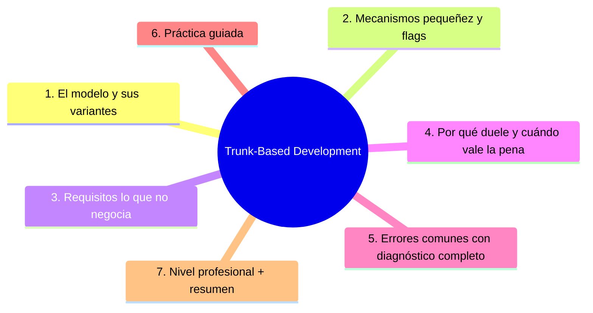

# Trunk-Based Development

## Introducción

**Trunk-Based Development** (TBD) es el enfoque más exigente y, cuando se sostiene, el que más rápido integra: todo el mundo sube a la rama principal (`trunk`/`main`) cada pocas horas o como máximo cada uno o dos días — con tests que protegen y *feature flags* para lo que aún no está listo.

No es «commitear a lo loco a main»: es integración continua de verdad con disciplina extrema. Este capítulo explica su modelo, sus mecanismos (flags, pequeños cambios), sus requisitos y su honesta dificultad.

---

## Mapa conceptual de este capítulo



---

## 1. El modelo y sus variantes

```text
LA IDEA
   │
   ├── rama viva ÚNICA: main/trunk
   ├── nadie guarda trabajo local > 1-2 días
   ├── lo «no listo» viaja APAGADO (flag) o integrado
   │   en tramos
   └── la rama de integración dura horas, no semanas
```

```text
VARIANTES
──────────────────────────────────────────────────────
a) directo a main con checks obligatorias
   · muy estricta; equipos maduros con CI fuerte

b) «feature branches efímeras» (horas)
   · se crea rama por la mañana, se mergea esa misma
     tarde — la variante más común y recomendada
   · el PR es corto y se revisa el mismo día
```

```text
   │
   ├── NADA de ramas de días/semanas (eso es
   │   feature branching, cap. 01)
   │
   └── release «por etiqueta» desde main cuando el
       producto lo pide (no release branches salvo
       soporte histórico)
```

---

## 2. Mecanismos: pequeñez y flags

```text
PEQUEÑEZ OBLIGADA
   │
   ├── cada integración = cambio pequeño y completo
   │   (tests incluidos)
   │
   └── «small continuous commits»: si no cabe en un
       día, se parte en tramos mergeables
       (infra → lógica oculta → activación)
```

```text
FEATURE FLAGS (banderas)
   │
   ├── código nuevo entra a main YA COMPILADO pero
   │   APAGADO para usuarios
   │
   ├── flag nuevo → test con flag on/off → rollout
   │   gradual → retiro del flag cuando se estabiliza
   │
   └── el flag es deuda: caducidad escrita
       («eliminar después del 15/10»)
```

```text
DETECCIÓN RÁPIDA DE ROTO
   │
   ├── tests en cada push (minutos)
   ├── main roto = alguien lo arregla en minutos
   │   («stop the line» — no se sigue integrando
   │   encima de rojo)
   └── canary/dark launch para riesgo de usuario
       (mención, sección 22/23)
```

```text
   │
   └── TBD convierte la pregunta «¿cuándo
       integramos?» en «¿por qué NO hemos integrado
       hoy?»
```

---

## 3. Requisitos (lo que no negocia)

```text
SIN ESTO, TBD NO FUNCIONA:
──────────────────────────────────────────────────────
1. CI robusta: tests unitarios + integración en
   pocos minutos, obligatorias
2. rama protegida: checks verdes + revisión
   (aunque sea rápida)
3. cultura de «rojo = arreglar ya» (no ignorar)
4. flags con dueño y fecha de retiro
5. equipo que se comunica (standup: «voy a
   integrar X hoy»)
6. capacidad de revert rápido (sección 29)
```

```text
   │
   └── la disciplina reemplaza a la rama: la
       seguridad que daba «no tocar main» ahora la
       dan los tests y la velocidad de detección
```

---

## 4. Por qué duele y cuándo vale la pena

```text
POR QUÉ VALE LA PENA:
   │
   ├── integración diaria → conflictos casi nulos
   ├── feedback de errores en horas, no en el merge
   │   de fin de sprint
   ├── despliegues frecuentes (con CD: sección 22)
   └── la demo y lo integrado son la misma cosa
```

```text
POR QUÉ DUELE:
   │
   ├── exige tests buenos y rápidos (si tardan 40
   │   min, nadie integra a diario)
   ├── requiere flags bien gestionados (deuda)
   ├── la revisión debe ser rápida (PR de 100
   │   líneas, respuesta en horas)
   └── cultural: aceptar que lo mergeado puede estar
       «medio terminado» pero APAGADO
```

```text
CUÁNDO ELEGIRLO:
   │
   ├── SÍ: equipos con CI madura, deploy continuo,
   │   producto que evoluciona a diario
   │
   ├── CON CARE: empezar con ramas efímeras de horas
   │   (transición desde GitHub Flow)
   │
   └── NO mientras: los tests duren 40 min o nadie
       pueda aprobar en el día (primero arregla eso:
       cap. 01 / sección 19)
```

---

## 5. Errores comunes con diagnóstico completo

### Error 1: «trunk-based» sin CI decente

**Qué ocurrió:** todo el mundo integrando a main con tests que tardan una hora o que no cubren nada → main roto constantemente.

**Por qué:** se copió la filosofía sin la infraestructura.

**Cómo comprobarlo:** duración y fiabilidad del CI; frecuencia de main rojo.

**Opciones:** invertir primero en suite rápida (paralelizar, dividir unit/integration); mientras tanto, volver a ramas de días (GitHub Flow).

**Riesgos:** «integración continua» sin continuidad = caos.

**Solución:** requisitos del punto 3, en orden.

**Cómo se evita:** madurez de CI como prerequisito documentado.

---

### Error 2: features enormes «apagadas» meses

**Qué ocurrió:** veinte flags vivos, código muerto-perdido, nadie sabe qué está envejecido.

**Por qué:** flags sin fecha ni dueño.

**Cómo comprobarlo:** inventario de flags (grep de variables de flag); flags con >60 días.

**Opciones:** rotar: terminar y activar, o eliminar el código (y su flag); regla de caducidad.

**Riesgos:** deuda acumulada que hace el código ilegible.

**Solución:** flag = tarjeta: dueño + fecha (punto 2).

**Cómo se evita:** revisión semanal de flags abiertos.

---

### Error 3: integrar sin revisión (la rama es «tuya»)

**Qué ocurrió:** con «permiso de push directo», llegan cambios sin segunda mirada.

**Por qué:** se interpretó TBD como «main abierto».

**Cómo comprobarlo:** historial: ¿PRs/revisores? ¿commits directos?

**Opciones:** exigir PR (corto) incluso en TBD; dos aprobaciones solo para áreas críticas (una basta para el resto).

**Riesgos:** calidad que depende de una sola persona.

**Solución:** revisión rápida sí, revisión ninguna no (punto 3).

**Cómo se evita:** protección de rama con una aprobación.

---

### Error 4: «stop the line» que nadie para

**Qué ocurrió:** main rojo durante días porque «ya hay más cambios encima».

**Por qué:** la roja se normaliza; el fix «espera al sprint».

**Cómo comprobarlo:** tiempo de main en rojo (métrica de CI).

**Opciones:** revert inmediato o fix-forward en el momento; quien rompe, repara (o el equipo se rotó).

**Riesgos:** el CI deja de informar (ruido rojo constante).

**Solución:** rojo = prioridad única (punto 3).

**Cómo se evita:** alerta + guardia (sección 19/23).

---

### Error 5: demos ligadas a flags apagados que nunca se abren

**Qué ocurrió:** la demo funciona con el flag de tu máquina; producción nunca lo activa.

**Por qué:** flag sin proceso de rollout.

**Cómo comprobarlo:** flags «solo en demo»; configuración de entorno divergente.

**Opciones:** rollout gradual (1% → 100%) y cierre; o quitar el código.

**Riesgos:** «funciona en mi flag».

**Solución:** mismo camino para demo y prod (sección 22).

**Cómo se evita:** checklist de activación de flags.

---

### Error 6: obligar TBD a un equipo que no está listo

**Qué ocurrió:** se decretó «de ahora en diario a main» y al mes el equipo reintegró Git Flow por su cuenta.

**Por qué:** cambio de proceso sin preparar herramientas ni cultura.

**Cómo comprobarlo:** resistencia, atajos, main siempre rojo.

**Opciones:** volver a un flujo estable y planificar la madurez (CI → flags → ramas más cortas → TBD); transición gradual.

**Riesgos:** desconfianza en cualquier flujo futuro.

**Solución:** adoptar por criterios, no por moda (cap. 06).

**Cómo se evita:** decisión con checklist de requisitos y equipo de acuerdo.

---

## 6. Práctica guiada

### Objetivo

Practicar la variante de ramas efímeras (horas) con un flag de ejemplo.

### Paso 1: rama efímera

```bash
git switch main && git pull
git switch -c feature/saludo-veloz
# cambio pequeño + test (¡completo!)
git commit -am "feat: saludo rápido (detrás de flag)"
git push -u origin feature/saludo-veloz
# → PR abierto HOY, revisado HOY, mergeado HOY
```

### Paso 2: flag

```python
# ejemplo conceptual (lenguaje tuyo):
FLAGS = {"saludo_veloz": False}   # apagado en prod
```

```text
1. añade test con flag ON y con flag OFF
2. documenta: dueño + «se elimina el (fecha)»
```

### Paso 3: CI rápida

```text
Tu CI debe correr en pocos minutos:
   │
   ├── solo tests del área afectada si el repo es
   │   grande (paths filters — sección 19)
   └── unit tests siempre; integración en paralelo
```

1. Comprueba la duración real de tu workflow.

### Paso 4: activa y retira

1. Activa el flag (config), verifica en producción simulada.
2. Retira el flag y su test («done» de verdad).

### Paso 5: simula el rojo

1. Introduce un fallo de test, push, observa cómo el PR bloquea.
2. Corrige («stop the line» funcionando).

### Paso 6: decide con criterio

```text
Compara con tu contexto real (cap. 06):
   │
   ├── ¿tu CI dura < 10 min? ¿hay revisión en el día?
   └── ¿tu producto necesita flags? → ¿TBD, GitHub
       Flow o híbrido?
```

### Resultado esperado

Un ciclo de rama-hora con flag, CI corta y bloqueo de rojos — más una decisión informada sobre tu flujo.

### Conclusión esperada

TBD no es anarquía: es la misma integración de siempre, acelerada por tests, flags y velocidad de respuesta.

---

### Ejercicio de transferencia

Lleva el principio de Trunk-Based Development a un entorno de documentación o configuración: en lugar de código, aplica la integración continua de cambios pequeños con banderas de funcionalidad (por ejemplo, activar/desactivar secciones de una guía) y verifica cómo reduce el riesgo de lanzamientos fallidos.

## 7. Nivel profesional + resumen

### 7.1. TBD en organiación

```text
MADUREZ PARA TBD
──────────────────────────────────────────────────────
1. CI < 10 min, confiable, obligatoria
2. tests con buena cobertura de lo crítico
3. flags con inventario, dueño y caducidad
4. revisión rápida (1 aprobación, PRs de horas)
5. métricas: main rojo, tiempo de integración,
   edad de flags
6. CD opcional pero natural (sección 22): integrar
   a diario para desplegar a diario
```

```text
   │
   ├── release por tag desde main; soporte de
   │   versiones antiguas → rama de soporte acotada
   │   (mención)
   │
   └── TBD + flags = la base técnica de la entrega
       continua moderna (sección 22/23)
```

### 7.2. Resumen

En este capítulo aprendiste que:

* TBD integra en main cada pocas horas/días — con la variante de ramas efímeras como puerta de entrada;
* los mecanismos son la pequeñez (cambios completos pequeños) y los feature flags (lo no listo viaja apagado con dueño y fecha);
* los requisitos no negociables: CI rápida, protección, «rojo = arreglar ya», flags gestionados y comunicación;
* duele sin tests ni cultura; vale la pena con producto en despliegue continuo;
* los errores típicos (TBD sin CI, flags eternos, sin revisión, rojos normalizados, flags de demo, adopción por moda) se previenen con madurez previa;
* a nivel profesional: checklist de madurez y métricas de integración.

La idea principal es:

> **Trunk-based es velocidad con red de seguridad: tests que avisan en minutos y flags que esconden lo que aún no debe verse — integrar a diario no es falta de proceso, es proceso más corto.**

---

## Autopreguntas de cierre

Sin mirar el material, responde mentalmente y luego compruébalo con este capítulo:

1. ¿Por qué es fundamental que los tests sean rápidos y confiables en Trunk-Based Development y qué sucede si son lentos o poco fiables?
2. ¿Cómo afecta la gestión de feature flags (caducidad, dueño) a la acumulación de deuda técnica y qué prácticas pueden mitigarla?
3. ¿En qué situaciones sería aceptable usar ramas efímeras de horas versus integrar directamente a main y qué criterios de equipo lo determinan?
4. ¿Qué métricas de velocidad de integración (tiempo medio de PR→merge, frecuencia de main rojo) son más relevantes para evaluar la salud de un flujo TBD?
5. ¿Cómo decidirías entre adoptar TBD directamente o transitar mediante ramas efímeras y qué factores de madurez de CI y cultura de equipo influyen?

## Próximo paso

Ya conoces los tres flujos principales.

El siguiente capítulo gestiona la vida de las ramas: sincronización, conflictos de integración y ramas largas.

Continúa con:

[`04-flujo-de-ramas-y-sincronizacion.md`](04-flujo-de-ramas-y-sincronizacion.md)
