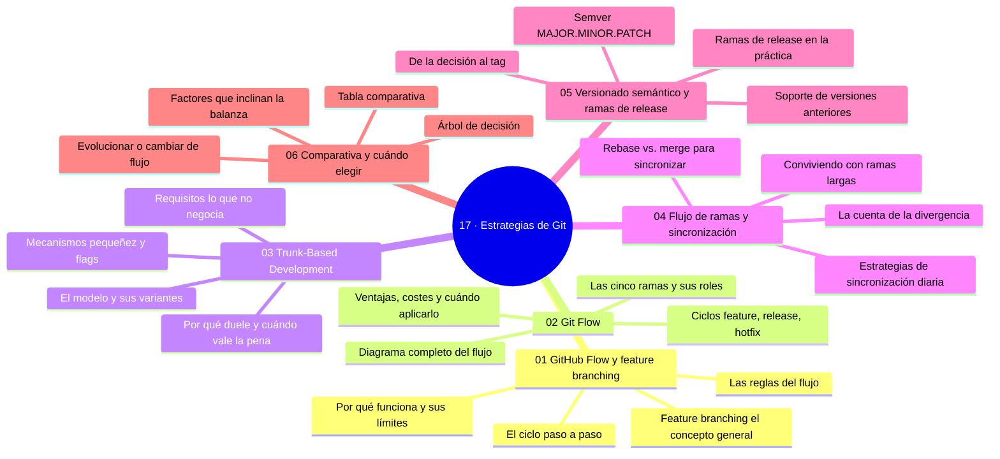

# 17 — Estrategias de Git

## Bienvenido a esta sección

No hay una única forma correcta de organizar un flujo de trabajo — hay formas que encajan con lo que entregas. Un equipo con versiones en tiendas vive otro mundo que un servicio web con despliegue a diario, y ambos mundos merecen su flujo.

En esta sección estudiarás los tres grandes enfoques (GitHub Flow, Git Flow, Trunk-Based Development), la conducción diaria de las ramas (sincronización y divergencia), el horizonte de versiones (semver y ramas de release) y, al final, cómo compararlos y elegir con criterio — no por moda.

## En esta sección estudiarás

* las cinco reglas de GitHub Flow y el ciclo completo de feature branching;
* las cinco ramas de Git Flow, sus dobles merges y su escenario natural;
* Trunk-Based Development: pequeñez, flags y requisitos de CI;
* medir y reducir la divergencia: rebase, merge y ramas largas;
* semver como contrato y ramas de release/soporte;
* un árbol de decisión y un ritual de migración de flujo.

## Objetivos de aprendizaje

Al terminar esta sección serás capaz de:
 
* explicar las cinco reglas de GitHub Flow y su escenario natural;
* describir Git Flow con sus cinco ramas y el caso donde conviene;
* aplicar trunk-based development con feature flags y CI fuerte;
* medir y reducir la divergencia de las ramas (rebase, merge, ramas largas);
* elegir un flujo con el árbol de decisión según contexto: releases, tamaño del equipo y CI.

## Mapa conceptual

---

## ¿Qué aprenderás en esta sección?

1. [`01-github-flow-y-feature-branching.md`](01-github-flow-y-feature-branching.md) — el flujo simple y sus límites.
2. [`02-git-flow.md`](02-git-flow.md) — release/hotfix con doble merge.
3. [`03-trunk-based-development.md`](03-trunk-based-development.md) — integración diaria con flags.
4. [`04-flujo-de-ramas-y-sincronizacion.md`](04-flujo-de-ramas-y-sincronizacion.md) — divergencia, rebase y higiene.
5. [`05-versionado-semantico-y-release-branches.md`](05-versionado-semantico-y-release-branches.md) — semver, tags y soporte.
6. [`06-comparativa-y-cuando-elegir.md`](06-comparativa-y-cuando-elegir.md) — comparativa, árbol de decisión y migración.

## Cómo estudiar esta sección

Ejecuta los ciclos en repos de práctica (el capítulo 02 y 03 son simulaciones completas) y, sobre todo, aplica el capítulo 06 a tu contexto real: escribe la respuesta del árbol de decisión con tus datos (CI, tamaño, modelo de entrega). Esa hoja vale más que memorizar las cinco ramas.

## Referencias

* GitHub — «Introducing GitHub Flow» (github.com/blog).
* Driessen, V. — «A successful Git branching model» (2010).
* Trunk Based Development — guía oficial (trunkbaseddevelopment.com).
* Google SRE Book — capítulo de Continuous Deployment.

---

## Checkpoint 17 — Comprobación obligatoria

Antes de avanzar a `18-github-profesional/`, demuestra que puedes (en un repositorio de práctica real):

1. **Crear** una rama feature/ desde main y abrir un PR con descripción, checks y obtener aprobación.
2. **Ejecutar** un rebase de tu rama contra main y resolver un conflicto simulado usando `git rerere` o edición manual.
3. **Medir** la divergencia de una rama con `git rev-list --count` y sincronizarla mediante merge o rebase según sea propia o compartida.
4. **Implementar** un feature flag sencillo en un archivo de configuración y verificar su activación/desactivación sin reiniciar la aplicación.
5. **Escribir** un árbol de decisión para elegir un flujo de trabajo dado un contexto de equipo (tamaño, frecuencia de despliegue, madurez de CI) y justificar la elección.

## Autopreguntas de cierre

Sin mirar el material, responde mentalmente y luego compruébalo con los capítulos de la sección:

1. ¿Cuáles son las cinco reglas de GitHub Flow?
2. ¿Cuándo Git Flow tiene más sentido que trunk-based?
3. ¿Cuáles son los dos requisitos no negociables del trunk-based?
4. Una rama lleva tres semanas abierta: ¿qué haces y por qué?
5. ¿Por qué es importante que main esté siempre desplegable en GitHub Flow y qué sucede si se rompe esa garantía?
6. ¿Cómo afecta la elección entre rebase y merge para sincronizar ramas a la claridad del historial y a la posibilidad de perder trabajo?
7. En un entorno con despliegue continuo, ¿qué trade‑offs existen entre usar feature flags y mantener ramas de release para estabilizar versiones?

---

## Próximo paso

Cuando termines los seis capítulos, continúa con la siguiente sección:

[`../18-github-profesional/`](../18-github-profesional/)
