# Estructura de un repositorio profesional

## Introducción

Un repositorio profesional se reconoce antes de leer una línea de código: está ordenado, tiene su documentación en el sitio esperado, sus automatizaciones donde las busca la plataforma y sus archivos de gobernanza en la raíz. La estructura no es estética — es el contrato que permite a un recién llegado encontrar, ejecutar y contribuir sin guía.

Este capítulo diseña la estructura completa de un repo de producción: raíz, `src`, `tests`, `docs`, `.github`, scripts y los archivos de contrato (README, LICENSE, CONTRIBUTING, SECURITY).

---

## Mapa conceptual de este capítulo

```mermaid
mindmap
  root((Estructura de un repositorio profesional))
    01 Principios de la estructura
    02 Mapa de carpetas modelo
    03 Archivos de contrato en la raíz
    04 .github/ el directorio del equipo
    05 Errores comunes con diagnóstico completo
    06 Práctica guiada
    07 Nivel profesional + resumen
```



---

## 1. Principios de la estructura

```text
PRINCIPIOS
──────────────────────────────────────────────────────
1. convención sobre invención: los estándares del
   lenguaje/ecosistema (sección 21) primero
2. separación por propósito: fuente, pruebas, docs,
   automatización, scripts
3. la raíz es un índice: 5-7 entradas, no un cajón
4. todo lo que el equipo necesita repetir vive en
   el repo (scripts, configs)
5. lo que la plataforma busca en sitios conocidos
   (.github/, LICENSE, SECURITY.md)
```

```text
   │
   ├── un recién llegado debe poder, en 10 minutos:
   │   encontrar el código, ejecutar las pruebas y
   │   saber cómo contribuir
   │
   └── si algo no encaja en ninguna carpeta y se
       repite → merece carpeta propia (decisión
       escrita)
```

---

## 2. Mapa de carpetas modelo

```text
repositorio/
├── README.md            ← puerta (sección 14)
├── LICENSE
├── CONTRIBUTING.md
├── CODE_OF_CONDUCT.md
├── SECURITY.md          ← canal de reportes (sección 20)
├── CHANGELOG.md
├── .gitignore
├── .gitattributes       (si aplica — sección 13)
│
├── src/  (o el paquete/raíz del código)
│   └── …
├── tests/ (o *.test.* junto al código: convención
│           del ecosistema)
├── docs/
│   ├── README.md        ← índice
│   ├── guias/
│   ├── arquitectura/
│   └── decisiones/      (ADRs — sección 14)
├── scripts/             ← operación repetible
├── config/  (si aplica)
│
├── .github/
│   ├── CODEOWNERS
│   ├── PULL_REQUEST_TEMPLATE.md
│   ├── ISSUE_TEMPLATE/
│   ├── workflows/       (Actions — sección 19)
│   └── dependabot.yml   (sección 20)
│
└── (monorepo: paquetes/ o apps/ — mención)
```

```text
VARIANTES HONESTAS POR ECOSISTEMA (sección 21):
   │
   ├── Python: src/ o raíz del paquete + pyproject.toml
   ├── JavaScript: src/ + package.json en raíz
   ├── datos/IA: data/ (¡sin datos sensibles en el
   │   repo!) + notebooks/ + entornos documentados
   └── lo IMPORTANTE: el equipo lo reconoce al
       instante
```

---

## 3. Archivos de contrato en la raíz

```text
ARCHIVO              RESPONDE A
──────────────────────────────────────────────────────
README.md            ¿qué es y cómo empiezo?
LICENSE              ¿puedo usarlo?
CONTRIBUTING.md      ¿cómo contribuyo?
CODE_OF_CONDUCT.md   ¿cómo convivimos?
SECURITY.md          ¿envejezco un fallo de seguridad?
CHANGELOG.md         ¿qué cambió por versión?
SUPPORT.md (opc.)    ¿dónde pido ayuda?
```

```text
   │
   ├── CONTRACTOS VIVOS: se revisan cuando cambia el
   │   proceso (sección 14/15)
   │
   ├── SECURITY.md en repo público es asunto serio:
   │   canal privado + tiempo de respuesta (sección
   │   20)
   │
   └── TODO fichero de raíz debe enlazar a los
       otros (README → CONTRIBUTING → SECURITY): la
       red de enlaces es la navegación
```

---

## 4. `.github/`: el directorio del equipo

```text
.github/
├── workflows/          ← Actions (sección 19)
├── ISSUE_TEMPLATE/     ← formularios (sección 14)
├── PULL_REQUEST_TEMPLATE.md
├── CODEOWNERS          ← dueños (sección 16)
├── dependabot.yml      ← actualizaciones (sección 20)
├── FUNDING.yml (opc.)
└── config.yml          ← enlaces del formulario de
                          issues
```

```text
POR QUÉ AQUÍ:
   │
   ├── la plataforma lo reconoce sin configuración
   ├── vive con el código → se revisa en PR
   └── en organización: se CLONA de plantillas
       (cap. 02) → consistencia entre repos
```

```text
   │
   └── regla: si un equipo necesita repetirlo en
       todos los repos → `.github/` de plantilla de
       la org (cap. 02)
```

---

## 5. Errores comunes con diagnóstico completo

### Error 1: la raíz es un cajón de sastre

**Qué ocurrió:** 40 archivos sueltos (notas, backups, `test2.py`, `nuevo-final.zip`).

**Por qué posibles:**
* crecimiento sin reglas;
* merges de archivos no versionados.

**Cómo comprobarlo:** listar la raíz; contar entradas.

**Opciones:** mover a carpetas por propósito; eliminar basura; `.gitignore` para lo local (sección 13).

**Riesgos:** nadie encuentra nada; el repo parece abandono.

**Solución:** índice de raíz (punto 2) + regla de entrada.

**Cómo se evita:** revisión de estructura en PRs grandes.

---

### Error 2: documentación fuera del repo (o en el wiki solo)

**Qué ocurrió:** docs importantes viven en un wiki externo que se desincronizó; el repo no las enlaza.

**Por qué posibles:**
* costumbre de plataforma;
* miedo a engordar el repo.

**Cómo comprobarlo:** buscar «documentación oficial» y ver si está versionada.

**Opciones:** migrar lo crítico a `docs/` (sección 14); dejar el wiki como borrador o eliminarlo.

**Riesgos:** doc sin historia ni revisión.

**Solución:** docs-as-code en el repo; wiki solo si el equipo lo mantiene.

**Cómo se evita:** índice en README hacia `docs/`.

---

### Error 3: tests enterrados o ausentes

**Qué ocurrió:** pruebas en `misc/pruebas-ana/` o en una rama antigua; el CI no las encuentra.

**Por qué:** sin convención de ubicación (sección 21).

**Cómo comprobarlo:** ejecutar la suite documentada; ¿cubre lo crítico?

**Opciones:** mover a la convención del ecosistema; añadir ejecución al CI (sección 19).

**Riesgos:** «tenemos tests» que nadie ejecuta.

**Solución:** convención + runner obligatorio en PR.

**Cómo se evita:** checklist de PR: «tests afectados actualizados».

---

### Error 4: archivos de contrato copiados sin adaptar

**Qué ocurrió:** CONTRIBUTING habla de comandos que no existen aquí; SECURITY.md con correo de otra empresa.

**Por qué:** se copió plantilla sin revisar.

**Cómo comprobarlo:** ejecutar los comandos del CONTRIBUTING; leer el SECURITY.

**Opciones:** personalizar; o empezar mínimo y crecer.

**Riesgos:** contratos que mienten (peor que no tener).

**Solución:** plantillas + revisión de contenido (sección 14 cap. 05).

**Cómo se evita:** al clonar plantilla, checklist «adaptar».

---

### Error 5: `.github/` incompleto o roto

**Qué ocurrió:** workflows con rutas que no existen, plantillas mal formadas, CODEOWNERS obsoleto.

**Por qué:** se fue añadiendo sin pruebas.

**Cómo comprobarlo:** ejecutar workflows; abrir la pestaña de issues/PR y ver las plantillas; revisar dueños.

**Opciones:** corregir; probar cada pieza al añadirla (sección 19/16).

**Riesgos:** automatización fantasma (nadie sabe si funciona).

**Solución:** `.github/` se prueba como código.

**Cómo se evita:** revisión de platform-config en PR.

---

### Error 6: estructura que no evoluciona (o evoluciona sin avisar)

**Qué ocurrió:** el proyecto creció a monorepo/de paquete y la estructura vieja quedó mitad vacía; o alguien reorganizó en un PR gigante y todos perdieron referencias.

**Por qué posibles:**
* crecimiento sin rediseño;
* reorganización sin coordinación.

**Cómo comprobarlo:** carpetas vacías, docs apuntando a rutas viejas, enlaces rotos.

**Opciones:** rediseño en PR dedicado con enlaces actualizados y aviso (sección 14 cap. 01).

**Riesgos:** enlaces rotos por doquier.

**Solución:** mudanzas anunciadas y verificadas (linter de enlaces).

**Cómo se evita:** revisión de estructura cuando cambia la fase (sección 25).

---

## 6. Práctica guiada

### Objetivo

Transformar un repositorio desordenado en la estructura modelo.

### Paso 1: diagnóstico

```text
Lista la raíz actual y clasifica:
   │
   ├── contrato (README, LICENSE…)
   ├── código fuente
   ├── pruebas
   ├── docs
   ├── scripts/configs
   ├── automatización (.github)
   └── basura/local (¿por qué está versionado?)
```

### Paso 2: crea el esqueleto

```bash
mkdir -p src tests docs/guias docs/arquitectura docs/decisiones scripts .github/workflows
```

### Paso 3: mueve con git mv

```bash
git mv archivo.md docs/
git mv pruebas/ tests/
git add -A && git commit -m "chore: reorganiza estructura del repo"
# usa git mv (no mover en el explorador) para
# conservar historia
```

### Paso 4: contratos

1. Raíz: README (enlaces), LICENSE, CONTRIBUTING, SECURITY, CHANGELOG (sección 14).
2. `.github/`: CODEOWNERS, plantillas de issue/PR (sección 14/16).

### Paso 5: verifica enlaces

```text
Recorre README y docs/:
   │
   ├── ¿todos los enlaces relativos resuelven?
   ├── ¿los comandos del CONTRIBUTING funcionan?
   └── ¿SECURITY.md tiene canal real?
```

### Paso 6: escribe la convención

1. Añade al CONTRIBUTING un bloque «Estructura del repo» con el mapa (punto 2) y la regla de entrada de archivos.

### Resultado esperado

Raíz con 6-7 entradas, carpetas por propósito, `.github/` completo y convención escrita.

### Conclusión esperada

La estructura es el primer documento que lee un colaborador ┠y se mantiene como se mantiene el código.
La estructura es el primer documento que lee un colaborador — y se mantiene como se mantiene el código.
### Ejercicio de transferencia

Aplica la estructura de repositorio profesional a un repositorio de solo documentación (por ejemplo, un blog con Markdown). Crea las carpetas `docs/`, `scripts/`, `.github/` y los archivos de contrato (README, LICENSE, CONTRIBUTING).
Entrega una captura del árbol de carpetas o un archivo `ESTRUCTURA.md` que liste la estructura creada.
---

## 7. Nivel profesional + resumen

### 7.1. Repos como producto

```text
   │
   ├── plantilla de organización: estructura +
   │   `.github/` + contratos clonables (cap. 02)
   │
   ├── linter de enlaces y docs en CI (sección 19)
   │
   ├── revisión periódica: enlaces, contratos,
   │   obsolescencia
   │
   ├── monorepos: raíz con paquetes/apps claros +
   │   filtros de CI por path (sección 19/25)
   │
   └── métrica informal: «tiempo de onboarding de un
       repo nuevo» (sección 26)
```

### 7.2. Resumen

En este capítulo aprendiste que:

* la estructura se diseña por propósito con convención de ecosistema: raíz como índice, `src`/`tests`/`docs`/`scripts`/`.github`;
* la raíz contiene los contratos (README, LICENSE, CONTRIBUTING, COC, SECURITY, CHANGELOG) enlazados entre sí;
* `.github/` es el directorio del equipo: workflows, plantillas, CODEOWNERS, dependabot — clonable desde plantillas de org;
* los errores típicos (raíz caótica, docs fuera, tests enterrados, contratos sin adaptar, `.github/` roto, mudanzas sin avisar) se previenen con convención y verificación;
* a nivel profesional: plantillas de org, linter de enlaces y métrica de onboarding.

La idea principal es:

> **Un repo profesional se entiende de pie: raíz como índice, cada cosa en su propósito y los contratos donde la plataforma — y las personas — los buscan.**

---

## Autopreguntas de cierre

Sin mirar el material, responde mentalmente y luego compruébalo con este capítulo:

1. ¿Por qué es importante que la raíz de un repositorio profesional tenga solo 5-7 entradas claramente definidas?
2. ¿Qué problemas pueden surgir si los archivos de contrato (README, LICENSE, etc.) se encuentran fuera de la raíz del repositorio?
3. ¿Cómo afecta la separación por propósito (src, tests, docs, .github) a la escalabilidad de un proyecto a medida que crece?
4. ¿Qué consecuencias tiene mantener documentación externa (como en un wiki) en lugar de dentro del repositorio bajo docs/?
5. ¿Por qué es necesario probar los workflows de .github/ como código antes de fusionarlos en la rama principal?
6. ¿Cómo influye una estructura de repositorio bien definida en el tiempo de incorporación de un nuevo colaborador?
7. ¿Qué riesgos existen al copiar plantillas de contrato sin adaptarlas al contexto específico del proyecto?

## Próximo paso

Ya tienes el mapa del repositorio.

El siguiente paso: convertir ese mapa en plantilla reutilizable para todo el equipo.

Continúa con:

[`02-plantillas-de-repositorio-y-starter-workflows.md`](02-plantillas-de-repositorio-y-starter-workflows.md)

