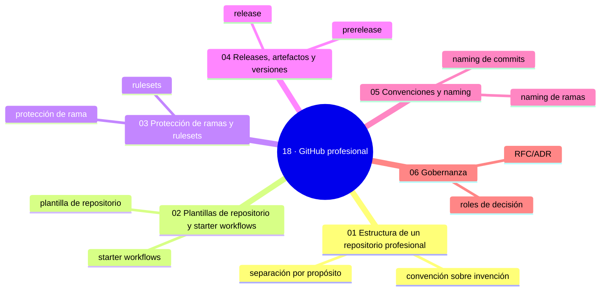

# 18 — GitHub profesional

## Bienvenido a esta sección

Un repositorio profesional es mucho más que `código + commits`. Es código + documentación + colaboración + pruebas + automatización + seguridad + gobierno — ensamblados con intención.

En esta sección juntamos las piezas dispersas en un solo sistema: la estructura que hace legible el repo, las plantillas que lo hacen nacer bien, las protecciones que hacen cumplir la política, las releases que publican con precisión, las convenciones que ahorran discusiones y la gobernanza que lo mantiene vivo.

## En esta sección estudiarás

* estructura de carpetas y contratos de un repo profesional;
* plantillas de repositorio, starter workflows y plantillas de org;
* protección de ramas y rulesets (política ejecutada);
* releases con artefactos, prereleases e inmutabilidad;
* convenciones de naming verificables (ramas, commits, archivos, workflows);
* gobernanza: roles de decisión, RFC/ADR, auditoría y revisiones.

## Objetivos de aprendizaje

Al terminar esta sección serás capaz de:

* diseñar la estructura de carpetas con contratos para un repositorio profesional;
* crear plantillas de repositorio y starter workflows para nacer bien y repetir;
* configurar protección de ramas y rulesets que ejecutan la política;
* publicar releases con artefactos, prereleases e inmutabilidad;
* aplicar convenciones de naming verificables a ramas, commits y workflows.
## Mapa conceptual

---

## ¿Qué aprenderás en esta sección?

1. [`01-estructura-de-un-repositorio-profesional.md`](01-estructura-de-un-repositorio-profesional.md) — mapa de carpetas y contratos.
2. [`02-plantillas-de-repositorio-y-starter-workflows.md`](02-plantillas-de-repositorio-y-starter-workflows.md) — nacer bien y repetir sin divergir.
3. [`03-proteccion-de-ramas-y-rulesets.md`](03-proteccion-de-ramas-y-rulesets.md) — la política que la plataforma ejecuta.
4. [`04-releases-artefactos-y-versiones.md`](04-releases-artefactos-y-versiones.md) — publicar con tag, notas y artefactos.
5. [`05-convenciones-y-naming.md`](05-convenciones-y-naming.md) — acordar una vez, verificar siempre.
6. [`06-gobernanza.md`](06-gobernanza.md) — quién decide, qué se registra y cuándo se audita.

## Cómo estudiar esta sección

Esta sección es de ensamblaje: aplica cada capítulo a un repositorio real (preferiblemente uno que vayas a mantener) y termina con un inventario: estructura ✔, plantilla ✔, protección ✔, releases ✔, convenciones ✔, gobernanza ✔. Ese inventario es el «acta de nacimiento» de un repo profesional.

## Referencias

* GitHub — Documentación oficial: «Branch protection rules», «About rulesets», «About releases».
* The 12-Factor App (12factor.net) — estructura y configuración.
* CONTRIBUTING.md de este repositorio como ejemplo de gobernanza aplicada.

---

## Checkpoint 18 — Comprobación obligatoria

Antes de avanzar a `19-github-actions/`, demuestra que puedes (en un repositorio de práctica real):

1. **Crear** una regla de protección de rama que requiera revisiones de pull request.
2. **Configurar** un ruleset que implique la línea de base de protección.
3. **Publicar** una release con artefactos y notas de versión.
4. **Aplicar** convenciones de naming verificables a ramas y commits.
5. **Definir** roles de decisión y un proceso de cambio RFC/ADR.
6. **Realizar** una auditoría de gobernanza básica revisando el CONTRIBUTING y SECURITY.

Si puedes hacerlo **sin mirar instrucciones**, el checkpoint está cerrado.

## Autopreguntas de cierre

Sin mirar el material, responde mentalmente y luego compruébalo con los capítulos de la sección:

1. ¿Qué garantiza una protección de ramas que «estamos de acuerdo en hacer X» no garantiza?
2. ¿Qué diferencia hay entre una release y una prerelease?
3. ¿Por qué debe ser inmutable una release publicada?
4. ¿Qué es un RFC y cuándo se prefiere frente a un ADR?
5. ¿Cómo afecta la protección de ramas a la colaboración en un equipo grande cuando se configura incorrectamente?
6. ¿Qué consecuencias tendría publicar una release prerelease como versión estable por error?
7. ¿Por qué es importante que las convenciones de naming sean verificables mediante CI plutôt que solo documentadas?

---

## Próximo paso

Cuando termines los seis capítulos, continúa con la siguiente sección:

[`../19-github-actions/`](../19-github-actions/)
