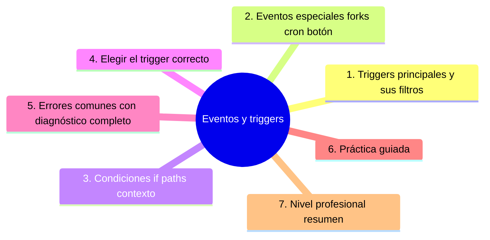

# Eventos y triggers

## Introducción

Un workflow que corre en cada push de todo es ruido y dinero. Un workflow que corre exactamente cuando debe — PR, integración, tag, horario, botón manual — es infraestructura con criterio.

Este capítulo detalla el sistema de eventos de GitHub Actions: los triggers principales, sus filtros, los eventos con matiz (PR de forks, schedules, releases) y cómo condicionar pasos y jobs con `if`.

---

## Mapa conceptual de este capítulo



---

## 1. Triggers principales y sus filtros

```text
EVENTO             CUÁNDO                USO TÍPICO
──────────────────────────────────────────────────────
pull_request       PR abierto/sincronizado CI de revisión
                   (opened, synchronize…)
push               commit a rama          CI post-merge,
                                          verificación en
                                          rama
workflow_dispatch  botón manual           lanzar a demanda
schedule (cron)    horario                 tareas diarias
release            publicación de release  build/notas
workflow_call      otro workflow lo llama  reutilización
```

```yaml
on:
  pull_request:
    branches: [main]          # PR hacia main
    paths:                    # solo si toca esto
      - 'src/**'
      - 'package.json'
  push:
    branches: [main]
    tags: ['v*']              # solo tags de versión
  workflow_dispatch:          # botón «Run workflow»
    inputs:
      entorno:
        description: 'Entorno'
        required: true
        default: 'staging'
        type: choice
        options: [staging, produccion]
```

```text
FILTROS COMUNES:
   │
   ├── branches / branches-ignore
   ├── paths / paths-ignore    ← ahorro enorme
   └── types: (apertura, cierre, sincronización de
       PR…)
```

```text
   │
   ├── `pull_request` ejecuta en el contexto del PR
   │   (código del fork con token restringido — cap.
   │   05)
   │
   └── `push` es post-integración: el lugar del
       build de main y de los tags
```

---

## 2. Eventos especiales (forks, cron, botón)

```text
FORKS (pull_request de repositorio externo)
   │
   ├── el código del fork se prueba con permisos
   │   mínimos y SIN secretos (por diseño — cap. 05)
   │
   ├── para validar con secretos: el flujo de dos
   │   etapas con `pull_request_target` es riesgoso si
   │   se hace mal → cap. 05 (no lo abras aquí)
   │
   └── política: los PR de forks reciben CI pública
       sin privilegios
```

```text
SCHEDULE (cron)
   │
   ├── ej. diario a las 3:00:
   │   schedule: [ cron: '0 3 * * *' ]
   │
   ├── usos: dependencias, escaneos, informes
   │
   └── advertencias: el horario NO es garantía (puede
       retrasarse en horarios congestionados — revisar
       docs actuales); no sirve para SLAs duros
```

```text
WORKFLOW_DISPATCH (botón)
   │
   ├── despliegues manuales con inputs (entorno,
   │   versión)
   │
   ├── la forma profesional de «deploy a mano»: con
   │   registro y parámetros, no con script suelto
   │
   └── permisos y confirmation (mención: protección
       por environment — cap. 04/05)
```

```text
RELEASE / TAGS
   │
   ├── build de release cuando se publica (sección
   │   18 cap. 04)
   └── on: push: tags: ['v*'] o on: release
```

---

## 3. Condiciones: if, paths, contexto

```yaml
jobs:
  deploy:
    if: github.event_name == 'workflow_dispatch'   # solo
                                                    # botón
    runs-on: ubuntu-latest
    steps:
      - uses: actions/checkout@v4
        if: runner.os == 'Linux'        # condición de
                                         # step
      - name: Solo en main
        if: github.ref == 'refs/heads/main'
        run: echo "estamos en main"
```

```text
CONTEXTOS ÚTILES (expresiones con ${{ }}):
   │
   ├── github.event_name   → qué disparó
   ├── github.ref          → rama/tag
   ├── github.head_ref     → rama del PR
   ├── github.event.pull_request.*  → datos del PR
   ├── needs.<job>.result  → estado de otro job
   └── matrix.*            → valores de matriz (cap.
       03)
```

```text
COMBINACIONES FRECUENTES:
   │
   ├── CI en PR + deploy solo en push a main
   ├── test rápido siempre; e2e en main/schedule
   └── job condicionado a que el PR sea de un repo
       determinado (sección 29: hotfix)
```

```text
   │
   └── `if` en JOB decide si se crea; `if` en STEP
       decide si se ejecuta — usa el nivel adecuado
       (evita jobs fantasma que «se saltan» todo)
```

---

## 4. Elegir el trigger correcto

```text
ÁRBOL RÁPIDO
──────────────────────────────────────────────────────
¿El código cambia en un PR?
  → pull_request  (+ paths si el repo es grande)

¿Entró a main?
  → push a main   (CI post-merge, deploy si aplica)

¿Se publicó versión?
  → release / tags v*

¿Hay que lanzarlo a mano?
  → workflow_dispatch (con inputs)

¿Es periódico (limpieza, escaneo)?
  → schedule

¿Otro workflow lo reutiliza?
  → workflow_call
```

```text
   │
   ├── en repos grandes: SIEMPRE evalúa `paths` —
   │   correr e2e por tocar un README es derroche
   │
   └── si dudas entre dos: imagina la ejecución
       «fantasma» que produces y pregúntate si
       alguien la entenderá en los logs
```

---

## 5. Errores comunes con diagnóstico completo

### Error 1: CI en cada push de cada rama (sin filtro)

**Qué ocurrió:** 12 ejecuciones por PR (por cada commit) y más en ramas viejas; presupuesto y ruido.

**Por qué:** `on: push` sin ramas/paths.

**Cómo comprobarlo:** pestaña Actions: conteo de ejecuciones.

**Opciones:** limitar `push` a main; PRs con `pull_request`; añadir paths.

**Riesgos:** costo y colas (las ejecuciones compiten).

**Solución:** trigger por evento con filtro (punto 1).

**Cómo se evita:** plantilla con triggers mínimos.

---

### Error 2: el workflow no corre «aunque el evento pasa»

**Qué ocurrió:** push a main sin ejecución; o PR sin check.

**Por qué posibles:**
* `branches`/`paths` excluyen tu caso;
* workflow en rama no mergeada (los triggers `push` viven en la rama de la config);
* `[skip ci]` en el mensaje de commit.

**Cómo comprobarlo:** leer `on:` contra lo que hiciste; mensaje del commit.

**Opciones:** corregir filtros; entender que la config de Actions vigente es la de la rama de destino en PRs.

**Riesgos:** falsa sensación de verificación.

**Solución:** prueba deliberada: PR que debe mostrar check (sección 19 cap. 01).

**Cómo se evita:** checklist: «¿trigger cubre el caso?».

---

### Error 3: schedule que no «cobra» (o no dispara)

**Qué ocurrió:** el cron diario no aparece, o aparece con retraso.

**Por qué posibles:**
* sintaxis cron mal escrita;
* repos inactivos con ejecuciones programadas suspendidas (revisar docs actuales);
* congestión de horario (los schedules se retrasan).

**Cómo comprobarlo:** historial de ejecuciones del workflow; parser de cron.

**Opciones:** corregir cron; elegir horario poco congestionado; no depender de cron para SLAs.

**Riesgos:** tareas críticas «olvidadas» (escaneos sin ejecutar).

**Solución:** schedule + verificación de que corrió (alerta si no).

**Cómo se evita:** revisar ejecuciones programadas en la revisión trimestral.

---

### Error 4: `workflow_dispatch` sin inputs ni registro

**Qué ocurrió:** botón que dispara algo mágico; nadie sabe qué hizo ni con qué parámetros.

**Por qué:** se creó el botón y nada más.

**Cómo comprobarlo:** workflow: ¿inputs? ¿logs claros?

**Opciones:** añadir inputs con defaults y description; `concurrency` (cap. 06) para evitar dobles.

**Riesgos:** despliegues manuales indistinguibles.

**Solución:** dispatch = parámetros + registro (punto 2).

**Cómo se evita:** checklist de workflow manual.

---

### Error 5: deploy en pull_request (¡al entorno equivocado!)

**Qué ocurrió:** un PR desplegó a staging/prod porque el job no distinguía el evento.

**Por qué:** un solo workflow con `on: [push, pull_request]` y deploy sin `if`.

**Cómo comprobarlo:** ejecución del PR: ¿corrió deploy?

**Opciones:** separar jobs con `if` (deploy solo `push` a main o `workflow_dispatch`); revisar entornos (cap. 04).

**Riesgos:** entornos manipulados por PRs de prueba (y de forks: cap. 05).

**Solución:** condición explícita de entorno (punto 3).

**Cómo se evita:** regla: «deploy exige evento verificado + environment».

---

### Error 6: paths olvidados (workflow que no cubre lo nuevo)

**Qué ocurrió:** cambiaste `infra/` y el workflow con `paths: src/**` no corrió.

**Por qué:** filtro desactualizado al crecer el repo.

**Cómo comprobarlo:** comparar paths del trigger con la estructura actual (sección 18 cap. 01).

**Opciones:** actualizar paths (o quitarlos si el repo ya es acotado).

**Riesgos:** huecos de verificación silenciosos.

**Solución:** paths = parte de la estructura; revisar al reorganizar.

**Cómo se evita:** PR de estructura toca también workflows.

---

## 6. Práctica guiada

### Objetivo

Montar un conjunto de triggers correctos: CI en PR, post-merge en main, dispatch con inputs y un cron.

### Paso 1: CI con filtros

```yaml
on:
  pull_request:
    branches: [main]
    paths: ['src/**', 'tests/**', 'package.json', '.github/workflows/**']
  push:
    branches: [main]
```

### Paso 2: dispatch con input

```yaml
  workflow_dispatch:
    inputs:
      nivel:
        description: 'Nivel de prueba'
        required: true
        default: 'rapido'
        type: choice
        options: [rapido, completo]
```

```yaml
jobs:
  pruebas:
    if: github.event_name == 'workflow_dispatch' || github.event_name == 'pull_request'
    runs-on: ubuntu-latest
    steps:
      - uses: actions/checkout@v4
      - run: echo "nivel: ${{ inputs.nivel || 'rapido' }}"
```

### Paso 3: cron de higiene

```yaml
on:
  schedule:
    - cron: '0 4 * * 1'   # lunes 04:00 UTC
```

1. Crea un workflow `higiene.yml` que haga algo simple (p. ej. `ls -la`) y observa su ejecución (puede tardar en aparecer: congestión).

### Paso 4: prueba negativa

1. Cambia algo fuera de `paths` (p. ej. un `.md` en raíz) en un PR: la CI **no** debe correr.
2. Cambia en `src/**`: debe correr.

### Paso 5: registro

1. Escribe en CONTRIBUTING qué corre en cada evento (tabla del punto 4).

### Resultado esperado

Triggers cubriendo PR/main/dispatch/cron con prueba de que `paths` filtra.

### Conclusión esperada

Cada ejecución debe ser explicable en una frase: qué evento, qué filtro, qué objetivo — el resto es ruido pagado.

---

### Ejercicio de transferencia

En un proyecto de despliegue de aplicaciones web, diseña un conjunto de triggers que ejecuten pruebas de unidad en PRs, pruebas de integración en push a main, y despliegues automáticos solo cuando se cree un tag de versión, usando filtros de paths para limitar la ejecución a cambios en el directorio de la aplicación.

## 7. Nivel profesional + resumen

### 7.1. Estrategia de disparo

```text
   │
   ├── presupuesto de CI: qué corre en PR (rápido y
   │   barato) vs. qué corre en main/schedule (completo)
   │
   ├── paths en repos grandes; matrix solo donde
   │   aporte (cap. 03)
   │
   ├── dispatch + environment con aprobación para
   │   despliegues (cap. 04)
   │
   ├── schedules con verificación de que corrieron
   │
   └── métrica: ejecuciones por día y minutos gastados
       (visibilidad del coste)
```

### 7.2. Resumen

En este capítulo aprendiste que:

* los triggers principales: `pull_request` (revisión), `push` (integración), `workflow_dispatch` (manual), `schedule` (periódico), `release`/tags y `workflow_call`;
* los filtros (`branches`, `paths`, `types`) ahorran ejecuciones y ruido;
* `if` y contextos (`${{ … }}`) condicionan jobs y steps; el deploy exige evento verificado;
* los eventos especiales: forks con permisos mínimos, cron con holgura, dispatch con inputs y registro;
* los errores típicos (CI a todo costo, trigger que no cubre, cron fantasma, dispatch mágico, deploy en PR, paths obsoletos) se previenen con diseño de disparo;
* a nivel profesional: presupuesto de CI y métrica de ejecuciones.

La idea principal es:

> **Dispara cuando haga falta y nada más: cada ejecución debe tener una razón legible — el filtro que no escribiste hoy es el costo que pagarás mañana.**

---

## Autopreguntas de cierre

Sin mirar el material, responde mentalmente y luego compruébalo con este capítulo:

1. ¿Por qué es importante limitar los triggers con filtros como `paths` y `branches` en repositorios grandes?
2. ¿Cómo difiere el comportamiento de `pull_request` y `push` en cuanto al contexto de ejecución y acceso a secretos?
3. ¿Qué ventajas ofrece usar `workflow_dispatch` con inputs y registro frente a un botón sin parámetros?
4. ¿Cómo afecta la combinación de `schedule` y la congestión de horario a la fiabilidad de tareas periódicas y qué alternativas existen?
5. ¿De qué manera el árbol rápido ayuda a seleccionar el trigger adecuado según el cambio de código y el objetivo del workflow?
6. ¿Por qué es necesario separar los jobs de deploy en PRs usando condicionales `if` y qué riesgos implica omitir esta separación?

## Próximo paso

Ya decides cuándo corre la máquina.

El siguiente paso: cómo se organiza lo que hace — jobs, matrices y artefactos.

Continúa con:

[`03-jobs-steps-y-ejecucion.md`](03-jobs-steps-y-ejecucion.md)
