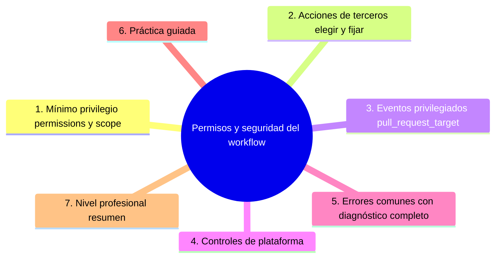

# Permisos y seguridad del workflow

## Introducción

Un workflow es código que se ejecuta con un token, acceso a tu repo y — si se diseña mal — puente hacia tus secretos. GitHub Actions tiene superficie de ataque propia: acciones de terceros sin fijar, eventos con más privilegio que código externo y tokens con permisos heredados.

Este capítulo enseña a endurecer los workflows: mínimo privilegio real, patrones peligrosos de eventos (`pull_request_target`), elección segura de acciones y los controles que conviene activar en la plataforma.

---

## Mapa conceptual de este capítulo



---

## 1. Mínimo privilegio: permissions y scope

```yaml
# por workflow (lo ideal: explícito siempre)
permissions:
  contents: read
```

```yaml
# por job (refinar más)
jobs:
  test:
    permissions:
      contents: read
  publicar-release:
    permissions:
      contents: write
```

```text
QUÉ CONTROLA:
   │
   ├── el PODER del GITHUB_TOKEN de la ejecución
   │   (issues, contents, packages, pull-requests…)
   │
   └── por defecto: si no lo pones, hereda la
       configuración del repo/org (puede ser amplia)
       → declara SIEMPRE
```

```text
REGLAS:
   │
   ├── read por defecto; write solo donde se suba o
   │   publique algo
   │
   ├── el `id-token: write` solo si usas OIDC
   │   (mención: publicación sin secretos de largo
   │   plazo — sección 22)
   │
   └── separar jobs: el de test no necesita write
```

```text
TAMBIÉN EN LA PLATAFORMA:
   │
   ├── Settings → Actions → Workflow permissions:
   │   «lectura y escritura» vs «solo lectura» por
   │   defecto
   │
   └── la política por defecto + declarations por
       workflow = dos capas
```

---

## 2. Acciones de terceros: elegir y fijar

```yaml
# ✗ arriesgado
- uses: alguien/accion-util@main          # rama móvil
- uses: alguien/accion-util@v1            # tag que
                                           # pueden
                                           # mover

# ✓ mejor
- uses: actions/checkout@v4               # oficial,
                                           # tag mayor
- uses: alguien/accion-util@<sha-completo> # fijado a
                                           # commit
```

```text
CRITERIO DE ELECCIÓN:
   │
   ├── preferir oficiales (actions/…)
   │
   ├── tercero: mantenido, con releases, licencia
   │   clara, mínimo de privilegios que pide
   │
   └── auditar: ¿qué hace? ¿qué inputs acepta? ¿pide
       secrets que no necesitas?
```

```text
FIJADO (pinning):
   │
   ├── SHA = inmutable (máxima seguridad)
   │
   ├── Dependabot puede renovar las versions de
   │   actions (dependabot.yml con ecosystem
   │   github-actions — sección 20)
   │
   └── el equilibrio práctico: oficiales por tag
       mayor; terceros por SHA con renovación
       automatizada
```

---

## 3. Eventos privilegiados: pull_request_target

```text
EL PROBLEMA:
   │
   ├── `pull_request` de un FORK corre con el código
   │   del forqueado y SIN secretos (seguro por
   │   diseño)
   │
   └── `pull_request_target` corre en el CONTEXTO de
       la rama base (con secretos y permisos) —
       diseñado para workflows de PR como etiquetado
       o comentarios, NO para ejecutar el código del
       PR
```

```text
PELIGRO CLÁSICO:
   │
   ├── workflow en `pull_request_target` que hace
   │   checkout del código del PR y lo ejecuta
   │   → ejecución de código externo CON tus
   │     secretos y token
   │
   └── esto ha sido explotado en proyectos reales
       (patrón conocido: «pwn request»)
```

```text
REGLAS SEGURAS:
   │
   ├── 1. si necesitas ejecutar el código del PR con
   │   privilegios → NO uses pull_request_target
   │   (busca flujos de dos etapas / aprobación
   │   manual)
   │
   ├── 2. si usas pull_request_target: jamás ejecutes
   │   artefactos del PR; solo operaciones de API
   │   (etiquetar, comentar) sobre el evento
   │
   └── 3. si dudas, escribe la pregunta: «¿este
       workflow puede tocar mis secretos con código
       que no revisé?»
```

```yaml
# patrón razonable de pull_request_target:
on: pull_request_target
permissions:
  pull-requests: write
  issues: write
jobs:
  etiqueta:
    runs-on: ubuntu-latest
    steps:
      - run: gh pr edit ... --add-label revisado
        # solo API; NO checkout ni build del PR
```

---

## 4. Controles de plataforma

```text
A AJUSTAR (Settings / org):
   │
   ├── Actions habilitado solo donde hace falta
   ├── Workflow permissions: default de solo lectura
   ├── Aprobación de workflows para PRs de forks
   │   (si está disponible en tu plan: los workflows
   │   nuevos de forks esperan aprobación)
   ├── Permitir/denegar actions específicas (lista
   │   de permitidas — según plan/config)
   ├── secret scanning + push protection (sección 20)
   └── artifact retention limitada (no retener
       indefinidamente)
```

```text
REVISIÓN DE WORKFLOWS (checklist):
   │
   ├── [ ] permissions explícitas
   ├── [ ] actions fijadas (SHA/tag mayor oficial)
   ├── [ ] sin checkout+exec en eventos privilegiados
   ├── [ ] secretos solo por env, por environment
   ├── [ ] deploy con environment + reviewers
   └── [ ] artefactos sin datos sensibles
```

```bash
# inventario rápido de workflows:
ls .github/workflows/
grep -r "uses:" .github/workflows/   # ¿terceros? ¿fijados?
grep -r "permissions:" .github/workflows/
grep -r "pull_request_target" .github/workflows/
```

---

## 5. Errores comunes con diagnóstico completo

### Error 1: permissions ausentes (herencia amplia)

**Qué ocurrió:** el workflow podía escribir en el repo y en issues sin necesitarlo.

**Por qué:** no se declaró `permissions:`.

**Cómo comprobarlo:** grep en workflows; settings de workflow permissions.

**Opciones:** declarar mínimo por workflow/job; bajar el default del repo a read.

**Riesgos:** blast radius si un step se compromete.

**Solución:** explícito siempre (punto 1).

**Cómo se evita:** plantilla con `permissions: contents: read`.

---

### Error 2: acción de terceros sin fijar

**Qué ocurrió:** `@main` de un repo que fue compromised → código ajeno en tu CI con tu token.

**Por qué:** comodidad (o plantilla vieja).

**Cómo comprobarlo:** grep de `uses:` con tags móviles.

**Opciones:** fijar SHA; verificar historial de la acción; habilitar renovación vía Dependabot.

**Riesgos:** supply chain (sección 20/24).

**Solución:** pin + renovación controlada (punto 2).

**Cómo se evita:** revisión de workflows y regla del equipo.

---

### Error 3: ejecutar código del PR con privilegios

**Qué ocurrió:** `pull_request_target` + `checkout` del PR + `run` → un fork ejecutó lo suyo con secretos.

**Por qué:** se copió un workflow «de etiquetado» y se le añadió build.

**Cómo comprobarlo:** grep de `pull_request_target` y steps de ejecución.

**Opciones:** separar: validación en `pull_request` (sin privilegios) y trabajo de API en `pull_request_target` sin ejecutar código ajeno.

**Riesgos:** robo de secretos / conmutación de repos.

**Solución:** reglas del punto 3.

**Cómo se evita:** checklist explícita en la revisión de workflows.

---

### Error 4: workflow de forks que espera secretos

**Qué ocurrió:** PR de un colaborador externo falla porque `secrets.X` no existe (o no debería).

**Por qué:** diseño de seguridad de la plataforma: forks no reciben secretos (en `pull_request`).

**Cómo comprobarlo:** ejecución del PR: «secret not found» o steps saltados.

**Opciones:** hacer que el flujo funcione sin secretos en PR externos (o con aprobación de workflow si tu plan la ofrece); reservar secretos para push a main/entornos.

**Riesgos:** CI que «solo funciona para insiders» sin que nadie lo entienda.

**Solución:** diseñar el flujo asumiendo este límite (punto 3).

**Cómo se evita:** documentar «qué corren los PRs de forks».

---

### Error 5: secretos en artefactos o cachés compartidos

**Qué ocurció:** un artifact o caché contenía un archivo con token (o config de entorno).

**Por qué:** `path` amplio o scripts que escriben env a ficheros.

**Cómo comprobarlo:** inspeccionar artefactos; scripts con `env > archivo`.

**Opciones:** restringir paths; regenerar cachés afectadas; rotar si hubo exposición.

**Riesgos:** credencial descargable por quien accede al artefacto.

**Solución:** los artefactos son públicos dentro de tu org: trátalos como código (punto 4).

**Cómo se evita:** checklist de artefactos.

---

### Error 6: sin revisión de workflows al cambiar la seguridad

**Qué ocurrió:** un workflow añadido hace un año no se mira en las revisiones de seguridad (que solo miran secretos y dependencias).

**Por qué:** el workflow no está en el inventario de gobernanza.

**Cómo comprobarlo:** ¿existe checklist de workflows? ¿frecuencia?

**Opciones:** añadir `.github/workflows/` a la revisión trimestral (sección 18 cap. 06); grep de patrones peligrosos (punto 4).

**Riesgos:** superficie que crece sin vigilancia.

**Solución:** workflows = código con dueño y revisión.

**Cómo se evita:** métrica: nº de workflows y terceros usados.

---

## 6. Práctica guiada

### Objetivo

Endurecer un set de workflows: permissions, fijado de acciones y análisis de eventos.

### Paso 1: inventario

```bash
grep -rn "uses:" .github/workflows/
grep -rn "permissions:" .github/workflows/
grep -rn "pull_request_target" .github/workflows/
```

1. Anota: ¿terceros? ¿sin fijar? ¿permissions ausentes?

### Paso 2: permissions

```yaml
# en cada workflow, lo mínimo:
permissions:
  contents: read
# y refinar por job donde haga falta write
```

1. Baja el default del repo a «lectura» si no lo está.

### Paso 3: fija acciones

```text
   │
   ├── oficiales: tag mayor (v4/v5)
   └── terceros: SHA (busca la release y fija)
Añade dependabot.yml con:
   package-ecosystem: github-actions
   directory: /
   schedule: semanal
```

### Paso 4: audita eventos

```text
Si tienes pull_request_target:
   │
   ├── ¿ejecuta código del PR? → SÍ: parar y rediseñar
   └── ¿solo API (etiquetar/comentar)? → permissions
       mínimas de PR/issues
```

### Paso 5: simulación de fork (si aplica)

1. Abre un PR desde un fork (o simula): comprueba que no recibe secretos y que el workflow de validación sigue verde sin ellos.

### Paso 6: checklist en gobernanza

1. Añade la checklist del punto 4 a tu revisión trimestral (sección 18 cap. 06).

### Resultado esperado

Workflows con permissions explícitas, acciones fijadas, patrones peligrosos auditados y checklist en la revisión.

### Conclusión esperada

La seguridad de Actions es mínimo privilegio + eventos conscientes + supply chain fijado — y se revisa con el resto de gobernanza.

---

### Ejercicio de transferencia

En un proyecto de desarrollo de una API que despliega en Kubernetes, crea un workflow que utilice permisos mínimos, fixe todas las acciones de terceros a sus SHA, y revise que no haya uso de `pull_request_target` para ejecutar código externo.

## 7. Nivel profesional + resumen

### 7.1. Endurecimiento a escala

```text
   │
   ├── default de solo lectura en org/repo +
   │   declaraciones por workflow
   │
   ├── lista de actions permitidas / pin + Dependabot
   │   renovando SHAs
   │
   ├── aprobación de workflows de forks (si el plan
   │   lo ofrece)
   │
   ├── OIDC para credenciales de despliegue de corta
   │   vida (evita secretos largos — mención,
   │   sección 22)
   │
   ├── artefactos con retención corta y paths
   │   mínimos
   │
   └── auditoría: grep de patrones + revisión
       trimestral (sección 20/24)
```

### 7.2. Resumen

En este capítulo aprendiste que:

* `permissions` gobierna el GITHUB_TOKEN: explícito, mínimo, por workflow/job; el default del repo también importa;
* las acciones de terceros se eligen con criterio y se fijan (SHA o tag mayor oficial) con renovación controlada;
* `pull_request_target` es para API sobre el PR, nunca para ejecutar su código con secretos;
* los controles de plataforma (workflow permissions, aprobación de forks, retención) complementan;
* los errores típicos (permissions heredadas, acciones móviles, pwn request, forks sin secretos, secretos en artefactos, workflows sin revisar) se previenen con checklist;
* a nivel profesional: endurecimiento por defecto y OIDC para deploys.

La idea principal es:

> **Un workflow solo debe poder lo que ejecuta: token mínimo, eventos sin privilegios sobre código ajeno y actions fijadas — la comodidad no compra credenciales.**

---

## Autopreguntas de cierre

Sin mirar el material, responde mentalmente y luego compruébalo con este capítulo:

1. ¿Por qué es esencial declarar explícitamente los permisos en un workflow y qué riesgos implica heredar la configuración del repo/org?
2. ¿Cuál es la diferencia entre usar una acción de terceros con un tag móvil y fijarla a un SHA específico, y cómo afecta eso a la seguridad de la cadena de suministro?
3. ¿En qué consiste el peligro de usar `pull_request_target` para ejecutar código del PR y qué alternativas seguras existen para validar PRs sin exponer secretos?
4. ¿Qué controles de plataforma se recomiendan activar para limitar la superficie de ataque de GitHub Actions y cómo afectan cada uno a la seguridad?
5. ¿Cómo influye la separación de jobs en términos de permisos y por qué es importante que un job de test no tenga permisos de escritura?
6. ¿Qué riesgos existen al usar acciones de terceros sin fijar y cómo se puede mitigar con Dependabot y revisiones de seguridad?

## Próximo paso

Ya endureces tus automatizaciones.

El último capítulo de la sección: hacerlas fiables — debugging, rendimiento y buenas prácticas.

Continúa con:

[`06-debugging-y-buenas-practicas.md`](06-debugging-y-buenas-practicas.md)
