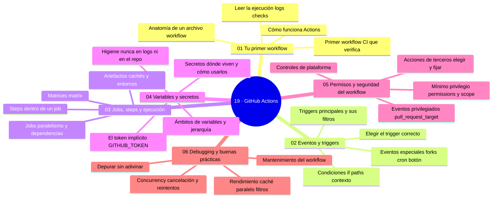

# 19 — GitHub Actions

## Bienvenido a esta sección

La automatización es lo que separa un repositorio que depende de la memoria del equipo de uno que verifica, construye y publica solo. GitHub Actions es el motor de GitHub: eventos que disparan workflows, jobs en runners, artefactos, matrices, secretos y permisos.

En esta sección aprenderás a leer y escribir automatización de verdad: la anatomía de un workflow, los disparadores correctos, la organización de la ejecución, el manejo seguro de datos y credenciales, la seguridad de la propia automatización y el oficio de depurar y mantenerla.

## En esta sección estudiarás

* el modelo evento → workflow → job → step → runner y tu primer CI;
* triggers: push, pull_request, schedule, dispatch, filtros y condiciones;
* jobs en paralelo, dependencias, matrices, artefactos, cachés y environments;
* variables vs. secretos, ámbitos, `GITHUB_TOKEN` e higiene de logs;
* permisos mínimos, acciones fijadas y los peligros de `pull_request_target`;
* debugging sin adivinar, rendimiento, concurrency y mantenimiento.

## Objetivos de aprendizaje

Al terminar esta sección serás capaz de:

* leer y escribir un workflow completo: evento → job → step → runner;
* elegir el disparador correcto (`push`, `pull_request`, `schedule`, `dispatch`) con filtros y condiciones;
* organizar la ejecución con dependencias (`needs`), matrices, artefactos y cachés;
* gestionar variables y secretos con ámbitos mínimos e higiene de logs;
* segurar la propia automatización: permisos mínimos, acciones fijadas y el riesgo de `pull_request_target`;
* depurar un workflow fallido sin adivinar.

## Mapa conceptual

---

## ¿Qué aprenderás en esta sección?

1. [`01-primer-workflow.md`](01-primer-workflow.md) — anatomía y primer CI.
2. [`02-eventos-y-triggers.md`](02-eventos-y-triggers.md) — disparadores, filtros y condiciones.
3. [`03-jobs-steps-y-ejecucion.md`](03-jobs-steps-y-ejecucion.md) — grafo, matrices y artefactos.
4. [`04-variables-y-secretos.md`](04-variables-y-secretos.md) — datos seguros en CI.
5. [`05-permisos-y-seguridad-del-workflow.md`](05-permisos-y-seguridad-del-workflow.md) — mínimo privilegio y supply chain.
6. [`06-debugging-y-buenas-practicas.md`](06-debugging-y-buenas-practicas.md) — depurar, acelerar y mantener.

## Cómo estudiar esta sección

Todo se aprende en la pestaña Actions: crea, rompe, lee el log, repara. Cierra la sección con un CI real en tu proyecto que pase la checklist de seguridad (permissions, fijado, triggers) y con la tabla de workflows documentada — en la sección 22 la convertirás en despliegue.

## Referencias

* GitHub Actions — Documentación oficial (docs.github.com/actions).
* GitHub Security Lab — guía de seguridad para GitHub Actions.
* OWASP DevSecOps Guide (PDF gratuito).

---

## Checkpoint 19 — Comprobación obligatoria

Antes de avanzar a `../20-github-security/`, demuestra que puedes (en un repositorio de práctica real):

1. **Crear** un workflow básico con trigger push y pull_request que ejecute un step de humo.
2. **Configurar** permisos mínimos `contents: read` en un workflow.
3. **Utilizar** secrets mediante env en un step y verificar que no aparecen en logs.
4. **Aplicar** una matriz de versiones de Node.js para probar en múltiples versiones.
5. **Depurar** un workflow fallido examinando el log del step con name.
6. **Implementar** concurrency con cancel-in-progress para PRs.

Si puedes hacerlo **sin mirar instrucciones**, el checkpoint está cerrado.

## Autopreguntas de cierre

Sin mirar el material, responde mentalmente y luego compruébalo con los capítulos de la sección:

1. ¿Qué diferencia hay entre los triggers `push` y `pull_request`?
2. ¿Qué hace `needs:` entre dos jobs?
3. ¿Por qué es peligroso `pull_request_target` combinado con checkout del PR?
4. ¿Cómo diagnosticas un paso fallido sin re-ejecutar todo el workflow?
5. ¿Por qué es peligroso usar `pull_request_target` con checkout del código del PR y cómo mitigarlo?
6. ¿Cómo afecta la clave de caché basada en lockfile a la validez de las dependencias y qué ocurre si se usa una constante?

---

## Próximo paso

Cuando termines los seis capítulos, continúa con la siguiente sección:

[`../20-github-security/`](../20-github-security/)
