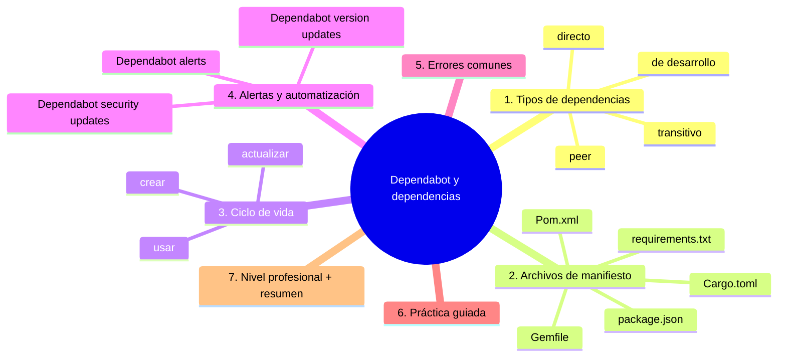
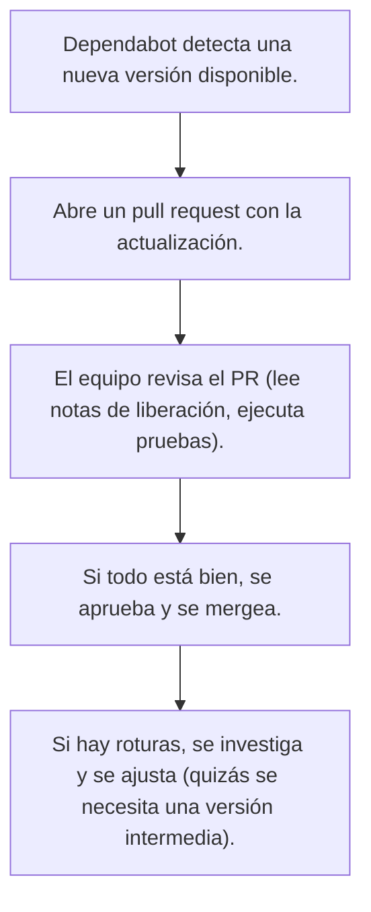

# Dependabot y dependencias

## Introducción

Casi ningún proyecto vive solo: importa bibliotecas, acciones de CI y herramientas. Cada dependencia es una decisión de confianza y una superficie de riesgo que cambia con el tiempo. Este capítulo cubre el ciclo de vida de dependencias en GitHub: alertas de vulnerabilidades, actualizaciones automáticas con Dependabot, versionado consciente y la relación entre dependencias, errores de compilación y cadena de suministro.

La regla fundamental: **las dependencias deben mantenerse actualizadas, pero siempre bajo control y revisión**.

---

## Mapa conceptual de este capítulo



---

## 1. Tipos de dependencias

```text
TIPO                 DESCRIPCIÓN                            EJEMPLOS
────────────────────────────────────────────────────────────────────
Directa              Bibliotecas que tu código importa      lodash, numpy
Transitiva           Dependencias de tus dependencias       paquetes internos de lodash
De desarrollo        Herramientas de testing, linting       jest, eslint, pytest
Peer                 Bibliotecas que esperan que el host las proporcione (plugins)
```

```text
¿POR QUÉ IMPORTANTE DISTINGUIRLOS?
- Las directas son las que tú eliges explícitamente.
- Las transitivas pueden introducir riesgos ocultos.
- Las de desarrollo no van al producto final, pero sí al flujo de CI.
- Las peer requieren que el proyecto consumidor las proporcione.
```

---

## 2. Archivos de manifiesto

```text
LENGUAJE      ARCHIVO               EJEMPLOS DE CONTENIDO
────────────────────────────────────────────────────────────────────
JavaScript    package.json          { "dependencies": { "lodash": "^4.17.21" } }
Python        requirements.txt      requests==2.28.1
Java          Pom.xml               <dependency><groupId>org.apache</groupId></dependency>
Ruby          Gemfile               gem 'rails', '~> 7.0.0'
Rust          Cargo.toml            [dependencies] serde = { version = "1.0" }
```

```text
BUenas PRÁCTICAS
- Usa versiones exactas (lockfiles) para builds reproducibles.
- Evita rangos amplios como "*" o "latest" en producción.
- Revisa los cambios en lockfiles al actualizar dependencias.
```

---

## 3. Ciclo de vida de una dependencia

```text
ETAPA              QUÉ HACE                              CÓMO SE GESTIONA
────────────────────────────────────────────────────────────────────────────
Crear              Añades la dependencia al manifiesto    npm install lodash@4.17.21
Usar               Tu código importa y usa la biblioteca   import _ from 'lodash'
Actualizar         Subes la versión y pruebas            npm update lodash
Monitorear         Recibes alertas de vulnerabilidad    Dependabot alert
Responder          Abres PR, revisas, pruebas, merges    Dependabot PR
```



---

## 4. Alertas y automatización con Dependabot

```text
TIPO DE ALERTA      QUÉ DETECTA                               ACCIÓN TÍPICA
────────────────────────────────────────────────────────────────────────────────
Security update     Vulnerabilidad conocida en la dependencia  Actualizar a versión parche
Version update      Nueva versión menor o mayor disponible    Actualizar según política
```

```text
CONFIGURACIÓN BÁSICA
- Archivo: .github/dependabot.yml
- Puedes definir:
  * paquetes a monitorizar
  * frecuencia de revisiones (diaria, semanal)
  * tipo de actualizaciones (security, version, ambos)
  * divisores por ecosistema (npm, pip, etc.)
```

```bash
# Ejemplo de .github/dependabot.yml
version: 2
updates:
  - package-ecosystem: "npm"
    directory: "/"
    schedule:
      interval: "daily"
    open-pull-requests-limit: 10
    allow:
      - dependency-type: "direct"
    assignees:
      - "dependabot[bot]"
  - package-ecosystem: "pip"
    directory: "/"
    schedule:
      interval: "weekly"
    open-pull-requests-limit: 5
```

---

## 5. Errores comunes con diagnóstico completo

### Error 1: Dependencia sin actualizar durante años

**Qué ocurrió:** una dependencia crítica tiene una vulnerabilidad conocida pero nunca se actualizó porque "funciona".

**Por qué posibles:** falta de monitoreo; miedo a romper algo.

**Cómo comprobarlo:** revisar alertas de Dependabot o ejecutar `npm audit` / `pip-audit`.

**Opciones:** actualizar a la última versión segura; si hay cambios rotundos, planear una migración.

**Riesgos:** explotación de la vulnerabilidad; pérdida de datos o servicio.

**Solución:** establecer un proceso de revisión regular (semanal o mensual) de alertas.

**Cómo se evita:** activar Dependabot alerts y version updates con asignación automática a un equipo.

### Error 2: Actualizar sin probar

**Qué ocurrió:** se actualizó una dependencia a una versión mayor que rompió la API y el deploy falló en producción.

**Por qué posibles:** confiar en que la versión menor es segura; no tener entorno de staging.

**Cómo comprobarlo:** revisar el PR de Dependabot y notar que falta evidencia de pruebas.

**Opciones:** siempre ejecutar la suite de pruebas en una rama de feature antes de mergear.

**Riesgos:** downtime; pérdida de confianza del usuario.

**Solución:** requerir que todo PR de Dependabot pase por el mismo flujo de CI que cualquier otro código.

**Cómo se evita:** proteger la rama principal con requerimientos de aprobación y checks verdes.

### Error 3: Ignorar las dependencias de desarrollo

**Qué ocurrió:** una vulnerabilidad en una herramienta de testing (ej. jest) se explotó porque nadie la monitoreaba.

**Por qué posibles:** creer que solo las dependencias de producción importan.

**Cómo comprobarlo:** revisar si Dependabot está configurado para monitorear `devDependencies` o `requirements-dev.txt`.

**Opciones:** añadir los archivos de desarrollo a la configuración de Dependabot.

**Riesgos:** compromiso del entorno de CI o de las máquinas de desarrolladores.

**Solución:** tratar las dependencias de desarrollo con la misma seriedad que las de producción.

### Error 4: Usar rangos de versión peligrosos

**Qué occurred:** se especificó `"lodash": "*"` y una actualización automática introdujo una versión mayor con cambios rotundos.

**Por qué posibles:** querer "siempre tener lo último" sin entender el impacto.

**Cómo comprobarlo:** revisar el manifiesto y ver rangos como `*` o `>`.

**Opciones:** cambiar a rangos cuidadosos como `^4.17.21` o `~4.17.0`.

**Riesgos:** ruptura inesperada del build o del comportamiento en tiempo de ejecución.

**Solución:** usar lockfiles y actualizaciones intencionales mediante Dependabot version updates.

**Cómo se evita:** educar al equipo sobre versionado semántico y el impacto de los rangos.

---

## 6. Práctica guiada

### Objetivo

Configurar Dependabot en un repositorio de práctica y simular una actualización de dependencia.

### Paso 1: explorar el manifiesto

```bash
# Revisa qué dependencias tienes
cat package.json   # o requirements.txt, Pom.xml, etc.
```

### Paso 2: crear el archivo de configuración

```bash
mkdir -p .github
cat > .github/dependabot.yml << 'EOF'
version: 2
updates:
  - package-ecosystem: "npm"
    directory: "/"
    schedule:
      interval: "weekly"
    open-pull-requests-limit: 5
    allow:
      - dependency-type: "direct"
    assignees:
      - "dependabot[bot]"
EOF
```

### Paso 3: esperar o forzar una alerta

```bash
# Si quieres forzar una alerta de seguridad, puedes añadir una dependencia vulnerable a propósito en un repo de prueba
# Ejemplo: añadir una versión antigua de lodash con CVE conocido
# Luego espera a que Dependabot la detecte (puede tomar unas horas)
```

### Paso 4: revisar el PR

1. Cuando Dependabot abra un PR, revisa la descripción (qué versión se actualiza, por qué).
2. Ejecuta las pruebas locales o en tu entorno de CI simulado.
3. Si todo está bien, aprueba y merges el PR.

### Resultado esperado

Un pull request de Dependabot que actualiza una dependencia, revisado y mergeado sin incidentes.

### Conclusión esperada

Dependabot automatiza el monitoreo y la actualización de dependencias, pero siempre requiere revisión humana antes de mergear.
### Ejercicio de transferencia
Configura Dependabot en un repositorio que use un manifiesto distinto al que usaste en la práctica guiada (por ejemplo, si usaste npm, ahora usa un proyecto Ruby con Gemfile). Entrega el archivo .github/dependabot.yml configurado y una captura de pantalla del PR generado por Dependabot.

---

## 7. Nivel profesional + resumen

### 7.1. Programa de gestión de dependencias

```text
    │
    ├── inventario de dependencias (manifestos + lockfiles)
    │   (actualizado en cada PR)
    │
    ├── Dependabot configurado para:
    │   * security updates: diarios
    │   * version updates: semanales
    │   * asignación automática a equipo de mantenimiento
    │
    ├── política de actualización:
    │   * security updates: merge automático si CI verde
    │   * version updates: revisión manual requerida
    │
    ├── bloqueo de merges si:
    │   * tests fallan
    │   * lockfiles cambiaron sin aprobación explícita
    │
    └── métricas:
    │   * tiempo medio de respuesta a alertas de seguridad
    │   * porcentaje de dependencias con versiones actualizadas
    │   * número de incidentes por dependencias desactualizadas
```

### 7.2. Resumen

En este capítulo aprendiste que:

* las dependencias son partes externas que tu proyecto consume y deben gestionarse con el mismo rigor que tu propio código.
* los tipos de dependencias (directa, transitiva, de desarrollo, peer) y sus archivos de manifiesto varían según el ecosistema.
* el ciclo de vida incluye crear, usar, actualizar y monitorear, con Dependabot como herramienta clave de automatización.
* los errores más comunes (dependencias sin actualizar, actualizar sin probar, ignorar dependencias de desarrollo, rangos peligrosos) se previenen con monitoreo, pruebas y políticas claras.
* a nivel profesional, un programa de gestión de dependencias combina inventario, automatizaciónDependabot, revisiones y métricas.

La idea principal es:

> **Automatiza el monitoreo, pero nunca automatiza la decisión: Dependabot te avisa, tú decides cuándo y cómo actualizar.**

---

## Autopreguntas de cierre

Sin mirar el material, responde mentalmente y luego compruébalo con este capítulo:

1. ¿Cuáles son los cuatro tipos principales de dependencias y un ejemplo de cada uno?
2. ¿Dónde viven las dependencias en un proyecto de JavaScript y de Python?
3. ¿Cuál es la diferencia entre una alerta de seguridad de Dependabot y una actualización de versión?
4. ¿Por qué es importante revisar los changelogs antes de mergear un PR de Dependabot?
5. ¿Cómo configurarías Dependabot para revisar dependencias de Python cada semana y crear como máximo três pull requests?
6. ¿Qué pasos seguirías si Dependabot te avisa de una vulnerabilidad crítica en una dependencia de producción?
7. ¿Por qué deberías tratar las dependencias de desarrollo con la misma seriedad que las de producción?
8. ¿Qué métricas serían útiles para evaluar la efectividad de tu programa de gestión de dependencias?

---

## Próximo paso

Cuando termines este capítulo, continúa con la defensa del código mismo: cómo analizarlo estáticamente para encontrar vulnerabilidades antes de que lleguen a producción.

[`04-code-scanning-y-codeql.md`](04-code-scanning-y-codeql.md)