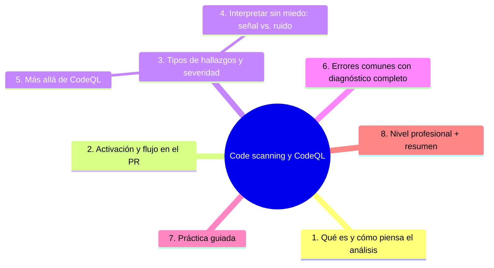
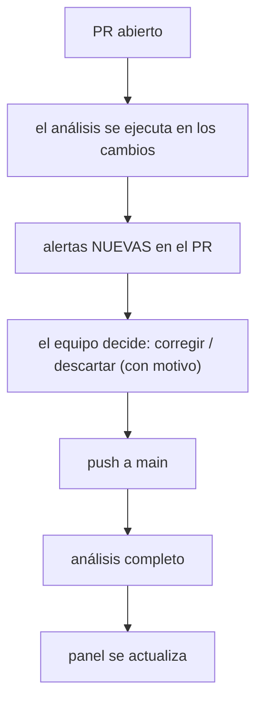

# Code scanning y CodeQL

## Introducción

Las dependencias se vigilan con alertas; tu propio código necesita algo equivalente. El análisis estático de código busca patrones peligrosos — inyección, rutas de acceso no controladas, uso de APIs inseguras — sin ejecutar el programa. En GitHub esto es **code scanning**, con el motor **CodeQL** como tecnología principal. Este capítulo explica el modelo, cómo se integra en el flujo de PR, cómo interpretar alertas sin caer en la parálisis y qué complementos existen.

---

## Mapa conceptual de este capítulo



---

## 1. Qué es y cómo piensa el análisis

```text
ANÁLISIS ESTÁTICO:
   │
   └── se lee el código (sin ejecutarlo) buscando
       flujos peligrosos: dato de origen → transformación
       → sumidero (SQL, shell, HTML, archivos…)
```

```text
CODEQL (modelo mental):
   │
   ├── el código se convierte en una BASE DE DATOS
   │   consultable
   │
   ├── queries escritas sobre conceptos del lenguaje
   │   (fuentes, sumideros, sanitizadores)
   │
   └── el resultado: alertas con ruta completa
       «aquí entra el dato → aquí se usa → por qué es
       riesgoso»
```

```text
LO QUE DETECTA (ejemplos, según lenguaje):
   │
   ├── inyección (SQL, comandos, rutas)
   ├── XSS / salida sin escapar
   ├── APIs criptográficas o de autenticación usadas
   │   mal
   ├── flujos no seguros de información
   └── errores comunes del lenguaje (NULL, recursos)
```

```text
   │
   └── NO sustituye: revisión humana (sección 15),
       pruebas (sección 09) ni sentido común — es otra
       capa
```

---

## 2. Activación y flujo en el PR

```text
CÓMO SE ACTIVA:
   │
   ├── pestaña de seguridad del repo → code scanning
   │   → setup (CodeQL o acción equivalente)
   │
   └── o workflow propio .github/workflows/codeql.yml
       con la acción oficial de CodeQL (fijada)
```



```text
SIN CRISTALIZACIÓN:
   │
   ├── lo nuevo en el PR es lo urgente (ahí duele
   │   corregir, barato)
   │
   └── el backlog de main se triaje (punto 4)
```

```yaml
# esquema del workflow (simplificado; usa la versión
# actual de la acción):
# on: { push: ramas main, pull_request }
# jobs:
#   analyze: steps con la acción oficial de CodeQL,
#            lenguajes del repo, fijada a versión
```

---

## 3. Tipos de hallazgos y severidad

```text
SEVERIDAD:
   │
   ├── error / security: atacable con impacto
   ├── warning: potencialmente peligroso
   └── note: higiene de código
```

```text
CATEGORÍAS TÍPICAS (ilustrativo):
   │
   ├── security-error: el camino explotable clásico
   ├── security-warning: depende de contexto/entrada
   └── deprecation/quality: no es seguridad — calidad
```

```text
RUTA DEL HALLAZGO:
   │
   ├── fuente (input, request, arg)
   ├── camino (transforms)
   └── sumidero (query, exec, render) — con
       TRAZA navegable en la plataforma
```

```text
   │
   └── entender la ruta es la mitad del triage: si la
       fuente no es alcanzable por un atacante, es
       candidata a «descartar con motivo»
```

---

## 4. Interpretar sin miedo: señal vs. ruido

```text
TRIAGE EN CUATRO PASOS:
   │
   ├── 1. leer la RUTA completa (no solo el título)
   ├── 2. ¿la fuente es real en mi app? (¿quién puede
   │       enviar eso?)
   ├── 3. ¿ya hay protección en el camino? (escapado,
   │       consultas parametrizadas) → puede ser falso
   │       positivo → descartar CON COMENTARIO
   └── 4. ¿real? → fix en el PR o ticket con dueño
```

```text
POLÍTICA DE RUIDO:
   │
   ├── descartar con motivo es trabajo válido (y se
   │   audita)
   │
   ├── si el mismo patrón se descarta 3 veces → mejora
   │   el detector (query propia/tuning) o el código
   │   base
   │
   └── «todo a naranja» = señal muerta (Error 4)
```

```text
FIX CLÁSICO (ejemplos conceptuales):
   │
   ├── SQL: consultas parametrizadas (nunca
   │   concatenar)
   ├── shell: lista blanca de argumentos, sin interpolar
   │   entradas
   └── render: escapar por defecto, marcar lo seguro
```

---

## 5. Más allá de CodeQL

```text
COMPLEMENTOS (categorías):
   │
   ├── análisis estático de estilo/lint con reglas de
   │   seguridad (eslint, ruff… — sección 06)
   │
   ├── secret scanning (cap. 02) — ya lo tienes
   │
   ├── dependencias (cap. 03) — idem
   │
   ├── escaneo de contenedores (si usas imágenes —
   │   mención; categorías de herramientas de
   │   vulnerabilidades de imagen)
   │
   └── pruebas de seguridad dinámicas: DAST (probar el
       sistema en marcha — nivel 23/24)
```

```text
   │
   └── el panel de seguridad del repo junta: secretos,
       dependencias, code scanning — una sola vista de
       la higiene (checklist de sección 18)
```

---

## 6. Errores comunes con diagnóstico completo

### Error 1: alertas de main nunca tocadas

**Qué ocurrió:** el análisis corre y muestra 40 alertas «históricas»; nadie las mira.

**Por qué:** solo se activó el análisis sin definir triage.

**Cómo comprobarlo:** nº de alertas y última resolución.

**Opciones:** triaje de backlog por severidad; regla «lo nuevo en PR siempre se ve»; SLA (cap. 07 / sección 24).

**Riesgos:** ruido → se ignoran las nuevas.

**Solución:** política de interpretación (punto 4).

**Cómo se evita:** dueño del panel en gobernanza.

---

### Error 2: descartar sin motivo (o con motivo copiado)

**Qué ocurrió:** falsos positivos descartados sin análisis; después, uno real del mismo tipo se ignoró.

**Por qué:** descartar es más rápido que entender.

**Cómo comprobarlo:** historial de descartes: ¿comentarios? ¿variación?

**Opciones:** exigir nota en el descarte; revisión por pares de descartes de severidad alta.

**Riesgos:** anestesiar el detector.

**Solución:** descarte con motivo (punto 4).

**Cómo se evita:** checklist de triage.

---

### Error 3: solo análisis al merge (sin PR)

**Qué ocurrió:** las alertas aparecían días después, ya dentro de main.

**Por qué:** workflow solo con `push`.

**Cómo comprobarlo:** triggers del workflow de CodeQL.

**Opciones:** añadir `pull_request`; ajustar ramas.

**Riesgos:** corrección cara y retrasada.

**Solución:** análisis en PR (punto 2).

**Cómo se evita:** plantilla de repo con el workflow (sección 18).

---

### Error 4: severidad máxima para todo

**Qué ocurrió:** todo marcado crítico → nadie distingue urgente de cosmético.

**Por qué:** no se ajustó severidad ni se hubo de descartar el ruido.

**Cómo comprobarlo:** distribución de severidades del panel.

**Opciones:** descartar/triar ruido; ajustar queries; separar calidad de seguridad.

**Riesgos:** alarma ciega.

**Solución:** señal > cantidad (punto 4).

**Cómo se evita:** revisar ruido trimestralmente.

---

### Error 5: confundir «verde de análisis» con «app segura»

**Qué ocurrió:** el equipo declaró «estamos auditados» con solo el escaneo estático verde.

**Por qué:** superdimensionar la herramienta.

**Cómo comprobarlo:** ¿hay revisión de seguridad, pruebas, threat model? ¿alguna vez?

**Opciones:** posicionar: es una capa más (punto 1/5); sumar revisiones y pruebas (secciones 15/09).

**Riesgos:** confianza falsa.

**Solución:** el análisis cubre patrones conocidos, no lógica de negocio.

**Cómo se evita:** lenguaje preciso en la documentación.

---

### Error 6: CodeQL desactualizado o lenguajes mal declarados

**Qué ocurrió:** el análisis dejó de cubrir un lenguaje nuevo del repo.

**Por qué:** la configuración solo listaba los lenguajes originales.

**Cómo comprobarlo:** qué lenguajes analiza el workflow vs. los que hay en el repo.

**Opciones:** añadir el lenguaje; renovar la action fijada (Dependabot — cap. 03).

**Riesgos:** zonas a ciegas.

**Solución:** cobertura = lenguajes reales (punto 2).

**Cómo se evita:** checklist al añadir lenguaje nuevo.

---

## 7. Práctica guiada

### Objetivo

Activar code scanning y vivir un triage completo en un PR.

### Paso 1: activación

1. Pestaña de seguridad → code scanning → CodeQL (o añade el workflow oficial).
2. Verifica: lenguajes correctos y análisis en PR.

### Paso 2: provocar hallazgo

```text
   │
   ├── en una rama: introduce un patrón obvio de tu
   │   lenguaje (p. ej. concatenación a consulta SQL o
   │   interpolación a shell con entrada)
   ├── abre PR
   └── ¿aparece la alerta con su ruta?
```

### Paso 3: leer la ruta

1. Sigue la traza en la plataforma: fuente → sumidero.
2. Decide: ¿real? corregir (parametriza / lista blanca).

### Paso 4: descartar con motivo

1. Si es falso positivo (por ejemplo, la entrada no es externa): descarta **con comentario explicando por qué**.

### Paso 5: backlog

1. Cuenta alertas de main. Clasifica: arreglar ahora / ticket / descartar con motivo. Cierra la primera categoría.

### Paso 6: documenta

```markdown
## Code scanning
- Se analiza: PR y main (CodeQL, lenguajes: X, Y)
- Regla: toda alerta nueva en PR se resuelve o
  descarta con motivo en el mismo PR
- Backlog: revisión mensual, SLA por severidad
```

### Resultado esperado

Análisis activo en PR, un hallazgo corregido, un descarte motivado y política escrita.

### Conclusión esperada

El análisis estático vale por lo que rechaza a tiempo y por el hábito de triage que impone — sin política, solo añade ruido.
### Ejercicio de transferencia
En un repositorio de práctica, activa el análisis de código con CodeQL, introduce un flujo de datos peligroso (por ejemplo, una consulta SQL concatenada con entrada de usuario) en una rama, abre un PR y documenta el proceso de triage: leer la ruta, decidir si es real, corregir con consultas parametrizadas y descartar con motivo si es falso positivo. Entrega capturas de pantalla de la alerta, la ruta y el comentario de descarte.

---
## 8. Nivel profesional + resumen

### 8.1. Programa de análisis de código

```text
   │
   ├── CodeQL (o equivalente) en plantilla de repo
   │   (sección 18)
   │
   ├── triage con SLA por severidad + descartes con
   │   motivo auditables
   │
   ├── tuning: queries propias/ajustes cuando un tipo
   │   de ruido se repite
   │
   ├── complementos: lint de seguridad, escaneo de
   │   imágenes, DAST en staging (sección 24)
   │
   ├── integración con el flujo de PR: la alerta nueva
   │   bloquea o comenta según severidad (decisión
   │   explícita)
   │
   └── métrica: alertas nuevas por PR resueltas en el
       mismo PR; backlog y su edad
```

### 8.2. Resumen

En este capítulo aprendiste que:

* el análisis estático lee sin ejecutar: fuente → sumidero, con trazas navegables;
* CodeQL modela el código como base de datos consultable; se activa en PR y main;
* severidad y ruta son la materia prima del triage: 4 pasos (ruta, fuente real, protección existente, fix o descarte motivado);
* los complementos: lint de seguridad, secretos, dependencias, imágenes, DAST;
* los errores típicos (backlog ignorado, descartes sin motivo, sin análisis en PR, alarma ciega, confianza excesiva, lenguajes sin cubrir) se previenen con política y checklist;
* a nivel profesional: SLA, tuning y métrica de resolución en PR.

La idea principal es:

> **Un detector solo protege mientras se le hace caso: el valor está en que toda alerta nueva encuentre dueño y respuesta en el mismo PR — el resto es ruido que se aprende a gobernar.**

---

## Autopreguntas de cierre
Sin mirar el material, responde mentalmente y luego compruébalo con este capítulo:
1. ¿Cuál es la diferencia entre una alerta de error/security y una de warning en CodeQL?
2. ¿Cómo se interpreta la ruta de un hallazgo (fuente → transformación → sumidero) para determinar si es un falso positivo?
3. ¿Por qué es importante que el análisis se ejecute en los pull requests y no solo en la rama principal?
4. ¿Qué significa «descartar con motivo» y por qué es una práctica válida en el triage de alertas?
5. ¿Cómo afecta la política de ruido al número de alertas que se consideran señal verdadera?
6. ¿Cuál es el flujo típico de un PR desde su apertura hasta la actualización del panel de seguridad?
7. ¿Qué complementos al analysis de CodeQL se mencionan en el capítulo y cómo contribuyen a la seguridad?
8. ¿Cómo se puede mejorar un detector cuando el mismo patrón se descarta varias veces como falso positivo?

## Próximo paso

Ya vigilas tu código.

La siguiente capa es el conjunto completo: cómo se construye y distribuye tu software sin que nadie lo intercambie por otro.

Continúa con:

[`05-cadena-de-suministro-sbom.md`](05-cadena-de-suministro-sbom.md)
