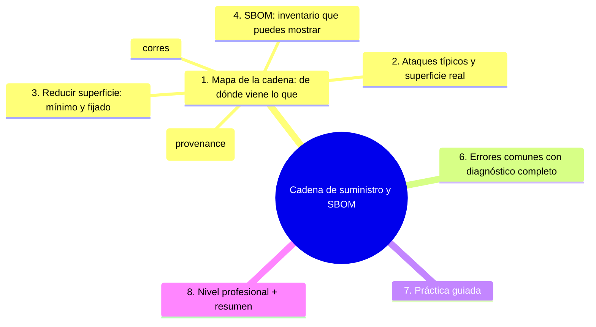

# Cadena de suministro y SBOM

## Introducción

Tu producto no es solo tu código: es un ensamblaje de paquetes, acciones, imágenes y herramientas que llegan desde decenas de terceros. A ese conjunto — y a la confianza en él — se le llama **cadena de suministro de software**. Cuando uno de sus eslabones se compromete, el daño viaja con el build hasta tus usuarios. Este capítulo cubre los riesgos reales de la cadena de suministro, las prácticas de reducción (fijado, mínimo, verificación), el **SBOM** (inventario de componentes) y cómo se firma y verifica lo que produces.

---

## Mapa conceptual de este capítulo



---

## 1. Mapa de la cadena: de dónde viene lo que corres

```text
TU RELEASE LLEGA CON:
   │
   ├── tu código (commits firmados opcionalmente)
   ├── dependencias de runtime (npm, pypi, maven…)
   ├── dependencias de CI (acciones de GitHub)
   ├── imágenes base (Docker) y el SO de los runners
   ├── herramientas de build (compiladores, linters)
   └── el propio artefacto que publicas (binario,
       imagen, paquete)
```

```text
ESLABONES Y RESPONSABLES:
──────────────────────────────────────────────────────
propietario     → tu código, tus workflows
terceros       → paquetes, acciones, imágenes
plataforma     → runners, registro de paquetes
contratos     → licencias, políticas de versiones
```

```text
   │
   └── la pregunta de cadena: «si mañana uno de
       estos eslabones se compromete, ¿me entero? ¿y
       quién lo apaga?» (caps. 02–04 + este)
```

---

## 2. Ataques típicos y superficie real

```text
PATRONES CONOCIDOS (conceptuales):
   │
   ├── dependencia popular comprometida → código
   │   malicioso en instalación (scripts postinstall)
   │
   ├── mantenidor legítimo → su cuenta robada publica
   │   versión maliciosa
   │
   ├── acción/CI troceada → credenciales de pipeline
   │   robadas (builds falsificados)
   │
   ├── espejo/repositorio no oficial → paquete
   │   «typosquatting» (nombre parecido)
   │
   └── artefacto tuyo → sustituido en el registro
       (sin firma)
```

```text
LO QUE ATACAN:
   │
   ├── el momento de instalar (máquina/CI)
   ├── el momento de construir (build reproducible)
   └── el momento de distribuir (artefacto entregado)
```

```text
   │
   └── impacto asimétrico: una buena cadena te da
       confianza en TODOS tus usuarios; una mala, un
       incidente colectivo (sección 24)
```

---

## 3. Reducir superficie: mínimo y fijado

```text
CONTROLES EN LA ENTRADA:
   │
   ├── mínimas deps (cap. 03 — la mejor es la que no
   │   está)
   │
   ├── fijado: lockfiles + actions por SHA/tag mayor +
   │   imágenes con digest/versiones (sección 19/03)
   │
   ├── fuentes oficiales: registries canónicos, nada
   │   de instalaciones por URL dudosa
   │
   └── Dependabot/renovación controlada (cap. 03)
```

```text
CONTROLES EN EL PROCESO:
   │
   ├── CI con permisos mínimos y secretos por
   │   environment (sección 19)
   │
   ├── reproducibilidad razonable: mismo lockfile →
   │   mismo resultado (facilita auditar)
   │
   └── entornos separados: build ≠ deploy (sección 22)
```

```text
CONTROLES EN LA SALIDA:
   │
   ├── firma de artefactos (punto 5)
   │
   └── registro de artefactos con retención e
       integridad (release de GitHub — sección 18
       cap. 04)
```

```text
   │
   └── política del equipo: «toda fuente externa está
       fijada y auditada» — checklist en la revisión de
       repos (sección 18)
```

---

## 4. SBOM: inventario que puedes mostrar

```text
QUÉ ES (SBOM — Software Bill of Materials):
   │
   └── lista estructurada de componentes y versiones
       que componen tu release — el «etiquetado» del
       software (analogía: ingredientes de un producto)
```

```text
POR QUÉ IMPORTA:
   │
   ├── incidente nuevo (CVE): ¿estoy afectado? →
   │   consulta del SBOM en segundos
   │
   ├── clientes/auditorías: pedir el inventario ya es
   │   habitual en entornos regulados
   │
   └── obligaciones crecientes (marco de ciberseguridad
       — mención legal, verifica alcance vigente)
```

```text
CÓMO SE GENERA (mención de herramientas):
   │
   ├── del lockfile/manifesto (formatos tipo CycloneDX
   │   o SPDX — que soportan tus herramientas)
   │
   ├── en el build de release (step que publica el
   │   SBOM junto al artefacto)
   │
   └── actualización: se regenera en CADA release (no
       es un documento a mano)
```

```text
   │
   └── el SBOM no es burocracia: es la respuesta
       «¿quién está afectado?» que necesitarás el día
       de un incidente (punto 6 — Error 6)
```

---

## 5. Firmar y verificar (provenance)

```text
PROVENANCE (procedencia):
   │
   └── evidencia de CÓMO y DÓNDE se construyó algo
       (qué workflow, qué commit, qué dependencias)
```

```text
FIRMAR:
   │
   ├── tu release: firma (o attestation) del artefacto
   │   → el consumidor verifica que viene de TU
   │   pipeline y no de otro sitio
   │
   ├── git: commits firmados (GPG/SSH) = «yo hice
   │   este commit» (mención — útil en equipos
   │   exigentes)
   │
   └── la verificación requiere confianza en la clave
       → gestión de claves (cap. 01)
```

```text
MODELO SIMPLE DE VERIFICACIÓN (conceptual):
   │
   ├── productor: construye → firma/en attestation
   │   (clave o identidad federada — en Actions
   │   existe OIDC, sección 19/22)
   │
   └── consumidor: antes de instalar/desplegar,
       verifica la firma contra la cadena de
       confianza conocida
```

```text
   │
   └── sin verificación, la firma es adorno: la
       política de tu equipo debe decir QUIÉN verifica
       y DÓNDE (Error 4)
```

---

## 6. Errores comunes con diagnóstico completo

### Error 1: instalaciones desde fuentes no canónicas

**Qué ocurrió:** un script instaló un paquete desde un repositorio personal o URL suelta.

**Por qué:** prisa o falta de registro oficial.

**Cómo comprobarlo:** scripts de build/CI buscando curl-pipe-bash o URLs de instalación ad-hoc.

**Opciones:** migrar a fuentes oficiales; fijar versión y checksum.

**Riesgos:** cancha sin inspección (Error 2 de cadena clásico).

**Solución:** fuentes y fijado (punto 3).

**Cómo se evita:** revisión de CI (checklist sección 19).

---

### Error 2: acción/dep «temporal» de un desconocido

**Qué ocurrió:** se añadió una acción de un repo pequeño sin verificar quién la mantiene; meses después, actualización maliciosa.

**Por qué:** se buscó utilidad sin verificar procedencia.

**Cómo comprobarlo:** inventario `uses:` (cap. 03): ¿oficiales/SHA? ¿terceros con historial?

**Opciones:** reemplazar por alternativa auditable; fijar SHA histórica; quitar si no se usa.

**Riesgos:** pipeline comprometido = release comprometido.

**Solución:** política de terceros (sección 19 cap. 05 / punto 3).

**Cómo se evita:** criterios escritos de aceptación de dependencias (cap. 03 punto 4).

---

### Error 3: tag móvil en componentes críticos

**Qué ocurrió:** `@v1` o `latest` cambiaron contenido sin cambiar nombre.

**Por qué:** convención cómoda mal entendida.

**Cómo comprobarlo:** grep de tags móviles/`latest` en workflows y Dockerfiles.

**Opciones:** fijar SHA/digest; renovación controlada (Dependabot).

**Riesgos:** reposición silenciosa de contenido.

**Solución:** fijado + renovación explícita (punto 3).

**Cómo se evita:** checklist (sección 19 cap. 05 Error 2).

---

### Error 4: artefactos sin verificar (y verificación opcional)

**Qué ocurrió:** el equipo firmaba imágenes, pero ningún despliegue las verificaba.

**Por qué:** se firmó «por si acaso» sin cerrar el bucle.

**Cómo comprobarlo:** ¿dónde se verifica? (¿pipeline de deploy? ¿pasos?)

**Opciones:** añadir verificación en deploy; si no puede haberla, no presentar la firma como control.

**Riesgos:** falsa sensación de integridad.

**Solución:** firma con consumidor (punto 5).

**Cómo se evita:** definir «quién verifica» al diseñar el flujo (sección 22).

---

### Error 5: imágenes base «de hace años» o mutables

**Qué ocurrió:** build sobre una base sin actualizar (vulnerable) o `alpine:latest` irreproducible.

**Por qué:** se heredó el Dockerfile sin mirarlo.

**Cómo comprobarlo:** `FROM` en los Dockerfiles; escaneo de imágenes (complemento cap. 04 punto 5).

**Opciones:** base con versión/digest; renovación periódica; rebuild por CVEs.

**Riesgos:** vulnerabilidad heredada a todo el producto.

**Solución:** bases como dependencias de verdad (punto 1/3).

**Cómo se evita:** incluir imágenes en el inventario (cap. 03 punto 1).

---

### Error 6: no saber qué llevas dentro cuando hay incidente

**Qué ocurrió:** un CVE crítico salió a la luz y el equipo tardó días en saber si su producto lo incluía.

**Por qué:** no había SBOM ni inventario consultable.

**Cómo comprobarlo:** ¿puedes listar componentes de la última release en 5 minutos?

**Opciones:** generar SBOM en el build (punto 4); al menos lockfiles + inventario de acciones.

**Riesgos:** respuesta lenta = daño extendido.

**Solución:** SBOM como paso del release (punto 4).

**Cómo se evita:** release checklist que incluye inventario.

---

## 7. Práctica guiada

### Objetivo

Cartografiar tu cadena y publicar el primer SBOM con tu release.

### Paso 1: mapa

```text
En docs/seguridad/cadena.md, lista:
   │
   ├── dependencias runtime (del lockfile)
   ├── acciones de CI (grep uses:)
   ├── imágenes base (FROM)
   └── herramientas externas del build
```

### Paso 2: endurece fuentes

1. Reemplaza cualquier instalación ad-hoc por fuente oficial fijada.
2. Fija actions e imágenes (SHA/digest) — usa la checklist de la sección 19.

### Paso 3: genera el SBOM

```text
   │
   ├── elige formato según tus herramientas (CycloneDX
   │   o SPDX)
   │
   ├── añade un step en tu workflow de release que
   │   genere el SBOM desde el lockfile
   │
   └── adjúntalo a la release junto al artefacto
       (sección 18 cap. 04)
```

### Paso 4: simulación de incidente

```text
Pregúntate: «salió un CVE en una librería de moda»
   │
   ├── ¿en qué minuto sabes si estás afectado?
   ├── ¿quién notifica a clientes si lo estás?
   └── ¿qué SBOM miras?
(Debería ser: abres el SBOM de la última release.)
```

### Paso 5: firma (nivel de entrada)

1. Revisa qué ofrece tu flujo actual para publicación de artefactos (attestations/releases) y activa lo que hoy sea viable.
2. Documenta quién verifica en qué paso (aunque hoy sea «nadie — pendiente»: escrito y con fecha).

### Paso 6: política

```markdown
## Cadena de suministro
- Fuentes: solo registries canónicos; nada de
  URL-suelta
- Fijado: lockfiles + actions SHA + imágenes digest
- SBOM: se genera en cada release y se adjunta
- Firmas: [activas/no] — verificación: [dónde]
```

### Resultado esperado

Mapa de cadena escrito, fuentes endurecidas, SBOM en tu primer release y política publicada.

### Ejercicio de transferencia
En un proyecto personal, genera un SBOM para tu release usando una herramienta como CycloneDX o SPDX, adjúntalo a la release y verifica que se muestra correctamente en la interfaz de GitHub. Entrega el archivo SBOM y una captura de pantalla de la release mostrando el SBOM adjunto.

### Conclusión esperada

La cadena de suministro se gobierna como inventario: sabes qué entra, qué sales y puedes demostrarlo — el día del incidente, eso es todo lo que importa.

---

## 8. Nivel profesional + resumen

### 8.1. Confianza en cadena a escala

```text
   │
   ├── SBOM obligatorio en releases + consulta rápida
   │   ante CVEs (herramientas de inventario)
   │
   ├── firmas y attestations en artefactos; OIDC para
   │   identidad de CI (sección 19/22)
   │
   ├── verificación en deploy como paso no opcional
   │   (sección 22/24)
   │
   ├── políticas de proveedores/terceros: licencias,
   │   versiones soportadas, review de deps nuevas
   │
   ├── proveedores: pedir SBOM a terceros críticos
   │   (contractual en entornos exigentes)
   │
   └── simulacros: «¿afectados por X?» con tiempo
       objetivo (métrica de respuesta)
```

### 8.2. Resumen

En este capítulo aprendiste que:

* tu release es un ensamblaje: deps, actions, imágenes, herramientas — la cadena se cartografía antes de poder protegerse;
* ataques típicos atacan instalar, construir y distribuir: se reducen con mínimo, fijado y fuentes canónicas;
* el SBOM es el inventario estructurado que responde «¿estamos afectados?» en segundos y se regenera por release;
* provenance y firmas solo valen con verificación en el consumidor;
* los errores típicos (fuentes raras, terceros sin auditar, tags móviles, firma sin verificación, bases vetustas, sin SBOM) se previenen con política escrita;
* a nivel profesional: attestations, verificación obligatoria en deploy y simulacros de incidente.

La idea principal es:

> **Nadie audita lo que no puede listar: el SBOM y el fijado convierten la confianza ciega en una lista que puedes revisar, y la firma en una respuesta que puedes verificar.**

---

## Autopreguntas de cierre
Sin mirar el material, responde mentalmente y luego compruébalo con este capítulo:
1. ¿Cuál es la diferencia entre un ataque de instalación y un ataque de distribución en la cadena de suministro?
2. ¿Cómo ayuda el fijado con lockfiles y digestos a reducir la superficie de ataque?
3. ¿Qué información contiene un SBOM y por qué es útil durante un incidente de seguridad?
4. ¿Por qué es importante verificar las firmas de los artefactos en el consumidor y no solo confiar en la presencia de la firma?
5. ¿Cómo se puede reducir la superficie de ataque mediante el principio de mínimo en dependencias?
6. ¿Qué papel juegan las acciones de GitHub fijadas por SHA en la seguridad de la cadena de suministro?
7. ¿Cómo afecta el uso de imágenes base mutables (como `alpine:latest`) a la reproducibilidad y seguridad de los builds?
8. ¿Qué es un attestation de provenance y cómo se diferencia de una simple firma de artefacto?

## Próximo paso

Ya conoces y reduces tu cadena de confianza.

Ahora la gobernanza: quién puede tocar qué, y cómo se protege una vez dentro.

Continúa con:

[`06-permisos-seguridad-y-ramas.md`](06-permisos-seguridad-y-ramas.md)
