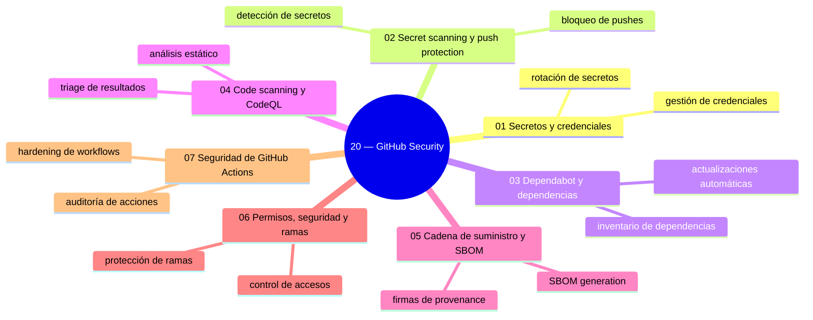
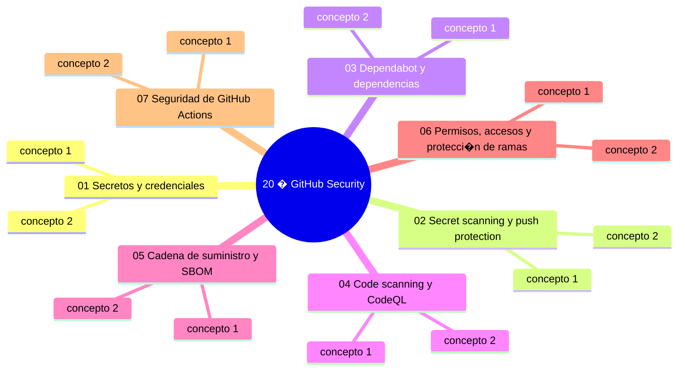

# 20 — GitHub Security

## Bienvenido a esta sección

La seguridad de un repositorio no es una herramienta suelta: es la suma de credenciales bien guardadas, detección automática, dependencias vigiladas, código analizado, cadena de suministro trazable y accesos gobernados. En esta sección recorres ese conjunto completo con la profundidad de un equipo de seguridad que además enseña.

## Mapa conceptual de este capítulo

## En esta sección estudiarás

* dónde vive cada credencial y cómo se gestiona su ciclo de vida sin que entre al historial;
* secret scanning y push protection: bloquear y responder a secretos;
* Dependabot, alertas de dependencias e inventario de versiones;
* code scanning con CodeQL: análisis estático, triage y políticas de ruido;
* cadena de suministro: fuentes, fijado, SBOM, firmas y provenance;
* permisos, 2FA, protección de ramas y rulesets como política de plataforma;
* environments, OIDC y auditoría aplicados a tus automatizaciones.

## Objetivos de aprendizaje

Al terminar esta sección serás capaz de:

* gestionar el ciclo de vida de credenciales para que ningún secreto entre al historial;
* aplicar secret scanning y push protection y ejecutar el procedimiento de respuesta;
* usar Dependabot para mantener el inventario de dependencias y sus alertas;
* configurar code scanning con CodeQL, triage y política de ruido;
* explicar la cadena de suministro: fijado de versiones, SBOM, firmas y provenance;
* aplicar mínimo privilegio a permisos, 2FA, ramas y environments.

## Mapa conceptual

---\n
## ¿Qué aprenderás en esta sección?

1. [`01-secretos-y-credenciales.md`](01-secretos-y-credenciales.md) — catálogo, hogar y ciclo de vida de credenciales.
2. [`02-secret-scanning-y-push-protection.md`](02-secret-scanning-y-push-protection.md) — detectar, bloquear y responder.
3. [`03-dependabot-y-dependencias.md`](03-dependabot-y-dependencias.md) — inventario, alertas y renovación automática.
4. [`04-code-scanning-y-codeql.md`](04-code-scanning-y-codeql.md) — análisis estático sin miedo al ruido.
5. [`05-cadena-de-suministro-sbom.md`](05-cadena-de-suministro-sbom.md) — confianza trazable: mínimo, fijado, SBOM y firmas.
6. [`06-permisos-seguridad-y-ramas.md`](06-permisos-seguridad-y-ramas.md) — identidad, permisos y ramas como política.
7. [`07-seguridad-de-github-actions.md`](07-seguridad-de-github-actions.md) — el pipeline como superficie crítica.

## Cómo estudiar esta sección

Activa cada control mientras lees: secret scanning, Dependabot, code scanning, environments. La sección termina con una checklist de seguridad que convertirás en revisión periódica — en la sección 24 esta higiene se eleva a programa DevSecOps con métricas y gates.

## Referencias

* GitHub — Documentación oficial: «About secret scanning», «Dependabot», «Code scanning».
* OWASP Top 10 (owasp.org).
* SLSA — niveles de cadena de suministro (slsa.dev).
* NIST SSDF — Software Supply Chain Security Framework.

## Mapa conceptual

`mermaid

mindmap
  root((20 � GitHub Security))
    01 Secretos y credenciales
      concepto 1
      concepto 2
    02 Secret scanning y push protection
      concepto 1
      concepto 2
    03 Dependabot y dependencias
      concepto 1
      concepto 2
    04 Code scanning y CodeQL
      concepto 1
      concepto 2
    05 Cadena de suministro y SBOM
      concepto 1
      concepto 2
    06 Permisos, accesos y protecci�n de ramas
      concepto 1
      concepto 2
    07 Seguridad de GitHub Actions
      concepto 1
      concepto 2
`

---\n
## Autopreguntas de cierre
## Checkpoint 20 � Comprobaci�n obligatoria

Antes de avanzar a `../21-git-para-programadores/`, demuestra que puedes (en un repositorio de pr�ctica real):

1. **Rotar** un token comprometido reescribiendo el historial y verificando que no quede rastro.
2. **Activar** secret scanning y push protection y simular una alerta para practicar el procedimiento de respuesta.
3. **Configurar** Dependabot para actualizar autom�ticamente una dependencia vulnerable y validar la pull request generada.
4. **Ejecutar** un an�lisis de CodeQL y aplicar un filtro de ruido para reducir falsos positivos.
5. **Generar** un SBOM de un repositorio y comprobar que incluye todas las dependencias directas.

Si puedes hacerlo **sin mirar instrucciones**, el checkpoint est� cerrado.

## Autopreguntas de cierre

Sin mirar el material, responde mentalmente y luego compruébalo con los capítulos de la sección:

1. Un token quedó en un commit: ¿cuáles son las tres acciones, en orden?
2. ¿Qué diferencia hay entre una alerta de Dependabot y un advisory?
3. ¿Para qué sirve un SBOM?
4. ¿Por qué un workflow debe pedir permisos mínimos incluso «solo para probar»?
5. ¿Cómo afecta la configuración de reglas de rama a la fusión de pull requests cuando se requiere revisión de código?
6. ¿Cuál es la diferencia entre un environment de protección y un environment estándar en GitHub Actions?
7. ¿Qué información contiene un attestation de provenance y cómo se verifica?
8. ¿Cómo se configura la escaneo de secretos para monitorizar repositorios privados de forma automática?

## Mapa conceptual
---\n
## Próximo paso

Cuando termines los siete capítulos, continúa con la siguiente sección:

[`../21-git-para-programadores/`](../21-git-para-programadores/)

