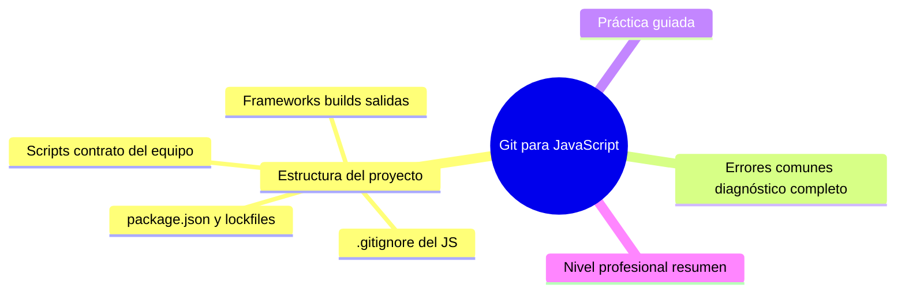

# Git para JavaScript

## Introducción

JavaScript vive en repositorios donde el volumen de archivos generados es enorme: `node_modules` puede superar el tamaño del código cien veces, y el ecosistema tiene opiniones fuertes sobre lockfiles y scripts. Este capítulo adapta Git a un proyecto web/JS: qué se versiona y qué no, cómo conviven `package.json` y lockfiles, los scripts como contrato de equipo y las particularidades de frameworks modernos.

---

## Mapa conceptual de este capítulo



---

## 1. Estructura de un proyecto

```text
proyecto-web/
├── src/
├── tests/  (o junto al código — coherencia)
├── public/         # estáticos si aplica
├── package.json
├── package-lock.json   # o pnpm-lock / yarn.lock
├── .gitignore
├── README.md
└── LICENSE
```

```text
REGLAS DE ORO (JS):
   │
   ├── node_modules/ JAMÁS en el repo
   │
   ├── el lock es de un solo dueño: elijo UN gestor
   │   (npm/pnpm/yarn) y el equipo entero lo usa
   │   (Error 1)
   │
   └── dist/ o build/ solo si el proyecto ES la web
       estática publicada desde git (caso especial —
       decision consciente, p. ej. gh-pages); por
       regla general: sale de CI
```

```text
   │
   └── «¿por qué tantos archivos?» — el README y la
       estructura lo responden sin abrir código
       (sección 18 cap. 01)
```

---

## 2. package.json y lockfiles

```text
PAPELES:
   │
   ├── package.json: manifiesto — nombre, scripts,
   │   dependencias con rangos
   │
   └── lock (package-lock.json / pnpm-lock.yaml /
       yarn.lock): árbol EXACTO instalado — se versiona
       SIEMPRE
```

```text
FLUJO:
   │
   ├── instalar: lee manifiesto y fija según lock
   ├── añadir paquete: actualiza manifiesto Y lock en
   │   el MISMO commit (mismo PR)
   └── renovar: Dependabot (ecosistema npm — sección 20
       cap. 03)
```

```text
ELECTORADO DE GESTOR (decisión de equipo):
   │
   ├── npm: el de la caja — siempre disponible
   ├── pnpm/yarn: más rápidos, otra sintaxis de lock
   └── el error clásico: mezclar (lock duplicado →
       conflictos absurdos)
```

```bash
# comprobación:
git ls-files | grep -E "(package.json|lock)" # ¿uno?
ls node_modules >/dev/null 2>&1 && git status  # ¿ruido?
```

---

## 3. Scripts: el contrato del equipo

```json
{
  "scripts": {
    "dev": "vite",
    "build": "vite build",
    "test": "vitest run",
    "lint": "eslint .",
    "format": "prettier --write ."
  }
}
```

```text
POR QUÉ IMPORTA EN GIT:
   │
   ├── los scripts son los comandos ESTÁNDAR del repo:
   │   nadie recuerda cómo testear, todos usan `npm
   │   test`
   │
   ├── CI ejecuta los MISMOS scripts (sección 19) →
   │   «en mi máquina funciona» pierde sentido
   │
   └── los scripts son documentación ejecutable
       (sección 14)
```

```text
   │
   └── añadir un script nuevo = cambio de equipo →
       documentarlo en el README (sección 14 cap. 02)
```

---

## 4. .gitignore del JS

```gitignore
# dependencias (instalables, nunca versionadas):
node_modules/

# builds:
dist/
build/
.next/
out/

# local y secretos:
.env
.env.local

# caché y cobertura:
.cache/
coverage/
.eslintcache

# logs:
npm-debug.log*
```

```text
   │
   ├── la plantilla de GitHub para Node ya cubre lo
   │   esencial — revisar al crear
   │
   └── frameworks con caché propia (.next, .turbo…):
       añadirlas según use el proyecto
```

---

## 5. Frameworks, builds y salidas

```text
CASOS FRECUENTES:
   │
   ├── SPA/build tool (vite/webpack…): src → build
   │   generado → normalmente SIN versionar la salida
   │
   ├── Next/Nuxt (SSR): código + configuración en
   │   repo; .next/.nuxt ignorados
   │
   ├── web estática publicada VÍA git (gh-pages):
   │   rama/publicación dedicada generada por CI — el
   │   código fuente nunca se mezcla con la salida
   │   (Error 4)
   │
   └── monorepo JS (workspaces/pnpm): varios
       package.json — conflictos de lock coordinados
       (sección 25)
```

```text
ARCHIVOS DE CONFIG QUE SÍ SE VERSIONAN:
   │
   ├── tsconfig, eslint, prettier, vite.config, …
   │
   └── configuración compartida = comportamiento del
       equipo; sin ella, cada quien lintea a su modo
```

```text
   │
   └── una app JS bien versionada se reconoce: al
       clonar, `install → test → dev` funcionan sin
       pasos extra mágicos
```

---

## 6. Errores comunes con diagnóstico completo

### Error 1: node_modules o lockfiles mezclados

**Qué ocurrió:** el repo tenía package-lock Y yarn.lock; CI y laptops instalaban árboles distintos.

**Por qué:** nadie fijó el gestor; cada quien instaló con el suyo.

**Cómo comprobarlo:** `git ls-files | grep lock`; .nvmrc/gestor documentado.

**Opciones:** elegir un gestor, borrar el resto, regenerar lock, anunciar al equipo.

**Riesgos:** dependencias «fantasma» distintas por máquina.

**Solución:** un gestor, un lock (punto 2).

**Cómo se evita:** decisión escrita en el README (sección 14).

---

### Error 2: package-lock desactualizado vs. package.json

**Qué ocurrió:** alguien editó dependencias a mano en package.json sin instalar → CI instalaba otra cosa que el manifiesto pedía.

**Por qué:** ediciones manuales en lugar de `npm install <paquete>`.

**Cómo comprobarlo:** diff del lock en el PR; `npm ci` falla (instalación estricta).

**Opciones:** regenerar lock; regla: manifiesto y lock cambian juntos (sección 04 cap. 05).

**Riesgos:** instalaciones inconsistentes.

**Solución:** solo gestionar deps con el gestor (punto 2).

**Cómo se evita:** `npm ci` en CI (falla si no cuadran) — Error 6 aplanado.

---

### Error 3: .env subido

**Qué ocurrió:** variables de entorno con claves entraron al historial (CI verde, repo roto).

**Por qué:** falta de .gitignore + prisa (mismo patrón que Python Error 3).

**Cómo comprobarlo:** secret scanning + historial.

**Opciones:** rotar → limpiar → verificar (sección 20 cap. 01); .env.example con placeholders.

**Riesgos:** exposición permanente.

**Solución:** local .env, versionado .env.example.

**Cómo se evita:** push protection (sección 20 cap. 02).

---

### Error 4: fuente y build mezclados en la misma rama

**Qué ocurrió:** commits con cambios de `src/` y de `dist/` juntos; diffs inmensos e inútiles.

**Por qué:** build ejecutado dentro del flujo de commits (o publicación por git sin separar).

**Cómo comprobarlo:** ¿dist/ está en `git ls-files`? ¿commits lo tocan?

**Opciones:** quitar build del repo; publicación por CI a rama de páginas/registries.

**Riesgos:** historial ilegible y conflictos constantes.

**Solución:** salida ≠ fuente (punto 5).

**Cómo se evita:** plantilla + checklist de PR.

---

### Error 5: artefactos generados en tests ignorados mal

**Qué ocurrió:** `coverage/` o `.next/` sin ignorar → commits con reportes.

**Por qué:** .gitignore no actualizado al adoptar la herramienta.

**Cómo comprobarlo:** `git ls-files | grep -E "(coverage|\.next)"`.

**Opciones:** ignorar + `git rm --cached`; ampliar guion.

**Riesgos:** ruido permanente.

**Solución:** guion completo (punto 4).

**Cómo se evita:** «nueva herramienta → nueva línea en .gitignore».

---

### Error 6: CI con install sin lock (npm install)

**Qué ocurrió:** el CI instalaba con rangos → una release nueva de una dependencia rompió el build aleatoriamente.

**Por qué:** workflow con `npm install` en vez de `npm ci`.

**Cómo comprobarlo:** pasos del workflow de CI.

**Opciones:** `npm ci` (fija al lock y falla si hay desajuste); renovación por Dependabot.

**Riesgos:** builds no reproducibles.

**Solución:** instalación estricta (punto 2/3).

**Cómo se evita:** plantilla de CI (sección 19/22).

---

## 7. Práctica guiada

### Objetivo

Dejar un proyecto JS con un gestor, un lock y un CI estricto.

### Paso 1: estructura y gestor

1. Elige el gestor (documenta por qué en una línea del README).
2. Asegura UN lock y borra duplicados si existen.

### Paso 2: .gitignore

```text
Verifica contra la lista del punto 4; añade salidas
de TU framework (.next, .nuxt, .turbo…)
```

### Paso 3: scripts

```json
{ "scripts": { "test": "…", "lint": "…", "build": "…" } }
```

1. Documenta en el README: install, dev, test, build.

### Paso 4: dependencias sanas

```bash
npm ci   # debe instalar exacto al lock y pasar
```

1. Añade una dependencia con el gestor (no a mano) y confirma que manifiesto + lock cambian juntos.

### Paso 5: CI estricto

```yaml
# esquema: setup-node con cache → npm ci → lint →
# test → build
```

1. Rompe el lock a propósito (edita el manifiesto sin instalar) y comprueba que CI FALLA con `npm ci`.

### Paso 6: revisión de ruido

```bash
git ls-files | grep -E "(node_modules|dist/|\.env$|coverage)" | head
```

1. Limpia con `git rm --cached` si aparece algo.

### Resultado esperado

Un gestor, un lock, scripts documentados, CI estricto y repo sin ruido.

### Conclusión esperada

En JS, la disciplina de lock+scripts+gitignore convierte el caos potencial del ecosistema en un `clone → ci → test` predecible.

---

## 8. Nivel profesional + resumen
### Ejercicio de transferencia
Aplica lo aprendido en este capítulo a un proyecto personal de tu elección. Por ejemplo, si el capítulo trata sobre ramas en Git, crea una nueva rama para una característica que hayas estado pensando y haz un commit inicial. Entregable: captura de pantalla del comando git branch mostrando tu nueva rama.
## 8. Nivel profesional + resumen

### 8.1. JavaScript a escala

```text
   │
   ├── monorepo con workspaces: lock único, paths de
   │   CI, cambios acotados (sección 25)
   │
   ├── builds y despliegues SOLO desde CI (sección
   │   19/22); la salida nunca compite con la fuente
   │
   ├── dependencias: lock + Dependabot + revisión de
   │   majors (sección 20 cap. 03)
   │
   ├── calidad como checks: lint/format/test/build
   │   obligatorios en PR (sección 15)
   │
   └── métrica: tiempo de install+test en CI, nº de
       dependencias (sección 26)
```

### 8.2. Resumen

En este capítulo aprendiste que:

* estructura clara y la frontera node_modules/fuente siempre visible;
* un gestor y un lock, versionados y sincronizados — manifiesto y lock cambian juntos;
* scripts como contrato: mismos comandos en local y CI;
* .gitignore completo para JS y salidas de frameworks;
* los errores típicos (gestores mezclados, lock desactualizado, .env, build en la rama, salidas sin ignorar, install sin ci) se previenen con disciplina estricta;
* a nivel profesional: monorepos, despliegue por CI y métricas.

La idea principal es:

> **El ecosistema JS premia la uniformidad: un gestor, un lock, unos scripts y un gitignore — todo lo demás son variantes que el equipo no puede permitirse.**

---

## Próximo paso
## Autopreguntas de cierre
1. ¿Cómo explicarías con tus propias palabras el concepto de Introducción?
1. ¿Cuál es la relación entre Mapa conceptual de este capítulo y 1. Estructura de un proyecto?
1. ¿Qué pasos seguirías para aplicar 1. Estructura de un proyecto en un escenario real?
1. ¿Qué errores comunes debes evitar al trabajar con 2. package.json y lockfiles?
1. ¿Cómo medirías el éxito al implementar 3. Scripts: el contrato del equipo?
1. ¿Qué herramientas o comandos mencionados en el capítulo son esenciales para 4. .gitignore del JS?
1. ¿Cómo adaptarías el proceso descrito en 5. Frameworks, builds y salidas si tuvieran que trabajar en un entorno distribuido?
1. ¿Qué principio subyace detrás de la recomendación de 6. Errores comunes con diagnóstico completo?
## Próximo paso

Ya cubres los dos lenguajes de aplicación.

Ahora cambia de terreno: los proyectos donde el código son notebooks y los resultados dependen de los datos.

Continúa con:

[`03-git-para-ciencia-de-datos.md`](03-git-para-ciencia-de-datos.md)
