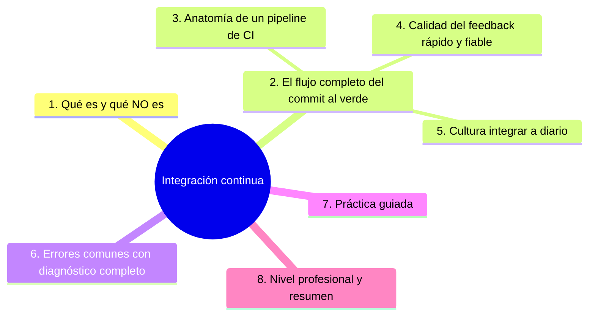

# Integración continua

## Introducción

**Integración continua** (CI) es el hábito de fusionar el trabajo de todos con frecuencia y verificarlo automáticamente cada vez. Nace de un problema antiguo: ramas que envejecen y que «integrar» se vuelve una semana de dolor. CI invierte la lógica — integras a diario, verificas en minutos y el error es barato. Este capítulo define la práctica, su flujo completo y cómo se ve un pipeline de CI sano con GitHub Actions (la sección 19 ya construyó los workflows; aquí miramos la disciplina).

---

## Mapa conceptual de este capítulo



---

## 1. Qué es (y qué NO es)

```text
CI ES:
   │
   ├── fusionar trabajo con frecuencia (a diario o
   │   mejor)
   │
   ├── verificar CADA integración automáticamente
   │   (build + pruebas + controles)
   │
   └── dar feedback en MINUTOS, no en días
```

```text
CI NO ES:
   │
   ├── «un botón de Actions que corre a veces»
   ├── un servidor que solo compila (sin pruebas)
   └── un check que se salta cuando apremia (entonces
       no integra nada — Error 5)
```

```text
EL PROBLEMA QUE RESUELVE:
──────────────────────────────────────────────────────
sin CI: integración grande, poco frecuente, cara
        y llena de sorpresas

con CI: integración pequeña, diaria, barata —
        cada error se atribuye a lo que acabas de
        tocar
```

```text
   │
   └── CI no es una herramienta: es una política de
       equipo con herramienta detrás (punto 5)
```

---

## 2. El flujo completo: del commit al verde

```text
DEVELOPER → CI → VERDE → FUSIÓN
──────────────────────────────────────────────────────
commit en rama
   ↓
push
   ↓
disparo (pull_request / push — sección 19 cap. 02)
   ↓
pipeline:
   · install/build        (¿compila?)
   · pruebas              (¿se comporta?)
   · calidad (lint/format) (¿estilo?)
   · seguridad (opcional)  (sección 20/24)
   ↓
resultado por PR: checks verdes → se puede fusionar
```

```text
RESULTADO:
   │
   ├── verde → confianza para fusionar (junto a
   │   revisión humana — sección 15)
   │
   ├── rojo → el autor arregla en su rama; nadie más
   │   lo hereda
   │
   └── main siempre verde → la base sigue
       desplegable (punto 4)
```

```text
   │
   └── el contrato: PR sin checks verdes no se
       fusiona — y eso lo garantiza la PROTECCIÓN DE
       RAMA (sección 20 cap. 06)
```

---

## 3. Anatomía de un pipeline de CI

```text
ETAPAS TÍPICAS (en orden de coste — Error 2):
──────────────────────────────────────────────────────
1. checkout + install   (segundos–minutos)
2. calidad: lint/format  (rápido)
3. build                 (¿compila?)
4. pruebas unitarias     (rápidas)
5. pruebas integración   (más lentas)
6. controles extra       (seguridad, cobertura…)
```

```yaml
# esquema (ya construido en sección 19):
# on: pull_request + push a main
# jobs:
#   quality: lint + build
#   test: pruebas (matriz si hace falta)
# → checks que la rama protegida exige
```

```text
REGLAS DE DISEÑO:
   │
   ├── lo barato primero (feedback rápido de lo
   │   obvio)
   │
   ├── paralelizar lo independiente (sección 19 cap.
   │   03)
   │
   ├── instalar con caché (lock → caché — sección 19)
   │
   └── el pipeline del PR = el camino rápido; lo
       pesado a main/schedule (sección 19 cap. 06)
```

---

## 4. Calidad del feedback: rápido y fiable

```text
DOS PROPIEDADES:
   │
   ├── RÁPIDO: un CI de PR que tarda 30 min matará el
   │   flujo (objetivo: minutos — Error 1)
   │
   └── FIABLE: verde es verde — si falla, es real
       (flaky = bug — sección 19 cap. 06)
```

```text
MÉTRICAS SENSATAS:
   │
   ├── duración mediana del CI de PR
   ├── % de reintentos necesarios
   └── tasa de «rojos en main» (si sube: ¿los checks
       del PR cubren?)
```

```text
   │
   └── un pipeline lento y ruidoso se convierte en
       «el que se salta» — la confianza es frágil
       (Error 5)
```

---

## 5. Cultura: integrar a diario

```text
HÁBITOS QUE SOSTIENEN CI:
   │
   ├── ramas de vida corta (sección 17 cap. 01) —
   │   si la rama vive una semana, integras a la
   │   semana
   │
   ├── PRs pequeños (sección 15 cap. 02): menos
   │   conflictos, revisión ágil, CI acotado
   │
   ├── main siempre integrable: nunca fusionas con
   │   rojo conocido («ya lo arreglo en el siguiente»
   │   es cómo nacen los vicios)
   │
   └── arreglar rojos es prioridad del equipo, no
       «del que tocó» (punto 6 Error 6)
```

```text
   │
   └── CI sin esta cultura es un ornamento caro: el
       pipeline corre y nadie le cree
```

---

## 6. Errores comunes con diagnóstico completo

### Error 1: pipeline de PR demasiado lento

**Qué ocurrió:** los PRs tardaban 25 minutos; el equipo empezó a fusionar «para no esperar».

**Por qué:** pruebas pesadas en el camino de todo PR + sin caché + sin paralelismo.

**Cómo comprobarlo:** duración mediana por ejecución (panel de Actions).

**Opciones:** caché, paralelizar jobs, mover lo pesado a main/schedule, paths (sección 19 cap. 06).

**Riesgos:** se contamina el flujo de revisión (sección 15).

**Solución:** presupuesto de duración (punto 4).

**Cómo se evita:** métrica en la retro (sección 26).

---

### Error 2: solo lint al final

**Qué ocurrió:** el fallo obvio (formato) se veía tras 20 minutos de pruebas.

**Por qué:** orden del pipeline al revés (punto 3).

**Cómo comprobarlo:** orden de los steps y sus tiempos.

**Opciones:** reordenar: calidad y build primero; pruebas después.

**Riesgos:** feedback tardío de lo más barato.

**Solución:** lo barato primero (punto 3).

**Cómo se evita:** revisar el diseño del pipeline al crearlo.

---

### Error 3: CI que no cubre lo que se rompe

**Qué ocurrió:** CI verde y producción rota en el mismo camino (build de release, configuración de producción).

**Por qué:** el pipeline testea código, no el artefacto/entorno real (punto 3/4).

**Cómo comprobarlo:** comparar: ¿qué falló en producción? ¿ese fallo era detectable en CI?

**Opciones:** añadir el paso faltante (build real, smoke test, entorno efímero — sección 22 cap. 04); prueba de humo post-deploy (cap. 04).

**Riesgos:** verde que no protege.

**Solución:** el pipeline verifica el CAMINO completo (punto 2).

**Cómo se evita:** revisar tras cada incidente «¿por qué no lo vio CI?».

---

### Error 4: checks desactivados para «no molestar»

**Qué ocurrió:** checks opcionales se saltaron siempre; cuando se activaron, nadie sabía interpretarlos.

**Por qué:** sin política de qué es obligatorio.

**Cómo comprobarlo:** reglas de rama: ¿qué checks exige?

**Opciones:** definir el conjunto mínimo obligatorio (lint + test + build) y tenerlo fijo; lo experimental se retira o se decide.

**Riesgos:** rama protegida con portera dormida.

**Solución:** checks explícitos y pocos (punto 2).

**Cómo se evita:** plantilla de rama (sección 18/20).

---

### Error 5: saltarse el CI «esta vez»

**Qué ocurrió:** bypass para un «cambio pequeño» que rompió main en caliente.

**Por qué:** urgencia sin proceso de hotfix (punto 5).

**Cómo comprobarlo:** eventos de protección; incidentes.

**Opciones:** hotfix vía PR exprés con revisión y checks (el proceso se acelera, no se salta — sección 20 cap. 06 Error 3).

**Riesgos:** confianza erosionada en el check.

**Solución:** nadie salta el verde (punto 2/5).

**Cómo se evita:** regla escrita + admins sujetos a reglas.

---

### Error 6: rojos sin dueño inmediato

**Qué ocurrió:** main cayó a rojo el lunes y seguía rojo el jueves.

**Por qué:** «ya lo verá quien toque a continuación» (punto 5).

**Cómo comprobarlo:** tiempo medio de reparación de main.

**Opciones:** norma: rojo en main se repara o se revierte ANTES de la siguiente fusión; dueño inmediato (sección 16/26).

**Riesgos:** el «siempre rojo» es el fin de CI.

**Solución:** rojo = prioridad máxima (punto 5).

**Cómo se evita:** acuerdo de equipo explícito.

---

## 7. Práctica guiada

### Objetivo

Montar un pipeline de CI de referencia y medir su calidad.

### Paso 1: disparadores

```yaml
on:
  pull_request:
  push:
    branches: [main]
```

1. Comprueba que todo PR dispara y que main también (cap. 02 de la sección 19).

### Paso 2: orden del pipeline

```text
Jobs (o steps) en este orden:
   │
   ├── install (con caché del lock)
   ├── lint/format
   ├── build
   └── tests
```

### Paso 3: protección

1. Asegura que main exige esos checks (sección 20 cap. 06).
2. Prueba: abre un PR con un fallo de lint — ¿se ve en segundos?

### Paso 4: medir

```text
Anota:
   │
   ├── duración total del CI de PR
   └── duración por job (¿dónde se va el tiempo?)
```

1. Aplica una optimización (caché/paralelismo) y vuelve a medir.

### Paso 5: fiabilidad

1. Introduce un test dependiente del azar o del orden (a propósito) y observa el flake.
2. Arréglalo: la propiedad «verde = verde» es la que sostiene todo.

### Paso 6: política

```markdown
## Integración continua
- Todo PR: install → lint → build → tests (checks
  obligatorios)
- Duración objetivo del CI de PR: < X minutos
- main: rojo se repara/revierte antes de la siguiente
  fusión
- Saltos del CI: solo con hotfix revisado (nunca bypass
  directo)
```

### Resultado esperado

Pipeline ordenado y medido, checks obligatorios y política escrita.

### Conclusión esperada

CI funciona cuando es rápido, fiable y no negociable: el equipo confía en el verde porque el verde nunca miente.

---
### Ejercicio de transferencia

En un repositorio público de ejemplo, crea un workflow de GitHub Actions que realice build y pruebas de una aplicación Node.js y suba el artefacto como release. Comparte el enlace al workflow y una captura del run exitoso.

## 8. Nivel profesional + resumen


### 8.1. CI a escala

```text
   │
   ├── plataforma de CI (sección 18/25): matrices,
   │   paths, workflows reutilizables para decenas de
   │   repos con plantilla
   │
   ├── presupuestos: duración, coste, reintentos
   │   (métricas en retro — sección 26)
   │
   ├── fiabilidad: flaky como bug con dueño; entornos
   │   efímeros para pruebas reales (sección 25)
   │
   ├── security checks en el flujo (sección 20/24) —
   │   el mismo pipeline, más capas
   │
   └── gobierno: checks mínimos por plantilla, no por
       improvisación (sección 18)
```

### 8.2. Resumen

En este capítulo aprendiste que:

* CI = integrar a diario + verificar cada integración + feedback en minutos;
* flujo: commit → push → pipeline (calidad → build → tests) → checks obligatorios → fusión;
* diseño del pipeline: lo barato primero, paralelo, con caché, camino rápido para PR;
* calidad del feedback: duración y fiabilidad medibles; flaky y salto de checks matan la confianza;
* los errores típicos (CI lento, orden invertido, cobertura que no protege, checks dormidos, bypass, rojos sin dueño) se previenen con diseño y política;
* a nivel profesional: plantillas, presupuestos y flaky como defecto.

La idea principal es:

> **Integración continua no es tener un pipeline: es que el equipo fusiona a diario con la seguridad de que el verde es verdad — y eso se sostiene con velocidad, fiabilidad y cero excepciones.**

---
## Autopreguntas de cierre

Sin mirar el material, responde mentalmente y luego compruébalo con este capítulo:

1. ¿Por qué es necesario que el feedback de CI sea rápido (en minutos) y no en días para que sea efectivo?
2. ¿Cuál es la diferencia entre «integrar a diario» y «subir todos los días» en términos de riesgo y costo de integración?
3. ¿Cómo contribuye la cultura de integrar a diario a reducir el miedo al merge y mejorar la confianza en el verde?
4. ¿Qué métricas usarías para evaluar la calidad de un pipeline de CI (tiempo de build, tasa de fallos, tiempo de recuperación)?
5. ¿Cómo afecta la falta de pruebas automatizadas en CI a la detección temprana de errores?
6. ¿De qué manera el uso de caché en dependencias mejora la eficiencia de CI y qué riesgos implica si se usa incorrectamente?

## Próximo paso


Ya tienes la verificación de cada integración.

Ahora el camino completo: cómo esa verificación se convierte en build y entrega.

Continúa con:

[`02-pipelines-y-builds.md`](02-pipelines-y-builds.md)
