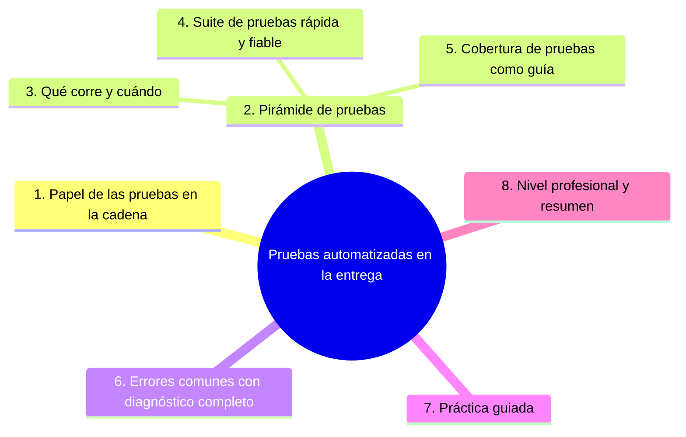

# Pruebas automatizadas en la entrega

## Introducción

La sección 09 enseñó a diseñar pruebas; este capítulo las sitúa dentro del pipeline: cuáles corren en cada PR, cuáles esperan a main, cómo evitar suites flaky y lentas, y cómo la cobertura de pruebas se convierte en la confianza que permite desplegar. Sin pruebas automatizadas, CI es un build con anuncios — y CD es una apuesta.

---

## Mapa conceptual de este capítulo



---

## 1. El papel de las pruebas en la cadena

```text
EN EL PIPELINE (sección 02):
   │
   ├── tests = el juicio que decide si el artefacto
   │   puede avanzar (gates)
   │
   ├── test unit → barato → PR (sección 01 cap. 03)
   ├── integración → más caro → PR o main (según
   │   duración)
   └── e2e / humo → caro → main/staging (cap. 04)
```

```text
LA PROMESA:
   │
   └── «si el pipeline está verde, sé que lo que se
       rompió del camino anterior NO se rompió de
       nuevo» — confianza acumulable (sección 01)
```

```text
   │
   └── sin pruebas en el flujo, el pipeline solo
       verifica que «compila» — Error 1
```

---

## 2. Pirámide (o lo que hoy funcione)

```text
MODELO CLÁSICO (pirámide):
──────────────────────────────────────────────────────
        / e2e \        pocas, lentas, valiosas
       / -------- \
      / integración \  medias
     / -------------- \
    /   unitarias      \ muchas, rápidas, baratas
   /____________________\
```

```text
AJUSTES MODERNOS (mención honesta):
   │
   ├── la pirámide perfecta choca con interfaces ricas:
   │   hoy conviven con contratos, tests de componente
   │   y menos e2e — el PRINCIPIO se mantiene:
   │   mayoría barata y rápida
   │
   └── lo que NO cambió: los caros no van al frente de
       todo PR sin motivo (punto 3)
```

```text
CÓMO DECIDIR DÓNDE VA CADA TEST (criterio):
   │
   ├── ¿falla raro y es rápido? → PR
   ├── ¿necesita servicios/entorno? → integración en
   │   PR si cabe en tiempo, si no en main
   └── ¿es un viaje completo por la UI? → pocos, en
       main/staging
```

---

## 3. Qué corre y cuándo

```text
POR ESCENARIO:
──────────────────────────────────────────────────────
PR        lint + unit + (integración si < presupuesto)
          → feedback al autor en minutos

push main todo lo del PR + suite completa + lo
          pesado (e2e, contrato con servicios)

schedule  suites lentas/navegadores/rarezas (nightly)

release   humo sobre el artefacto + checklist
          (sección 18 cap. 04 / cap. 04 aquí)
```

```text
   │
   └── el criterio NO es «todo siempre» sino «lo que
       protege cada puerta, en el momento en que se
       abre esa puerta» (Error 3)
```

```yaml
# matiz de disparo (sección 19 cap. 02):
# PR: suite rápida
# main: suite completa
# schedule: lo que no cabe en el día
```

---

## 4. Suite saludable: rápida y fiable

```text
SALUD DE LA SUITE:
   │
   ├── rápida: minutos, no decenas (presupuesto de
   │   la sección 01 cap. 04)
   │
   ├── fiable: flaky = bug con dueño (sección 19 cap.
   │   06 Error 1)
   │
   ├── determinista: sin dependencia de red/orden/hora
   │   (o con aislamiento explícito)
   │
   └── legible: el fallo dice QUÉ esperaba y QUÉ hubo
```

```text
PRÁCTICAS DE MANTENIMIENTO:
   │
   ├── tests que fallan siempre → arreglar o borrar
   │   (un test rojo permanente no es test, es ruido)
   │
   ├── duplicados → fusionar (sección 09)
   │
   ├── datos de prueba propios por test (aislamiento)
   │
   └── revisar la suite como código: es código con
       dueño (sección 16)
```

```text
   │
   └── la suite es la memoria del proyecto: si nadie
       la cuida, la confianza en el verde se pudre
       (Error 4)
```

---

## 5. Cobertura como guía, no como meta

```text
QUÉ ES (cobertura):
   │
   └── % de líneas/ejecutadas por los tests
```

```text
QUÉ NO ES:
   │
   ├── no es calidad: puedes cubrir el 90% con tests
   │   que no verifican nada (Error 5)
   │
   └── no es objetivo único: subir % no es el fin
```

```text
USO CORRECTO:
   │
   ├── detectar ZONAS SIN TEST (código nuevo sin
   │   cubrir → pregunta en el PR)
   │
   ├── umbral suave para evitar caídas grandes
   │   (p. ej. «no baja de X»)
   │
   └── conversación: «esta rama toca módulo crítico y
       sus tests cubren poco» → mejor pregunta que un
       número decorativo
```

```text
   │
   └── métrica útil en la retro: cobertura de CAMBIOS
       (lo que toca el PR) vs. cobertura global
       — sección 26
```

---

## 6. Errores comunes con diagnóstico completo

### Error 1: pipeline sin pruebas (solo compila)

**Qué ocurrió:** CI verde constante; producción encontraba bugs en cada entrega.

**Por qué:** no se añadieron tests al pipeline (o hay pocos en el repo).

**Cómo comprobarlo:** pasos del workflow; nº de tests ejecutados.

**Opciones:** empezar con tests unitarios del núcleo y smoke; crecer por zonas críticas (sección 09).

**Riesgos:** CI decorativo (Error de sección 01 cap. 06).

**Solución:** tests como gate (punto 1).

**Cómo se evita:** plantilla de pipeline con al menos unit + smoke.

---

### Error 2: todo el peso en el PR

**Qué ocurrió:** PRs de 20 minutos por e2e completos; el equipo redujo los PRs a cambios grandes para «amortizar».

**Por qué:** sin jerarquía por coste (punto 3).

**Cómo comprobarlo:** composición de tiempos del CI de PR.

**Opciones:** mover lo caro a main/schedule; en PR, el grueso barato.

**Riesgos:** se destruye el flujo pequeño (sección 15/01).

**Solución:** qué corre dónde (punto 3).

**Cómo se evita:** presupuesto de PR (sección 01 cap. 04).

---

### Error 3: los tests caros protegen solo main

**Qué ocurrió:** e2e solo en main; los fallos llegaban fusionados y había que revertir.

**Por qué:** se priorizó ahorrar PR sin medir (Error 2 inverso).

**Cómo comprobarlo:** dónde se descubren los fallos: ¿en PR o en main?

**Opciones:** subconjunto de e2e en PR si cabe; humo en staging antes de prod (cap. 04).

**Riesgos:** main rojo a diario.

**Solución:** capas en ambos (punto 3).

**Cómo se evita:** métrica «rojos en main» (sección 01 cap. 04).

---

### Error 4: suite flaky normalizada

**Qué ocurrió:** «un 5% de reintentos es normal» se volvió política involuntaria.

**Por qué:** nadie tiene dueño del flake (punto 4).

**Cómo comprobarlo:** tasa de reintentos (panel de ejecuciones).

**Opciones:** backlog de flaky con dueño y SLA; arreglar o retirar.

**Riesgos:** alarma inservible.

**Solución:** verde = verdad (punto 4).

**Cómo se evita:** métrica de reintentos en retro.

---

### Error 5: cobertura inflada con tests triviales

**Qué ocurrió:** 90% de cobertura y bugs reales pasando (los tests verificaban que las funciones existen).

**Por qué:** se midió el número y no la calidad (punto 5).

**Cómo comprobarlo:** leer una muestra: ¿asserts que verifican comportamiento?

**Opciones:** replantear tests del núcleo; umbral suave + revisión de calidad en PR (sección 15 cap. 03).

**Riesgos:** confianza falsa.

**Solución:** cobertura como guía (punto 5).

**Cómo se evita:** cultura: revisar tests como parte de la revisión.

---

### Error 6: datos de prueba compartidos y rotos

**Qué ocurrió:** tests que dependen de datos globales fallaban según el orden o dejaban basura.

**Por qué:** sin aislamiento (punto 4).

**Cómo comprobarlo:** fallos solo en CI completo o al paralelizar.

**Opciones:** fixtures propias por test, limpieza explícita, entornos efímeros (sección 25).

**Riesgos:** inestabilidad crónica.

**Solución:** aislamiento (punto 4).

**Cómo se evita:** estándares de fixtures (sección 09).

---

## 7. Práctica guiada

### Objetivo

Reorganizar la estrategia de pruebas de tu proyecto según el pipeline.

### Paso 1: inventario

```text
Lista tus tests: unit · integración · e2e · smoke.
Anota duración aproximada de cada grupo.
```

### Paso 2: jerarquía por puerta

```text
PR      → unit + lint + (integración rápida)
main    → + suite completa + e2e subset
schedule→ lo lento/raro
```

1. Ajusta los workflows (sección 19 cap. 02: triggers por evento).

### Paso 3: presupuesto

1. Mide: ¿el PR cabe en el presupuesto? Si no: mueve un grupo (punto 3) y vuelve a medir.

### Paso 4: caza de flaky

1. Revisa las últimas 20 ejecuciones: ¿algún fallo reintentado? Identifica el test y ábrele entrada con dueño.

### Paso 5: cobertura de cambios

1. Activa informe de cobertura y mira UN PR: ¿lo que tocó está cubierto? Añade el test que falte.

### Paso 6: política

```markdown
## Pruebas en la entrega
- PR: unit + integración rápida (presupuesto < X min)
- main: suite completa + e2e subset
- Flaky: dueño y SLA — reintentos como deuda
- Cobertura: no baja; se revisa por CAMBIO en PR
- Tests: se revisan como código en el PR
```

### Resultado esperado

Estrategia por puerta aplicada, presupuesto cumplido, flaky en radar y política escrita.

### Conclusión esperada

Las pruebas en la entrega no son «más pasos»: son las puertas que protegen cada avance — y solo funcionan si son rápidas, fiables y están donde el costo lo justifica.

---
### Ejercicio de transferencia

En un proyecto de una biblioteca JavaScript, define qué pruebas deben correr en cada PR (unitarias y lint), qué pruebas en cada push a main (integración y cobertura) y qué pruebas en releases nocturnos (e2e y performance). Documenta la decisión y comparte el archivo de configuración.

## 8. Nivel profesional + resumen


### 8.1. Pruebas a escala

```text
   │
   ├── estrategia documentada por plantilla de repo:
   │   qué corre en PR/main/schedule (sección 18)
   │
   ├── métricas: duración de suite, reintentos,
   │   cobertura de cambios, rojos en main
   │
   ├── flaky como defecto con dueño y SLA
   │
   ├── datos/entornos de prueba efímeros (sección 25)
   │
   ├── tests de contrato entre servicios cuando hay
   │   varios (mención — integración con arquitectura,
   │   sección 25)
   │
   └── confianza de despliegue: la tasa de fallos que
       llegan a staging define cuánto gate falta
       (cap. 04)
```

### 8.2. Resumen

En este capítulo aprendiste que:

* las pruebas son el juicio del pipeline: cada puerta (PR, main, release) con su capa;
* pirámide práctica: mayoría barata y rápida; los caros, donde aportan;
* suite saludable: rápido, fiable, aislado, legible — flaky y tests muertos se combaten;
* cobertura como guía de zonas y de cambios, no como premio;
* los errores típicos (CI sin tests, todo en el PR, e2e solo en main, flaky normalizado, cobertura inflada, datos compartidos) se previenen con estrategia y métricas;
* a nivel profesional: plantillas de estrategia y confianza medida.

La idea principal es:

> **La confianza para desplegar se compra con puertas bien colocadas: pruebas rápidas donde se decide, lentas donde caben y ninguna que mienta — porque un verde flaky es un rojo disfrazado.**

---
## Autopreguntas de cierre

Sin mirar el material, responde mentalmente y luego compruébalo con este capítulo:

1. ¿Por qué es necesario colocar pruebas como puertas en el pipeline y qué ocurre si se omite alguna puerta?
2. ¿Cómo ayuda la pirámide de pruebas a equilibrar velocidad y confianza en el proceso de entrega?
3. ¿Qué tipos de pruebas deberían ejecutarse en cada pull request, en la rama main y en los releases, y por qué?
4. ¿Qué características definen una suite de pruebas «saludable» (rápida y fiable) y cómo se logra?
5. ¿De qué manera la cobertura de pruebas puede ser una guía útil pero no una meta absoluta, y qué riesgos existen al perseguir alta cobertura sin considerar calidad?
6. ¿Cómo detectar y corregir suites flaky que comprometen la fiabilidad del verde en CI?

## Próximo paso


Ya tienes la verificación con criterio.

Ahora el paso siguiente del flujo: entregar continua y desplegar sin sustos.

Continúa con:

[`04-entrega-continua-y-despliegue-continuo.md`](04-entrega-continua-y-despliegue-continuo.md)
