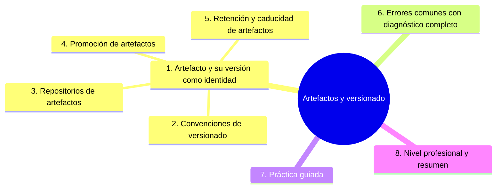

# Artefactos y versionado

## Introducción

Un **artefacto** es la salida concreta de tu pipeline — paquete, imagen, binario — y su **versión** es la etiqueta que le da identidad en el tiempo. Sin artefactos bien versionados, «¿qué hay en producción?» no tiene respuesta, el rollback es una apuesta y la auditoría es imposible. Este capítulo cubre el ciclo de vida del artefacto: cómo se nombra, dónde vive, cómo se prueba, se promociona y se retiene.

---

## Mapa conceptual de este capítulo



---

## 1. Qué es un artefacto y por qué su versión es la identidad

```text
ARTEFACTO = salida ejecutable/transportable:
   │
   ├── paquete (wheel, npm, jar, binario)
   ├── imagen de contenedor
   ├── ejecutable/compilado
   └── dataset/modelo con metadatos (sección 21)
```

```text
IDENTIDAD COMPLETA (lo que debe llevar siempre):
   │
   ├── nombre
   ├── versión
   ├── commit que lo produjo
   └── digest/hash (integridad — sección 20 cap. 05)
```

```text
   │
   └── la versión responde: «¿qué hay en producción?»
       → nombre+versión+commit → trazabilidad total
       (Error 1 si no existe)
```

```text
   │
   └── regla: si dos artefactos tienen el mismo
       nombre y versión, son el MISMO artefacto — por
       eso NO se sobrescribe lo publicado (Error 2)
```

---

## 2. Convenciones de versionado

```text
SEMVER (vMAJOR.MINOR.PATCH — sección 17 cap. 05):
   │
   ├── MAJOR: cambios incompatibles
   ├── MINOR: compatibles con crecimiento
   └── PATCH: arreglo compatible
```

```text
VERSIONADO CON EL CÓDIGO:
   │
   ├── la versión nace de la convención del repo:
   │   tag de release (sección 18 cap. 04) o
   │   incremento automático por commit/tipo
   │
   └── una entrega = una versión = un tag en git
       (punto 3)
```

```text
VERSIONES EN CI:
   │
   ├── ej: 1.4.0+ci.28 (build metadata) o sufijo de
   │   commit corto (1.4.0-a1b2c3d) para internos
   │
   └── lo importante: sea ÚNICA y ligada al commit
       (nada de «latest» como versión)
```

```text
   │
   └── artefactos de CI intermedios (builds de prueba)
       también se versionan — pero distinguiéndolos
       (no confundir con release público)
```

---

## 3. Repositorios de artefactos

```text
DÓNDE VIVEN:
   │
   ├── registries por ecosistema (npm, pypi, ghcr,
   │   registries de contenedores — mención)
   │
   ├── artefactos de CI (la plataforma — sección 19)
   │
   └── releases (sección 18 cap. 04): publicación
       ligada al tag
```

```text
CÓMO ELIGES (criterio):
   │
   ├── consumo interno: registry del equipo/organización
   │
   ├── público: el registry oficial del ecosistema
   │
   └── en todo caso: credenciales de publicación en
       environment (sección 20 cap. 07 / OIDC cap. 07
       sección 20)
```

```text
ACCESO:
   │
   ├── publicar: solo el pipeline (nunca a mano — la
   │   publicación manual no es reproducible)
   │
   └── consumir: credencial mínima, rotada (sección 20
       cap. 01)
```

```text
   │
   └── el registry es la memoria del producto: si ahí
       solo hay «la última» no hay memoria (Error 4)
```

---

## 4. Promocición: el mismo a todo el viaje

```text
FLUJO:
──────────────────────────────────────────────────────
build (CI) → staging: versión X → validación →
promoción de X a production → misma versión X
```

```text
PRINCIPIO DE PROMOCIÓN:
   │
   ├── NO se reconstruye en cada entorno (sección 02
   │   Error 2): se re-usa la MISMA pieza con la
   │   MISMA versión
   │
   └── staging y production corren «lo mismo» → el
       riesgo es conocido
```

```text
CÓMO SE LLEVA A LA PRÁCTICA:
   │
   ├── etiquetas/digest del artefacto que está en
   │   staging se reutiliza en el gate de producción
   │
   └── el registro de despliegues (qué versión en qué
       entorno) se deriva de esto — pregúntate: ¿puedo
       listar producción ahora mismo? (sección 26)
```

```text
   │
   └── sin promoción, cada entorno es un experimento
       distinto (Error 3)
```

---

## 5. Retención y caducidad

```text
POLÍTICA DE RETENCIÓN (decisión escrita):
   │
   ├── CI intermedio: días (sección 19 cap. 05)
   │
   ├── releases públicos/internos: meses/años según
   │   soporte y auditoría
   │
   └── seguridad: los vulnerables NO se consumen (se
       retiran o se bloquean — sección 20 cap. 03)
```

```text
RETIRAR:
   │
   ├── marcar como deprecado (si lo consumen otros)
   │
   └── no borrar lo que producción todavía corre —
       retirar cuando nadie lo use (inventario)
```

```text
   │
   └── retener ≠ guardar todo para siempre: la
       política evita tanto el vertedero como la
       pérdida del rollback (Error 6)
```

---

## 6. Errores comunes con diagnóstico completo

### Error 1: artefactos sin versión («build123» suelto)

**Qué ocurrió:** nadie sabía qué build correspondía a qué release; la auditoría fue reconstruir por fechas.

**Por qué:** sin convención (punto 1/2).

**Cómo comprobarlo:** nombres en el registry; existe mapping versión→commit?

**Opciones:** adoptar semver+tag; regenerar mapping para lo reciente; documentar.

**Riesgos:** sin trazabilidad no hay rollback ni auditoría.

**Solución:** identidad completa (punto 1).

**Cómo se evita:** plantilla de release (sección 18 cap. 04).

---

### Error 2: sobrescribir la versión publicada

**Qué ocurrió:** se reemplazó `app:1.4.0` con un build nuevo tras un «arreglo»; dos máquinas tenían «1.4.0» distintos.

**Por qué:** se pensó «es más rápido que subir versión» (punto 1).

**Cómo comprobarlo:** digests del mismo tag en distintos momentos.

**Opciones:** publicar 1.4.1; regla: lo publicado es inmutable; digest como verdad.

**Riesgos:** imposible saber qué había.

**Solución:** inmutabilidad (punto 1).

**Cómo se evita:** revisar el paso de publicación en CI (no hay overwrite).

---

### Error 3: reconstruir para producción (sin promoción)

**Qué ocurrió:** staging validó la versión A; producción construyó otra con el mismo código pero dependencias distintas.

**Por qué:** dos pipelines (punto 4).

**Cómo comprobarlo:** ¿el despliegue de prod usa el artefacto validado?

**Opciones:** un solo build y promoción por digest; retiros de la práctica antigua.

**Riesgos:** lo validado ≠ lo entregado (sección 02).

**Solución:** misma pieza (punto 4).

**Cómo se evita:** checklist de despliegue (cap. 04).

---

### Error 4: registry sin registro de despliegues

**Qué ocurrió:** había 40 imágenes y nadie sabía cuál corría en cada entorno.

**Por qué:** solo publicar, sin registrar (punto 3/4).

**Cómo comprobarlo:** ¿listas producción ahora? ¿con qué versión corre X?

**Opciones:** registro simple (entorno→versión→fecha→quién); automatizar desde el pipeline.

**Riesgos:** respuesta imposible en incidente.

**Solución:** inventario vivo (punto 4).

**Cómo se evita:** incluir el registro en el runbook (sección 26).

---

### Error 5: publicación manual desde la laptop

**Qué ocurrió:** alguien publicó «un fix» desde su máquina; no estaba en main ni en CI.

**Por qué:** permisos de publicación accesibles a personas (punto 3).

**Cómo comprobarlo:** quién tiene credencial de publicación; publicaciones sin ejecución de CI.

**Opciones:** credencial solo en environment de CI (OIDC); revertir la publicación manual si procede.

**Riesgos:** versión que no existe en el código.

**Solución:** solo pipeline publica (punto 3).

**Cómo se evita:** permisos y auditoría (sección 20 cap. 07).

---

### Error 6: retención «forever» o «nada»

**Qué ocurrió:** o el storage crecía sin control, o se purgaron artefactos y el rollback del mes anterior era imposible.

**Por qué:** sin política (punto 5).

**Cómo comprobarlo:** existe política escrita? ¿la refleja la configuración?

**Opciones:** definir retención por categoría y aplicarla; revisar trimestralmente.

**Riesgos:** coste o pérdida de reversibilidad.

**Solución:** política escrita (punto 5).

**Cómo se evita:** gobernanza (sección 18).

---

## 7. Práctica guiada

### Objetivo

Publicar un artefacto con identidad completa y registrarlo.

### Paso 1: convención

```text
Elige y escribe:
   │
   ├── formato de versión (semver + sufijo de CI)
   ├── quién la decide (tag / autoincremento)
   └── regla: inmutable tras publicar
```

### Paso 2: publicación en CI

1. Añade el paso de publicación al workflow de release (credential solo en environment).
2. Comprueba: el artefacto publicado lleva versión + commit + digest.

### Paso 3: registro de despliegues

```markdown
| Entorno | Versión | Commit | Fecha | Quién |
|---------|---------|--------|-------|-------|
| staging | 1.4.0-rc.1 | a1b2c3d | ... | CI |
| production | 1.3.2 | f9e8d7c | ... | ana |
```

1. Poblado manualmente por ahora; el pipeline lo hará después (punto 4).

### Paso 4: promoción

```text
Simula: despliega a staging la versión A; para pasar
a production, reusa EXACTAMENTE A (misma versión y
digest) — no recompiles.
```

### Paso 5: inmutabilidad

1. Intenta publicar dos veces la misma versión en un registro de práctica: entiende qué impide (o qué deberías impedir por política).

### Paso 6: retención

1. Escribe la política (punto 5) en `docs/operaciones.md` con categorías y plazos.

### Resultado esperado

Versión semántica con digest, publicación por CI, registro poblado y política de retención escrita.

### Conclusión esperada

El artefacto con identidad es el contrato del despliegue: lo que se publica, se registra, no se toca y se puede volver a encontrar.

---
### Ejercicio de transferencia

En un proyecto de una librería de Python, publica un paquete en TestPyPI siguiendo SemVer, luego promueve la misma versión a PyPI después de pasar pruebas de integración. Comparte los comandos usados y los enlaces a los paquetes.

## 8. Nivel profesional + resumen


### 8.1. Artefactos a escala

```text
   │
   ├── registro de artefactos + registro de
   │   despliegues como fuentes de verdad (sección 26)
   │
   ├── publicación con OIDC y environments (sección 20
   │   cap. 07)
   │
   ├── SBOM por artefacto (sección 20 cap. 05)
   │
   ├── políticas de retención y deprecación en
   │   organización (sección 18)
   │
   ├── promoción automatizada por gates (cap. 04)
   │
   └── métrica: tiempo desde commit hasta artefacto
       publicado; % de producción con versión registrada
```

### 8.2. Resumen

En este capítulo aprendiste que:

* el artefacto lleva identidad: nombre, versión, commit y digest — y es inmutable;
* versionado semver o sufijo de CI, nacido del código (tags), nunca «a ojo»;
* el registry como memoria: solo CI publica, con credencial de environment;
* promoción: la misma pieza recorre staging y producción;
* retención con política escrita: ni vertedero ni pérdida de rollback;
* los errores típicos (sin versión, overwrite, reconstrucción, sin registro, publicación manual, retención caótica) se previenen con convención y automatización;
* a nivel profesional: registros vivos y SBOM por pieza.

La idea principal es:

> **La versión es la identidad del producto en el tiempo: lo que se publica no se toca, lo que se despliega es la pieza validada y lo que se corre siempre se puede nombrar — si no, no hay incidente que puedas resolver con precisión.**

---
## Autopreguntas de cierre

Sin mirar el material, responde mentalmente y luego compruébalo con este capítulo:

1. ¿Por qué la versión de un artefacto debe ser su identidad inmutable y qué problemas surgen si se reutiliza una versión?
2. ¿Qué convenciones de versionado (como SemVer) son más adecuadas para artefactos de software y por qué?
3. ¿Cómo elegir un repositorio de artefactos (como Docker Hub, Maven Central, GitHub Packages) y qué características deben evaluarse?
4. ¿Qué significa promocionar un artefacto y por qué es importante que el mismo artefacto recorra todos los entornos sin ser reconstruido?
5. ¿Qué políticas de retención y caducidad deberías aplicar a artefactos para equilibrar costo de almacenamiento y necesidades de auditoría?
6. ¿Cómo afecta la falta de retención adecuada de artefactos a la capacidad de realizar rollbacks o investigar incidentes pasados?

## Próximo paso


Ya sabes construir, nombrar y promocionar.

Ahora lo que completa el ciclo: cuando el despliegue sale mal.

Continúa con:

[`06-rollback-y-recuperacion.md`](06-rollback-y-recuperacion.md)
