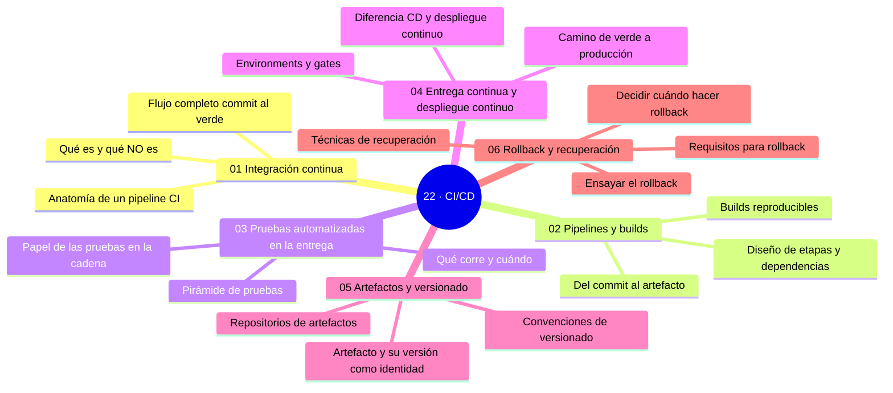

# 22 — CI/CD

## Bienvenido a esta sección

Aquí Git se convierte en entrega: del commit a producción con verificación en cada paso. La integración continua pone el verde confiable; los pipelines convierten código en artefactos; las pruebas son las puertas; la entrega continua añade environments y gates; los artefactos viajan con identidad; y el rollback garantiza que ningún despliegue sea una calle sin salida.

## En esta sección estudiarás

* qué es integración continua de verdad — y qué no es;
* diseño de pipelines: etapas, builds reproducibles y artefactos entre jobs;
* pruebas automatizadas colocadas por puerta (PR, main, release), rápidas y fiables;
* entrega continua vs. despliegue continuo, environments, gates y estrategias de publicación;
* artefactos: versionado, inmutabilidad, registries y promoción;
* rollback: umbral, requisitos, ensayo y post-mortem.

## Objetivos de aprendizaje

Al terminar esta sección serás capaz de:

* diferenciar integración continua real de «subir todos los días»;
* diseñar pipelines con etapas, builds reproducibles y artefactos entre jobs;
* colocar pruebas automatizadas como puertas (PR, main, release) rápidas y fiables;
* aplicar entrega continua con environments, gates y estrategias de publicación;
* versionar artefactos con inmutabilidad y promoción entre entornos;
* planear un rollback con umbral, ensayo y post-mortem.

## Mapa conceptual

---

## ¿Qué aprenderás en esta sección?

1. [`01-integracion-continua.md`](01-integracion-continua.md) — del commit al verde y su cultura.
2. [`02-pipelines-y-builds.md`](02-pipelines-y-builds.md) — grafo de etapas y builds reproducibles.
3. [`03-pruebas-automatizadas-en-la-entrega.md`](03-pruebas-automatizadas-en-la-entrega.md) — qué corre y cuándo.
4. [`04-entrega-continua-y-despliegue-continuo.md`](04-entrega-continua-y-despliegue-continuo.md) — de verde a producción con gates.
5. [`05-artefactos-y-versionado.md`](05-artefactos-y-versionado.md) — identidad, registry y promoción.
6. [`06-rollback-y-recuperacion.md`](06-rollback-y-recuperacion.md) — el plan B ensayado.

## Cómo estudiar esta sección

Reconstruye tu cadena de entrega mientras lees: CI ordenado, artefacto identificado, staging con humo, gate de aprobación y un runbook de reversión ensayado. Cada capítulo asiente sobre el anterior — el cierre es una entrega real y su simulacro de rollback.

## Referencias

* Humble, J. y Farley, D. — *Continuous Delivery* (2010) — principios.
* DORA — DevOps Research and Assessment: métricas de flujo (dora.dev).
* GitHub Actions — documentación de CI (docs.github.com/actions).

---
## Checkpoint 22 — Comprobación obligatoria

Antes de avanzar a `../23-devops/`, demuestra que puedes (en un repositorio de práctica real):

1. **Crear** un workflow de GitHub Actions que compile, pruebe y empaquete una aplicación sencilla.
2. **Definir** etapas en un pipeline (build, test, deploy) y especificar dependencias entre jobs.
3. **Configurar** artefactos de construcción y subir them as a GitHub Release o a un registro de paquetes.
4. **Implementar** una puerta de aprobación manual antes del despliegue a producción usando protección de ramas o entorno.
5. **Simular** un rollback mediante la reimplementación de una versión anterior y verificar la recuperación del servicio.
6. **Utilizar** caches de dependencias para acelerar builds repetitivos y reducir tiempo de CI.

## Autopreguntas de cierre

Sin mirar el material, responde mentalmente y luego compruébalo con los capítulos de la sección:

1. ¿Qué significa «CI verde» que no significa «me pasaron las pruebas en mi máquina»?
2. ¿Qué diferencia hay entre entrega continua y despliegue continuo?
3. ¿Qué hace que un build sea «reproducible»?
4. ¿Qué es una promoción de artefactos y para qué sirve?
5. ¿Por qué es importante que los artefactos sean inmutables y cómo se logra eso en un registry?
6. ¿Cómo afecta la elección de la estrategia de branching (GitFlow, trunk‑based) a la eficacia de CI/CD?
7. ¿Qué métricas (tiempo de recuperación, frecuencia de despliegue, etc.) indican que tu pipeline está optimizado?
8. Describe un escenario donde un fallo en una etapa de test genere un bloqueo válido y cómo deberías proceder.

---

## Próximo paso

Cuando termines los seis capítulos, continúa con la siguiente sección:

[`../23-devops/`](../23-devops/)
