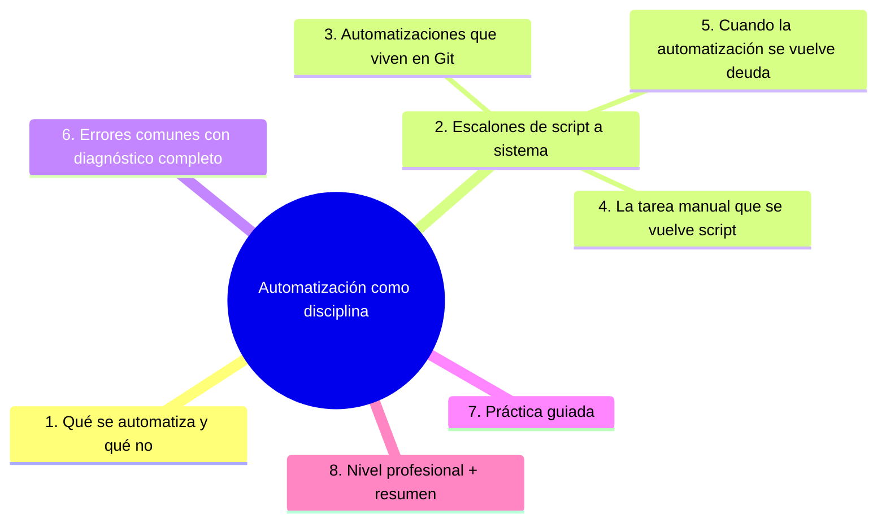
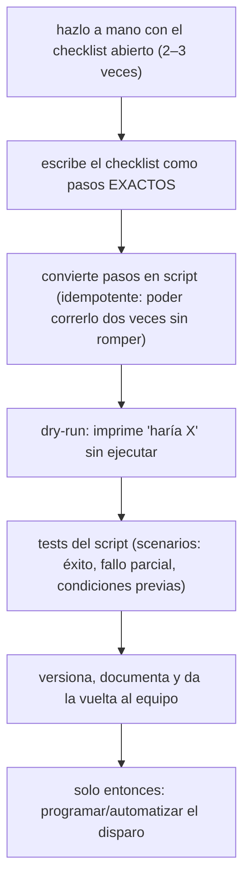

# Automatización como disciplina

## Introducción

Ya automatizaste CI y entrega (sección 22); aquí la automatización se vuelve método: la regla de «lo que se hace dos veces se automatiza», aplicada a todo el ciclo — configuración de entornos, tareas de mantenimiento, provisionamiento y las repetitividades que consumen la atención del equipo. También enseña el arte de automatizar bien: scripts pequeños, versionados, con tests y dueños — porque una automatización rota es más cara que la tarea manual.

## ---
## Mapa conceptual de este capítulo



---
## 1. Qué se automatiza (y qué no)

```text
BUENOS CANDIDATOS:
    │
    ├── lo repetitivo y con reglas claras (build,
    │   deploy, backups, reportes)
    ├── lo olvidadizo (rotaciones, recordatorios,
    │   renovaciones — sección 20 cap. 03)
    ├── lo peligroso si se hace mal (procesos con
    │   checklist que la máquina ejecuta siempre igual)
    └── lo que da feedback lento a mano (verificaciones)
```

```text
MALOS CANDIDATOS (al menos al principio):
    │
    ├── decisiones sin criterio escrito (automatizar la
    │   ambigüedad automatiza el caos)
    │
    ├── tareas que cambian cada vez (espera a que
    │   estabilicen el proceso)
    │
    └── lo que nadie entiende: sin entenderlo a mano,
        no se puede confiar en la versión script
```

```text
    │
    └── criterio: primero entender y estandarizar;
        después automatizar (Error 1 si se invierte)
```

---
## 2. Escalones: de script a sistema

```text
NIVELES (crece según necesidad):
──────────────────────────────────────────────────────
0. checklist humana       (cuando nadie puede
                           equivocarse de paso)
1. script local           (un archivo, versionado)
2. script ejecutable      por el equipo (requisitos,
                           --help, errores claros)
3. job en CI/CD           (disparo, registro, alerta)
4. sistema con estado     (reintentos, colas, paneles)
```

```text
    │
    └── el error no es quedarse en 1: es saltar a 4
        con un proceso que aún vive en la cabeza de
        una persona (Error 3)
```

```text
EN CADA ESCALÓN:
    │
    ├── el script es código: se revisa, se versiona, se
    │   prueba (sección 15)
    │
    └── nombre claro, salidas legibles, código de
        salida útil (errores ≠ «falló algo»)
```

---
## 3. Automatizaciones que viven en Git

```text
DÓNDE VIVEN:
    │
    ├── scripts/ o tools/ en el repo del producto
    │
    ├── workflows (sección 19) para lo que corre en CI
    │
    └── repos de plataforma (sección 25) cuando sirven
        a varios equipos
```

```text
QUÉ SIGNIFICA "LIVE EN GIT":
    │
    ├── cambios por PR con revisión (nadie cambia una
    │   automatización «a mano en el servidor»)
    │
    ├── historial: quién cambió qué y por qué (sección
    │   14 — mensajes con motivo)
    │
    ├── probado: la automatización crítica tiene su
    │   test o su modo dry-run (simulación)
    │
    └── con dueño (sección 16 cap. 06)
```

---
## 4. La tarea manual que se vuelve script



```text
IDEMPOTENCIA (concepto clave):
    │
    └── ejecutar el script 1 vez = ejecutarlo 5 veces:
        crea si no existe, actualiza si existe, no
        duplica — base de toda automatización segura
        (Error 4)
```

```text
    │
    └── la tarea manual que se documenta YA es la mitad
        del script: el runbook es el prototipo (sección
        22 cap. 06)
```

---
## 5. Cuando la automatización se vuelve deuda

```text
SEÑALES:
    │
    ├── falla y se "arregla" saltándola a mano
    ├── nadie sabe qué hace exactamente
    ├── tarda más que la tarea original
    └── cambia sin que nadie se entere (fuera de Git)
```

```text
DECISIÓN: REPARAR, SIMPLIFICAR O RETIRAR
    │
    ├── se usa y duele → reparar con prioridad
    ├── se usa poco → ¿merece? ¿o volver a manual y
    │   simplificar?
    └── no se usa → retirar (lo que no se usa también
        miente con su presencia)
```

```text
    │
    └── cada automatización tiene fecha de revisión en
        la gobernanza (sección 18) — Error 6 si vive
        indefinida sin mirarla
```

---
## 6. Errores comunes con diagnóstico completo

### Error 1: automatizar un proceso que nadie entiende

**Qué ocurrió:** el script replicó un proceso con pasos contradictorios; el resultado era correcto solo a veces.

**Por qué:** se saltó estandarizar (punto 1).

**Cómo comprobarlo:** ¿el proceso está escrito en algún lado antes del script?

**Opciones:** detener, documentar la tarea manual, estandarizar, reescribir.

**Riesgos:** automático y mal a la vez.

**Solución:** entender → estandarizar → automatizar (punto 1).

**Cómo se evita:** la receta del punto 4.

---

### Error 2: script que vive solo en una laptop

**Qué ocurrió:** la única copia de la automatización crítica estaba en el disco de una persona.

**Por qué:** nunca se versionó (punto 3).

**Cómo comprobarlo:** ¿existe en el repo? ¿tiene histórico?

**Opciones:** subirlo (revisando secretos), darle dueño, retirar copias locales sueltas.

**Riesgos:** pérdida total y cambios informales.

**Solución:** en Git con revisión (punto 3).

**Cómo se evita:** norma «toda herramienta del equipo, en el repo».

---

### Error 3: saltar a sistema complejo con proceso inmaduro

**Qué ocurrió:** se montó una cola de trabajos con paneles para un proceso que cambiaba cada semana; el sistema quedó a medias.

**Por qué:** nivel 4 para un nivel 1 (punto 2).

**Cómo comprobarlo:** ¿el proceso manual está estable? ¿sigue cambiando?

**Opciones:** volver al script simple; estabilizar el proceso; subir de nivel cuando duela.

**Riesgos:** infraestructura muerta.

**Solución:** escalones (punto 2).

**Cómo se evita:** criterio de subida escrito.

---

### Error 4: script no idempotente

**Qué ocurrió:** re-ejecutarlo duplicaba entradas o rompía el estado; se temía correrlo.

**Por qué:** no se diseñó para repetirse (punto 4).

**Cómo comprobarlo:** ejecútalo dos veces en un entorno de prueba.

**Opciones:** añadir chequeos previos (si existe, no crear; si está hecho, no repetir); dry-run.

**Riesgos:** miedo a usar la propia herramienta.

**Solución:** idempotencia (punto 4).

**Cómo se evita:** patrón obligatorio en la plantilla del equipo.

---

### Error 5: automatización sin registro

**Qué ocurrió:** la tarea corrió a las 3:00 y falló; nadie se enteró hasta el lunes.

**Por qué:** sin log ni alerta (nivel 3 incompleto — punto 2).

**Cómo comprobarlo:** ¿dónde están sus salidas? ¿quién recibe el fallo?

**Opciones:** logging con salida clara + alerta al canal/dueño; reintentos definidos.

**Riesgos:** fallo silencioso (peor que no automatizar).

**Solución:** automatizar incluye avisar (punto 2/3).

**Cómo se evita:** checklist de publicación de automatizaciones.

---

### Error 6: scripts con secretos incrustados

**Qué ocurrió:** el script de despliegue tenía la clave en texto dentro del archivo versionado.

**Por qué:** atajo (sección 20 cap. 01).

**Cómo comprobarlo:** búsqueda en scripts/ + secret scanning.

**Opciones:** incidente (rotar) + pasar a variables/secretos de CI.

**Riesgos:** exposición y traspaso del secreto a todos los clones.

**Solución:** credencial en su hogar (sección 19/20).

**Cómo se evita:** plantilla sin secretos + escaneo.

---
## 7. Práctica guiada

### Objetivo

Convertir una tarea manual recurrente en automatización versionada.

### Paso 1: elige la tarea

```text
Algo que haces ≥ 2 veces por semana con pasos fijos
(p. ej.: preparar release, verificar entorno, generar
informe).
```

### Paso 2: checklist a mano

1. Hazlo con el checklist abierto y ajusta los pasos hasta que sean exactos.

### Paso 3: script

```bash
#!/usr/bin/env bash
set -euo pipefail
# 1. comprobaciones previas (¿cumple condiciones?)
# 2. acciones (idempotentes)
# 3. resumen claro al final
```

### Paso 4: dry-run y doble ejecución

1. Añade `--dry-run` que imprima las acciones.
2. Ejecútalo dos veces seguidas: segundo resultado idéntico (idempotencia).

### Paso 5: vive en Git

1. Coloca en `tools/` (o equivalente), documenta en el README (sección 14 cap. 02), da dueño.
2. Si aplica: job de CI con registro y alerta (nivel 3).

### Paso 6: retira la versión manual

1. Comunica al equipo, retira el checklist viejo (o marcalo como «solo emergencias») y cronometra: ¿cuánto tiempo ahorraste?

### Resultado esperado

Script idempotente con dry-run, versionado, documentado y con su disparo/registro.

### Conclusión esperada

La disciplina no es automatizar mucho: es automatizar lo estable, probarlo, versionarlo y darle dueño — el resto sigue siendo una tarea a la espera de entenderse.

### Ejercicio de transferencia

Selecciona una tarea manual que realices con frecuencia (como actualizar un sitio web o generar un informe mensual). Aplica la receta de conversión: documenta el checklist, crea un script idempotente con pruebas de éxito/fallo, guárdalo en versión y establece su ejecución automática (como un job de CI o un cron). Entrega el enlace al repositorio y una breve explicación de cómo mejoró la fiabilidad o ahorró tiempo.


---
## 8. Nivel profesional + resumen

### 8.1. Automatización a escala

```text
    │
    ├── catálogo de automatizaciones con dueño y fecha
    │   de revisión (gobernanza — sección 18)
    │
    ├── plataforma de tareas (runners, colas, paneles)
    │   como producto interno (sección 25)
    │
    ├── estándares: dry-run, idempotencia, logging,
    │   alerta — checklist de la casa
    │
    ├── renovación automatizada de lo que se olvida
    │   (Dependabot, rotaciones — sección 20)
    │
    └── métrica: horas ahorradas/mes (estimación
        honesta) y fallos de automatización por trimestre
```

### 8.2. Resumen

En este capítulo aprendiste que:

* automatizar = entender y estandarizar primero; candidatos: repetitivo, olvidadizo, peligroso, de feedback lento;
* escalones: checklist → script → sistema en CI → sistema con estado — se sube cuando el anterior duele;
* la automatización vive en Git: PR, revisión, historial, dueño y dry-run;
* receta de conversión: checklist → script idempotente → doble ejecución → versionar → disparo;
* retiro: lo que no sirve se retira; lo que duele se repara con fecha;
* los errores típicos (proceso inmaduro, script local, salto de nivel, no idempotente, sin log, secretos) se previenen con disciplina;
* a nivel profesional: catálogo gobernado y estándares de la casa.

La idea principal es:

> **Una automatización es código con poder: si no está probada, versionada y con dueño, no es infraestructura — es una bomba de relojería con horario.**

---
## Autopreguntas de cierre

Sin mirar el material, responde mentalmente y luego compruébalo con este capítulo:

1. ¿Por qué es fundamental entender y estandarizar un proceso antes de automatizarlo, y qué riesgos asume uno al automatizar sin este paso?
2. ¿Cómo se determina cuándo subir un escalón de automatización (de script local a sistema en CI, por ejemplo), y qué señales indican que es momento de hacerlo?
3. ¿De qué manera los principios de Git (PR, revisión, historial, dueño y dry-run) aseguran que una automatización sea confiable y segura a largo plazo?
4. ¿En qué consiste la receta de conversión de una tarea manual a un script idempotente, y por qué cada paso es crítico para el éxito?
5. ¿Cómo se decide cuándo retirar una automatización versus repararla cuando se vuelve deuda, y qué criterios deben guiar esa decisión?
6. ¿Qué papel juegan los estándares y el catálogo gobernado en la escalabilidad de la automatización a nivel profesional, y cómo evitan los errores típicos?


## Próximo paso

Ya conviertes tareas en sistemas.

Ahora el contenedor: la caja que hace que «en mi máquina funciona» deje de existir.

Continúa con:

[`03-contenedores-y-docker.md`](03-contenedores-y-docker.md)