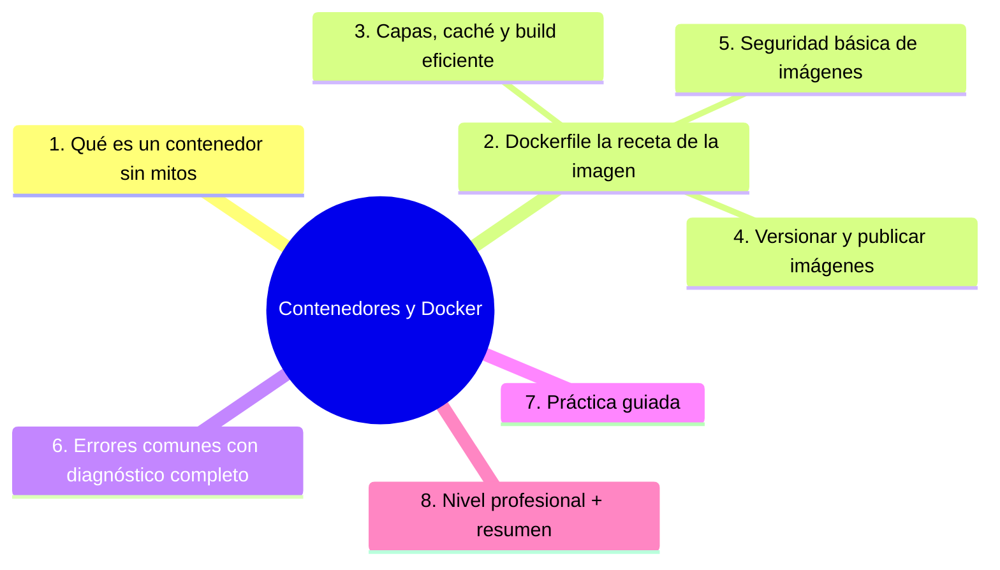
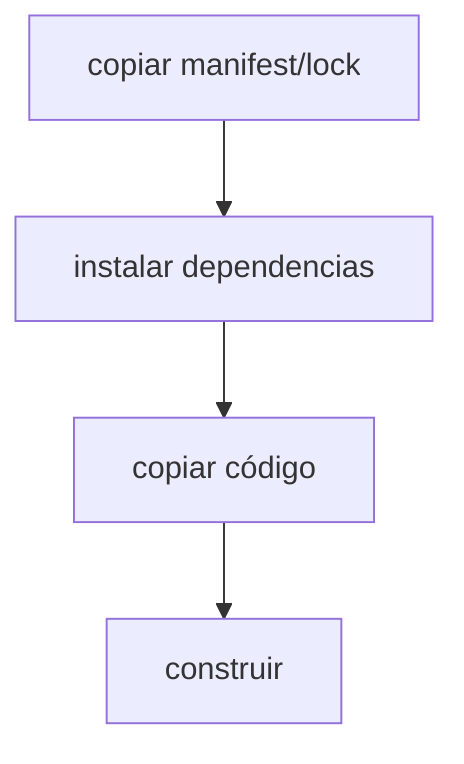

# Contenedores y Docker

## Introducción

El contenedor es la respuesta técnica a «en mi máquina funciona»: empaqueta la aplicación con sus dependencias en una caja reproducible que corre igual en la laptop, el CI y producción. **Docker** es la herramienta que popularizó el modelo. Este capítulo explica qué es realmente un contenedor, cómo se construyen imágenes con Dockerfile, cómo se versionan y publican, y cómo encajan en el flujo que ya construiste — sin mitos ni sobreventa.

## ---
## Mapa conceptual de este capítulo



---
## 1. Qué es un contenedor (sin mitos)

```text
IDEA CENTRAL:
    │
    └── proceso del SO con su propio aislamiento: el
        programa corre contra lo que la imagen trae
        (bibliotecas, versión de lenguaje), no contra
        lo que tenga la máquina anfitriona
```

```text
CONTRA LA MÁQUINA VIRTUAL (idea general):
    │
    ├── contenedor: comparte el SO anfitrión → más
    │   ligero y rápido de arrancar
    │
    └── VM: SO completo por dentro → aislamiento más
        pesado (pero más grueso)
```

```text
QUÉ SOLUCIONA:
    │
    ├── entorno idéntico en dev, CI y prod (punto 2/3
    │   de la sección 22: build reproducible)
    │
    ├── empaquetado: imagen = app + dependencias + SO
    │   mínimo
    │
    └── base para orquestación (mención: Kubernetes y
        similares — categoría, sección 25/26)
```

```text
QUÉ NO SOLUCIONA:
    │
    ├── no arregla código desordenado (sigue siendo tu
    │   app dentro)
    │
    ├── no sustituye la seguridad (una imagen insegura
    │   es una caja insegura — punto 5)
    │
    ├── no es obligatorio: muchos proyectos lo
        necesitan, muchos otros no (Error 1)
```

---
## 2. Dockerfile: la receta de la imagen

```dockerfile
# esquema típico (versión de ejemplo — ajusta a tu
# lenguaje):
FROM node:22-slim            # base fijada (sección 20)
WORKDIR /app
COPY package*.json ./
RUN npm ci --omit=dev       # dependencias desde lock
COPY . .
RUN npm run build
EXPOSE 3000
CMD ["node", "dist/server.js"]
```

```text
PIEZAS:
    │
    ├── FROM: base — fijada por versión/digest (sección
    │   20 cap. 05 Error 5)
    │
    ├── COPY/RUN: capas del sistema de ficheros
    │
    └── CMD/ENTRYPOINT: qué corre al arrancar
```

```text
REGLAS DE ORO:
    │
    ├── .dockerignore: no mandes node_modules/.git/.env
    │   al contexto de build (Error 2)
    │
    ├── no usar latest; fija la base
    │
    ├── usuario no-root dentro del contenedor
    │   (punto 5)
    │
    └── el Dockerfile vive en el repo y se revisa como
        cualquier código (sección 15)
```

```text
    │
    └── la imagen ES el build de producción: si el
        Dockerfile cambió, cambió cómo corre todo
```

---
## 3. Capas, caché y build eficiente



```text
EJEMPLO DE MAL ORDEN:
    │
    ├── COPY . . antes de instalar → cada cambio de
    │   código invalida la instalación de dependencias
    │   (builds lentos — sección 22 Error 2 de tiempos)
    │
    └── orden bueno: lock → install → código → build
```

```text
    │
    └── caché no es magia: es disciplina de orden en el
        Dockerfile (Error 3)
```

---
## 4. Versionar y publicar imágenes

```text
IDENTIDAD (igual que sección 22 cap. 05):
    │
    ├── nombre + versión + tag + digest (hash)
    │
    └── tags útiles: versión semver, versión+commit,
        latest SOLO como alias de conveniencia (nunca
        como versión real)
```

```text
PUBLICAR (en el flujo):
    │
    ├── build en CI (no en la laptop — sección 22)
    │
    ├── a registry (el de la organización/registro de
    │   contenedores — mención)
    │
    └── credenciales en environment (OIDC si tu
        plataforma lo soporta — sección 20 cap. 07)
```

```text
PROMOCIÓN (sección 22 cap. 05 aplica tal cual):
    │
    ├── staging y producción corren el MISMO digest
    │
    └── registro de despliegues: qué digest en qué
        entorno (sección 22 cap. 05 Error 4)
```

```text
    │
    └── imágenes = artefactos; las reglas del artefacto
        son aquí idénticas (inmutabilidad, retención)
```

---
## 5. Seguridad básica de imágenes

```text
CAPAS DE CUIDADO:
    │
    ├── base actualizada y mínima (poco = menos
    │   superficie — sección 20 cap. 03)
    │
    ├── dependencias dentro de la imagen: también
    │   escaneables (el scanner de imágenes — sección
    │   20 cap. 04 punto 5)
    │
    ├── usuario no-root: `USER` al final del build
    │
    ├── sin secretos en la imagen (¡se distribuye!):
    │   secretos en runtime (sección 19/20) — Error 5
    │
    └── firma/attestation de la imagen cuando el nivel
        lo exija (sección 20 cap. 05)
```

```text
    │
    └── una imagen publicada se comparte: lo que lleve
        dentro, sale con ella (Error 5 — el peor de la
        lista)
```

---
## 6. Errores comunes con diagnóstico completo

### Error 1: contenedorizar por moda

**Qué ocurrió:** un proyecto sencillo ganó Dockerfile, compose y build incomprensible; nadie lo ejecutaba ya «tal cual».

**Por qué:** se copió el stack de otro proyecto sin necesidad (punto 1).

**Cómo comprobarlo:** ¿hay entorno de ejecución documentado Y mantenido? ¿se usa?

**Opciones:** simplificar al método nativo si sobra; si se queda, mantenerlo completo (docker build funcional).

**Riesgos:** doble mantenimiento y falsa modernidad.

**Solución:** la herramienta sirve a la necesidad (punto 1).

**Cómo se evita:** decisión escrita en el README.

---

### Error 2: contexto de build gigante (sin .dockerignore)

**Qué ocurrió:** el build copiaba node_modules, .git y artefactos → imágenes pesadas y builds lentos.

**Por qué:** sin .dockerignore (punto 2).

**Cómo comprobarlo:** tamaño de la imagen; tiempo de build; qué copia COPY . .

**Opciones:** añadir .dockerignore (no menor que .gitignore); copias específicas.

**Riesgos:** lentitud + fugas de archivos locales (Error 2 y 5 relacionados).

**Solución:** contexto limpio (punto 2).

**Cómo se evita:** plantilla con .dockerignore (sección 18).

---

### Error 3: orden de capas que mata la caché

**Qué ocurrió:** cada commit re-instalaba todas las dependencias (build de 10 minutos).

**Por qué:** COPY . . antes de install (punto 3).

**Cómo comprobarlo:** cambiar solo código y ver si reinstala.

**Opciones:** reordenar: manifest+lock primero; código después.

**Riesgos:** CI lento cada PR (sección 22 cap. 01 Error 1).

**Solución:** disciplina de capas (punto 3).

**Cómo se evita:** revisar el Dockerfile en el PR.

---

### Error 4: latest en producción

**Qué ocurrió:** un deploy nocturno trajo una base «latest» recién publicada; algo cambió bajo los pies.

**Por qué:** sin fijado (punto 2 / sección 20 cap. 05).

**Cómo comprobarlo:** grep de FROM with latest.

**Opciones:** fijar versión/digest; renovación controlada con escaneo (Dependabot of dockerfiles — mención).

**Riesgos:** cambio fantasma en cada build.

**Solución:** base fijada (punto 2).

**Cómo se evita:** checklist del Dockerfile.

---

### Error 5: secretos o datos dentro de la imagen

**Qué ocurrió:** la imagen publicada llevaba un .env con credenciales — cualquiera que la bajara podía extraerlo.

**Por qué:** se copió todo el directorio incluido .env (punto 2/5).

**Cómo comprobarlo:** inspeccionar capas de la imagen (herramientas de inspección) — Error: revisar en el PR.

**Opciones:** rotar spot (sección 20 cap. 01), limpiar imagen y cachés de registry, reglas para no repetir.

**Riesgos:** credencial distribuida (sección 20 cap. 01 Error 1).

**Solución:** secretos en runtime, nunca en build (punto 5).

**Cómo se evita:** .dockerignore + escaneo de imágenes + revisión.

---

### Error 6: correr como root

**Qué ocurrió:** contenedor con root → un fallo en la app tenía permisos de sistema dentro de la caja.

**Por qué:** default de muchas bases (punto 5).

**Cómo comprobarlo:** inspeccionar usuario de la imagen; probar `id` dentro.

**Opciones:** añadir usuario no-root y dar permisos solo donde haga falta.

**Riesgos:** el aislamiento se debilita justo en el momento de un error.

**Solución:** principio de mínimo privilegio (punto 5 / sección 20).

**Cómo se evita:** plantilla de Dockerfile de la casa.

---
## 7. Práctica guiada

### Objetivo

Contenedorizar un proyecto pequeño con build eficiente y publicación por CI.

### Paso 1: Dockerfile

```dockerfile
FROM <base-fijada>
WORKDIR /app
COPY <manifest+lock> ./
RUN <instalar-sin-desarrollo>
COPY . .
RUN <build>
USER nonroot
CMD [<arranque>]
```

### Paso 2: .dockerignore

```gitignore
node_modules/
.git/
.env
dist/
coverage/
```

### Paso 3: build y prueba local

```bash
docker build -t miapp:0.1.0 .
docker run --rm -p 3000:3000 miapp:0.1.0
# comprueba: ¿responde? ¿es la versión correcta?
```

### Paso 4: capas eficientes

1. Cambia SOLO un archivo de código y vuelve a build: ¿reinstala dependencias? (Si lo hace, reordena — punto 3.)

### Paso 5: publicación en CI

```text
Añade al workflow de release:
    │
    ├── build de la imagen con tag versión+commit
    │   → push al registry (credentials en environment)
    │   └── anota el digest en el registro de despliegues
```

### Paso 6: seguridad

```bash
# revisa dentro de la imagen:
docker run --rm miapp:0.1.0 id        # ¿no-root?
# ¿lleva .env? inspecciona si tu herramienta lo permite
```

### Resultado esperado

Imagen fijada, build con caché sana, publicación por CI con digest y arranque como no-root.

### Conclusión esperada

El contenedor es el contrato de ejecución: si la receta (Dockerfile) es fija, limpia y segura, «en mi máquina funciona» deja de ser discusión.

### Ejercicio de transferencia

Selecciona una aplicación que actualmente ejecutas en una máquina virtual o servidor físico (como un sitio web estático o una API sencilla). Crea un Dockerfile optimizado con base fijada, .dockerignore, usuario no-root y orden de capas eficiente. Construye la imagen, publícala en un registry y verifica que se ejecuta como no-root. Entrega el Dockerfile, el enlace a la imagen y una breve explicación de los beneficios obtenidos.


---
## 8. Nivel profesional + resumen

### 8.1. Contenedores a escala

```text
    │
    ├── imágenes como parte del release: digest en el
    │   registro de despliegues (sección 22 cap. 05)
    │
    ├── escaneo de imágenes y firmas (sección 20
    │   caps. 04/05)
    │
    ├── bases mínimas y renovadas (distroless/templadas
    │   — mención según ecosistema)
    │
    ├── orquestación cuando el volumen lo justifica
    │   (sección 25/26 — categoría)
    │
    ├── imagen única por release, desplegada en varios
    │   entornos (promoción — sección 22)
    │
    └── métrica: tamaño de imagen, tiempo de build,
        vulnerabilidades abiertas por imagen
```

### 8.2. Resumen

En este capítulo aprendiste que:

* contenedor = proceso aislado con su receta; resuelve entorno, no código;
* Dockerfile: base fijada, .dockerignore, usuario no-root, orden de capas con caché;
* imágenes = artefactos: versionadas, publicadas por CI, con digest y promoción;
* seguridad: mínima superficie, escaneo, cero secretos dentro — la imagen se comparte;
* los errores típicos (moda, contexto sucio, caché muerta, latest, secretos en capas, root) se previenen con plantilla y revisión;
* a nivel profesional: imagen única por release y métricas de tamaño/vulnerabilidad.

La idea principal es:

> **La imagen es tu aplicación cuando sale de tu laptop: si su receta es fija y limpia, lo que pruebas es lo que corre — y lo que corre, nunca lleva tus secretos dentro.**

---
## Autopreguntas de cierre

Sin mirar el material, responde mentalmente y luego compruébalo con este capítulo:

1. ¿Por qué es esencial que un contenedor aile el proceso del sistema operativo anfitrión, y qué problemas resuelve esto en términos de reproducibilidad y seguridad?
2. ¿Cómo contribuyen las prácticas de Dockerfile (base fijada, .dockerignore, usuario no-root, orden de capas con caché) a la eficiencia, seguridad y reproducibilidad de las imágenes?
3. ¿De qué manera las imágenes funcionan como artefactos inmutables, y por qué es importante versionarlas, publicarlas por CI y usar digest para la promoción entre entornos?
4. ¿Cuáles son las capas de seguridad mínima para las imágenes de contenedores, y cómo se previenen los errores típicos como imágenes con secretos o ejecutándose como root?
5. ¿Por qué es recomendable usar una imagen única por release desplegada en múltiples entornos, y qué métricas son relevantes a nivel profesional para evaluar la calidad de las imágenes?
6. ¿Cómo se puede evitar el error de "contenedorizar por moda" y cuándo es realmente beneficioso adoptar contenedores en un proyecto?


## Próximo paso

Ya empaquetas en cajas reproducibles.

Ahora la máquina que corre esas cajas: infraestructura y configuración como código.

Continúa con:

[`04-infraestructura-y-configuracion-como-codigo.md`](04-infraestructura-y-configuracion-como-codigo.md)