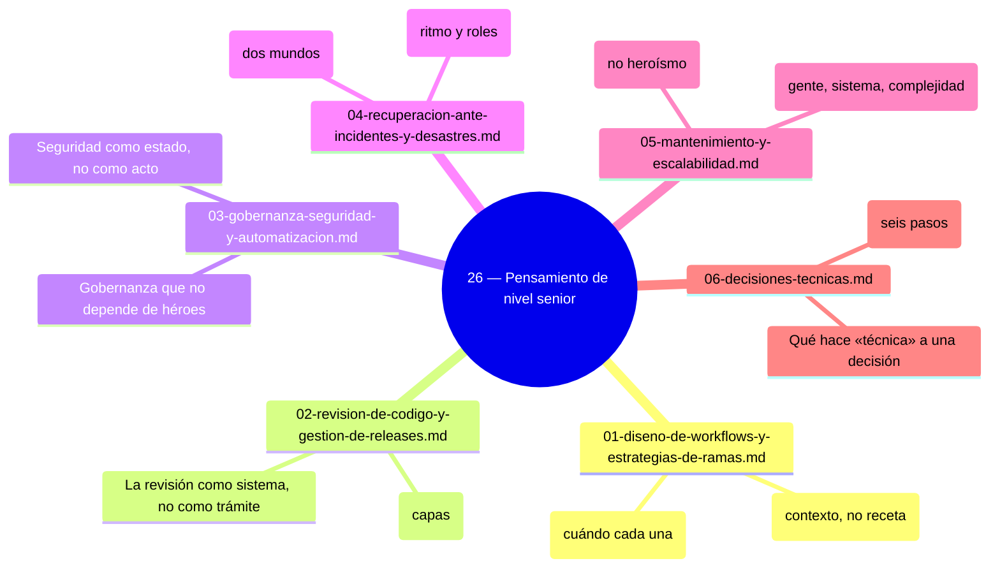

```mermaid
mindmap
  root((26 — Pensamiento de nivel senior))
    01-diseno-de-workflows-y-estrategias-de-ramas.md
      La pregunta senior (contexto, no receta)
      Las estrategias como familia (cuándo cada una)
    02-revision-de-codigo-y-gestion-de-releases.md
      La revisión como sistema, no como trámite
      Qué mira una revisión senior (capas)
    03-gobernanza-seguridad-y-automatizacion.md
      Gobernanza que no depende de héroes
      Seguridad como estado, no como acto
    04-recuperacion-ante-incidentes-y-desastres.md
      Incidente vs. desastre (dos mundos)
      Respuesta a incidentes (ritmo y roles)
    05-mantenimiento-y-escalabilidad.md
      Mantenimiento como presupuesto (no heroísmo)
      Las tres escalas (gente, sistema, complejidad)
    06-decisiones-tecnicas.md
      Qué hace «técnica» a una decisión
      El método completo (seis pasos)
```